<!--* caratula -->

# Informe Trabajo Final 📙

### Universidad Peruana de Ciencias Aplicadas ♨️

🧑‍💻 Ingeniería de software - 2026-01

**Sección:** 3690

**Docente:** Jorge Luis Mayta Guillermo

**StartUp:** F1nTrack

**Producto:** KapakID

	

~~~C#
static string[] Integrantes() {
    return new string[] {
        "🧑‍💻 Villanueva Andrade, Ysaac Ligorio - U20231C168",
        "👩‍💻 Tasayco Osorio, Raul Hiroshi - U202319415",
        "👩‍💻 Vega Coronado, Fabricio Samir - U202317000",
        "👩‍💻 Tasayco Almonacid, Rafael Augusto - U20231F226",
        "👩‍💻 Quiroz Zambrano, Fabrizio Javier - u202213406", 
    };
}
~~~

## Registro de Versiones del Informe

| Versión | Fecha | Autor | Descripción |
| :--- | :--- | :--- | :--- |
| 1.0 | [Fecha] | [Nombre] | Creación del documento y estructura inicial. |

## Project Report Collaboration Insights

[Enlace o descripción de la colaboración del equipo, métricas de commits, etc.]

---

## Contenido
- [Student Outcome](#student-outcome)
- [Objetivos SMART](#objetivos-smart)
- [Capítulo I: Presentación](#capítulo-i-presentación)
    - [1.1. Startup Profile](#11-startup-profile)
    - [1.2. Solution Profile](#12-solution-profile)
    - [1.3. Segmentos objetivo](#13-segmentos-objetivo)
- [Capítulo II: Requirements Development and Software Solution Design](#capítulo-ii-requirements-development-and-software-solution-design)
    - [2.1. Competidores](#21-competidores)
    - [2.2. Entrevistas](#22-entrevistas)
    - [2.3. Needfinding](#23-needfinding)
    - [2.4. Requirements specification](#24-requirements-specification)
    - [2.5. Strategic-Level Domain-Driven Design](#25-strategic-level-domain-driven-design)
    - [2.6. Tactical-Level Domain-Driven Design](#26-tactical-level-domain-driven-design)
- [Capítulo III: Solution UI/UX Design](#capítulo-iii-solution-uiux-design)
    - [3.1. Product design](#31-product-design)
- [Capítulo IV: Product Implementation & Validation](#capítulo-iv-product-implementation--validation)
    - [4.1. Software Configuration Management](#41-software-configuration-management)
    - [4.2. Landing Page & Mobile Application Implementation](#42-landing-page--mobile-application-implementation)
    - [4.3. Validation Interviews](#43-validation-interviews)
- [Conclusiones y Recomendaciones](#conclusiones-y-recomendaciones)
- [Video App Validation](#video-app-validation)
- [Glosario](#glosario)
- [Bibliografía](#bibliografía)
- [Anexos](#anexos)

---

## Student Outcome
*(Ver anexo A)*

## Objetivos SMART
[Descripción de los objetivos]

## Capítulo I: Presentación

<section id="startup-profile">
  <h2>1.1 Startup Profile</h2>

  <!-- 1.1.1 Descripción de la Startup -->
 <article id="descripcion-startup" aria-labelledby="descripcion-startup-title">
  <h3 id="descripcion-startup-title">1.1.1 Descripción de la Startup</h3>

  

    <strong>KapakID</strong> es una startup enfocada en desarrollar soluciones
    tecnológicas para la <strong>gestión personal de documentos e identidad digital</strong>. 
    Nuestro objetivo es ayudar a los usuarios a centralizar, proteger y acceder de forma segura 
    a sus documentos esenciales desde cualquier dispositivo conectado a internet.
  

  <h4>Propuesta de valor</h4>
  <ul>
    <li><strong>Seguridad:</strong> reducción del riesgo de pérdida o robo de documentos físicos.</li>
    <li><strong>Ahorro de tiempo:</strong> búsqueda rápida y consolidación de información en un solo lugar.</li>
    <li><strong>Acceso inmediato:</strong> disponibilidad de documentos en situaciones de emergencia.</li>
    <li><strong>Gestión eficiente:</strong> recordatorios automáticos para fechas de vencimiento.</li>
    <li><strong>Integración:</strong> conexión con sistemas de pago y recarga de servicios.</li>
  </ul>

  <h4>Misión</h4>
  

    Proporcionar soluciones digitales accesibles e innovadoras que permitan a estudiantes, 
    profesionales y familias <strong>gestionar de forma centralizada y segura sus documentos personales</strong>, 
    facilitando el acceso, la organización y la protección de su identidad digital.
  

  <h4>Visión</h4>
  

    Convertirnos en la <strong>plataforma líder en gestión de documentos e identidad digital en Latinoamérica</strong>, 
    reconocida por brindar seguridad, confianza y accesibilidad, contribuyendo al bienestar 
    de las personas y al avance hacia sociedades más digitales y organizadas.
  

</article>

<h3>1.1.2. Perfiles de los integrantes del grupo</h3>

   <!--TODO: integrante 1 -->
  > 🧑‍💻 <strong>INTEGRANTE 1</strong> 
   

   

     
   

   ~~~txt
   
   ~~~

   

  
   <!--TODO: integrante 2 -->
**> 🧑‍💻 <strong>Raul Hiroshi Tasayco Osorio**</strong>
   

   

   ~~~txt
   Soy un estudiante de Ingeniería de Software de la Universidad Peruana de Ciencias Aplicadas (UPC),
   actualmente me encuentro cursando el 7mo ciclo de la carrera.
    
    A lo largo del tiempo que me encuentro en la carrera pude aprender diferentes tecnologías, tanto lenguajes de programación, buenas prácticas de desarrollo, estructuras de datos, finalmente Frameworks como mi Angular en el cual me desempeño en el Frontend:
      1️⃣ C++     
      2️⃣ Python  
      3️⃣ SQL     
      4️⃣ Angular & Vue   
      5️⃣ HTML,CSS & TS     
    Me considero una persona responsable, listo para trabajar en equipo brindando mi apoyo y con un fuerte compromiso con todos mis deberes. 
    
    Mis expectativas para el curso de Aplicaciones Móviles son muy altas, puesto que es un curso en el cual aprenderé diferentes habilidades tanto frontend como backend 📱
   ~~~

   

   <!--TODO: integrante 3 -->
**> 🧑‍💻 <strong>Rafael Augusto Tasayco Almonacid**</strong>
   

     

   ~~~txt
Soy estudiante de la carrera de Ingeniería de Software y actualmente estoy cursando el sexto ciclo de mi carrera universitaria. Entre mis hobbies se encuentran jugar básquet, disfrutar de los videojuegos y escuchar música en mis momentos libres.
Cuando culmine mis estudios, me encantaría especializarme y concentrarme en el campo de la ciberseguridad, un área que me apasiona y en la que deseo desarrollarme profesionalmente.
   ~~~
   

   <!--TODO: integrante 4 -->
**> 🧑‍💻<strong>Ysaac Ligorio Villanueva Andrade**</strong>
   

   
  
   ~~~txt
   Soy estudiante del 7mo ciclo de la carrera de Ingeniería de Software en la UPC. 

    Durante estos años en la universidad y ahora enfocado en el desarrollo del ecosistema KapakID, he podido ganar experiencia práctica en varias tecnologías y formas de trabajo:
      🔵Backend & APIs: Java con Spring Boot
      🔵Arquitectura: Domain-Driven Design (DDD) y Structurizr
      🔵Bases de Datos: PostgreSQL y SQLite (para caché local)
      🔵Frontend Móvil: [Flutter / Kotlin / Swift]

    Como parte del equipo, me gusta ser proactivo y enfocarme en que la arquitectura que diseñamos no se quede solo en papel, sino que funcione bien y de forma ordenada en el código.

    Mis expectativas para el curso de Aplicaciones Móviles son altas. Más allá de solo programar, quiero aprender a resolver los retos reales del entorno móvil, como el manejo de datos sin internet (modo offline) y lograr que la migración de nuestra plataforma web sea un éxito.
   ~~~

   

   <!--TODO: integrante 5 -->

**> 🧑‍💻 Fabrizio Javier Quiroz Zambrano (U202213406)**
   

   

   ~~~txt
    Actualmente curso el sexto ciclo de Ingeniería de Software en la Universidad Peruana de Ciencias Aplicadas (UPC), donde he venido desarrollando una sólida base técnica y una visión crítica
    sobre el desarrollo de soluciones digitales. Mi formación me ha permitido explorar distintos lenguajes y herramientas, desde la lógica estructurada de C++ hasta el dinamismo de frameworks
    modernos como Angular, con los que he trabajado principalmente en el frontend. También tengo experiencia en Python y SQL, lo que me ha ayudado a comprender mejor la gestión de datos y la
    construcción de aplicaciones más completas.

    Más allá de lo técnico, me considero una persona comprometida con el aprendizaje constante, con facilidad para adaptarme a nuevos entornos y colaborar en equipo. Me gusta enfrentar desafíos
    que me obliguen a pensar fuera de lo convencional y a buscar soluciones eficientes y sostenibles.

    Tengo grandes expectativas para el curso de Aplicaciones Web, ya que representa una oportunidad para fortalecer mis habilidades en el desarrollo fullstack y familiarizarme con nuevas tecnologías
    como Vue. Estoy convencido de que este tipo de experiencias me acercan cada vez más al perfil profesional que quiero construir: uno capaz de crear software útil, escalable y centrado en las personas.
   ~~~

   

   
<!-- 1.2.1 Antecedentes y problemática -->

<article id="solution-profile">

<h2>1.2. Solution profile</h2>
<article id="antecedentes-problematica">
  <h3>1.2.1 Antecedentes y problemática</h3>
  

    En la actualidad, muchas personas y pequeñas empresas enfrentan dificultades al momento de 
    <strong>gestionar, proteger y acceder a sus documentos importantes</strong>. 
    La dependencia de formatos físicos, el desorden en el almacenamiento digital y la ausencia de 
    herramientas tecnológicas accesibles generan pérdida de tiempo, riesgo de extravío y 
    complicaciones en trámites que requieren información inmediata. 
  

  

    Frente a esta problemática surge la necesidad de contar con soluciones digitales prácticas que 
    permitan a los usuarios centralizar, resguardar y disponer de sus documentos en cualquier momento 
    y lugar, de forma segura y confiable.
  

  <h4>5“W”s + 2"H"</h4>
  <ul>
    <li>
      <strong>WHAT (QUÉ):</strong>  
      El problema principal es la <strong>dificultad para gestionar documentos personales y empresariales</strong>.  
      Muchos usuarios no tienen un sistema ordenado para guardar DNI, contratos, certificados o 
      recibos, lo que ocasiona pérdidas de información, duplicidad de archivos y retrasos en 
      procesos administrativos.
    </li>
     
    <li>
      <strong>WHEN (CUÁNDO):</strong>  
      Este problema ocurre <strong>de manera frecuente</strong>, especialmente en situaciones críticas:  
      - Renovación de documentos o trámites legales.  
      - Acceso a información en emergencias.  
      - Fechas de vencimiento de contratos, pólizas o servicios.  
      La falta de organización se hace evidente justo cuando más se necesita la información.
    </li>
     
    <li>
      <strong>WHERE (DÓNDE):</strong>  
      El problema se da en distintos <strong>ámbitos</strong>:  
      - En el <em>personal</em>, cuando alguien requiere documentos médicos, escolares o financieros.  
      - En el <em>profesional</em>, entre estudiantes y trabajadores que deben presentar certificados o 
        contratos.  
      - En el <em>empresarial</em>, en micro y pequeñas empresas que no cuentan con sistemas digitales 
        para organizar facturas, permisos o documentación interna.
    </li>
     
    <li>
      <strong>WHO (QUIÉN):</strong>  
      Los principales afectados son:  
      - <strong>Personas naturales</strong> que dependen de trámites frecuentes.  
      - <strong>Estudiantes y profesionales</strong> que requieren tener certificados y documentos al día.  
      - <strong>Emprendedores y pequeñas empresas</strong> que no pueden costear soluciones corporativas 
        avanzadas de gestión documental.
    </li>
     
    <li>
      <strong>WHY (POR QUÉ):</strong>  
      Porque actualmente <strong>no existen herramientas accesibles, seguras y fáciles de usar</strong> 
      que permitan gestionar documentos de manera integral.  
      Las soluciones disponibles suelen ser:  
      - Limitadas a almacenamiento básico en la nube sin organización avanzada.  
      - Costosas para usuarios comunes o pequeñas empresas.  
      - Poco personalizables para distintos tipos de documentos y recordatorios de vencimiento.
    </li>
     
    <li>
      <strong>HOW (CÓMO):</strong>  
      La solución se plantea mediante el desarrollo de una <strong>plataforma web</strong> que:  
      - Centralice el almacenamiento digital de documentos.  
      - Brinde recordatorios automáticos para fechas de vencimiento.  
      - Permita acceso inmediato y seguro desde cualquier dispositivo.  
      - Ofrezca integración con pagos y recargas de servicios relacionados a la documentación.
    </li>
     
    <li>
      <strong>HOW MUCH (CUÁNTO):</strong>  
      Actualmente, contratar un gestor documental empresarial o servicios especializados supone un 
      <strong>costo elevado</strong>, inaccesible para la mayoría.  
      KapakID busca ofrecer una solución <strong>económica, accesible y escalable</strong>, con planes 
      gratuitos para funciones básicas y opciones premium de bajo costo para usuarios con mayores 
      necesidades.
    </li>
  </ul>
</article>

___

### 1.2.2 Lean Ux Process
#### 1.2.2.1. Lean UX Problem Statements
 
Actualmente, las personas enfrentan grandes dificultades para gestionar y llevar consigo sus documentos personales y tarjetas, como DNI, pasaporte, tarjetas bancarias, licencias de conducir, carnés universitarios, entre otros, debido a la incomodidad de portar documentos físicos, el riesgo de pérdida o robo, y la falta de una solución digital integrada que facilite su uso y administración. Esto se debe a varios factores, como la ausencia de una plataforma centralizada para almacenar y verificar documentos, la complejidad de realizar trámites digitales como renovaciones o pagos, y la falta de acceso offline a información crítica, lo que resulta en inconvenientes, pérdida de tiempo y dificultades para gestionar trámites y pagos de manera eficiente.

Nosotros consideramos que estos usuarios necesitan una solución integral y segura que les permita centralizar, gestionar y utilizar sus documentos y tarjetas desde su celular, sin depender de llevar documentos físicos o acceder a múltiples plataformas para realizar trámites. Por ello, KapakID resuelve este problema mediante una aplicación web intuitiva desarrollada en Vue, que permite registrar y verificar documentos como DNI, pasaporte, tarjetas bancarias, licencias, carnés, certificados de vacunas, y más. Ofrece funcionalidades como recarga de tarjetas de transporte, pago de deudas, recarga de teléfono, renovación de documentos, consulta de saldos, historial de trámites y pagos, notificaciones de saldo bajo o vencimiento de documentos, modo offline para acceso limitado a documentos verificados, y una opción premium para gestionar múltiples perfiles (por ejemplo, documentos de hijos). Sabremos que hemos tenido éxito cuando los usuarios reporten una reducción significativa en el uso de documentos físicos, un aumento en la eficiencia al realizar trámites digitales, y una mejora en la satisfacción con la gestión de sus documentos y pagos dentro de los primeros tres meses de uso.

#### 1.2.2.2. Lean UX Assumptions

#### Business Outcomes :

* **🔵 Crecimiento de la Base de Usuarios**  

     KapakID busca atraer a personas que desean gestionar sus documentos y tarjetas de manera digital con campañas de marketing que resalten la facilidad de uso de la plataforma. Su diseño intuitivo y herramientas como el registro de DNI, pasaporte, tarjetas bancarias y notificaciones fomentarán una adopción amplia y sostenida.

* **🔵 Alta Retención de Usuarios**  

     Buscamos retener a los usuarios comprometidos con una experiencia fluida y funcionalidades valiosas como consulta de saldos, historial de trámites y notificaciones de vencimiento. El dashboard principal, claro y accesible, asegurará que los usuarios integren KapakID en su rutina diaria.

* **🔵 Ingresos por Suscripciones Premium**  

     Generaremos ingresos a través de suscripciones premium, con funciones avanzadas como soporte para múltiples perfiles (por ejemplo, para gestionar documentos de hijos). Estas herramientas motivarán a los usuarios a optar por planes pagos para una mayor comodidad en la gestión de documentos.

* **🔵 Minimización del Churn Rate**  

     Reducir la pérdida de usuarios es clave para KapakID. Con un dashboard principal útil y herramientas como modo offline y notificaciones de vencimiento, la plataforma ofrecerá valor continuo, manteniendo a los usuarios leales y comprometidos a largo plazo.

* **🔵 Satisfacción del Usuario (NPS)**  

     KapakID maximizará la satisfacción con una interfaz intuitiva y funciones prácticas como recarga de tarjetas, renovación de documentos y modo offline. La retroalimentación constante permitirá ajustar la plataforma para superar las expectativas de los usuarios.

* **🔵 Adopción de Funciones de Gestión de Documentos**  

     Fomentaremos el uso de herramientas para registrar y verificar documentos como DNI, pasaporte, licencias y carnés, accesibles desde el dashboard principal. Estas funcionalidades serán clave para que los usuarios reemplacen documentos físicos por la app.

* **🔵 Establecimiento de Hábitos de Gestión Digital**  

     Buscaremos motivar a los usuarios a gestionar trámites y pagos, como recargas de teléfono o renovación de documentos, con una interfaz sencilla y notificaciones motivadoras en el dashboard principal. Esto convertirá a KapakID en un aliado para la organización personal.

* **🔵 Optimización de Trámites Digitales**  

     KapakID ayudará a los usuarios a optimizar trámites con herramientas de renovación de documentos, consulta de saldos y historial de pagos, accesibles desde el dashboard principal. Notificaciones personalizadas apoyarán la eficiencia y la organización.

* **🔵 Precisión en Notificaciones de Vencimiento**  

     KapakID mejorará la experiencia con notificaciones precisas sobre vencimientos de documentos o saldos bajos, integradas en el dashboard principal. Esto permitirá a los usuarios planificar y actuar con anticipación.

* **🔵 Usuarios Activos en Familias**  

     KapakID atraerá a familias con la opción premium para gestionar múltiples perfiles, como documentos de hijos, desde un dashboard principal intuitivo. Su enfoque práctico y escalable lo convertirá en la opción ideal para la gestión documental familiar.

* **🔵 Uso de Funciones de Pago y Recarga**  

     KapakID promoverá el uso de herramientas para recargar tarjetas de transporte, pagar deudas y recargar teléfonos desde el dashboard principal. Esto facilitará una gestión financiera responsable y aumentará la confianza en la plataforma.

* **🔵 Asociaciones con Entidades Gubernamentales y Financieras**  

     KapakID establecerá alianzas con entidades gubernamentales y financieras para integrar servicios como renovación de documentos y pagos de tarjetas. Estas colaboraciones, accesibles desde el dashboard principal, enriquecerán la experiencia y el valor para los usuarios.

* **🔵 Frecuencia de Uso del Dashboard Principal**  

     KapakID incentivará el uso frecuente del dashboard principal, que muestra documentos, saldos, historial de trámites y notificaciones de forma clara. Su diseño atractivo asegurará que los usuarios lo consulten regularmente para gestionar sus documentos y pagos.

* **🔵 Precisión en Notificaciones de Saldo Bajo** 

     KapakID fortalecerá la confianza con notificaciones precisas de saldos bajos en tarjetas, integradas en el dashboard principal. Estas alertas ayudarán a los usuarios a identificar necesidades de recarga y tomar medidas rápidas.

* **🔵 Reducción de Costos de Soporte** 

     KapakID minimizará los costos de soporte con tutoriales interactivos y FAQs integrados en la plataforma. Esto permitirá a los usuarios resolver dudas de forma autónoma, mejorando la experiencia general.

### User Outcomes 

* **🟢 Control Documental Personal Mejorado** 

     Los usuarios de KapakID lograrán un mayor control sobre sus documentos personales y tarjetas, como DNI, pasaporte, licencias y carnés, al utilizar herramientas de registro y verificación digital. El dashboard principal les proporcionará una visión clara de sus documentos, saldos y trámites, permitiéndoles gestionar todo desde su celular y reducir la dependencia de documentos físicos.

* **🟢 Organización Eficiente para Familias** 

     Los usuarios, especialmente familias, usarán KapakID para organizar documentos de múltiples perfiles (como los de sus hijos) con la opción premium. El dashboard principal les ofrecerá una vista consolidada de documentos y trámites, ayudándoles a anticipar vencimientos y gestionar renovaciones de manera eficiente.

* **🟢 Optimización de Trámites Digitales** 

     Los usuarios optimizarán sus trámites con KapakID, utilizando herramientas para renovar documentos, recargar tarjetas de transporte y pagar deudas desde el dashboard principal. Esto les permitirá ahorrar tiempo, reducir la necesidad de acudir a oficinas físicas y mantener un historial organizado de sus gestiones.

* **🟢 Confianza en la Gestión de Pagos** 

     Los usuarios que realizan pagos encontrarán en KapakID una herramienta confiable para recargar tarjetas, pagar deudas o recargar teléfonos. Desde el dashboard principal, podrán consultar saldos y revisar el historial de pagos, tomando decisiones informadas sin comprometer su organización financiera.

* **🟢 Adopción de Gestión Documental Digital** 

     KapakID empoderará a los usuarios para gestionar documentos digitalmente, como DNI, pasaporte o certificados, con una interfaz sencilla y notificaciones de vencimiento en el dashboard principal. Esto les ayudará a mantenerse organizados y reducir el uso de documentos físicos con facilidad.

* **🟢 Reducción del Estrés Documental** 

     Los usuarios experimentarán menos estrés al gestionar documentos gracias a la claridad que ofrece el dashboard principal y las notificaciones de vencimiento o saldo bajo. Estas funcionalidades les permitirán monitorear sus documentos en tiempo real, reaccionar ante alertas y mantener el control sin esfuerzo.

* **🟢 Mayor Confianza en la Seguridad de Documentos** 

     KapakID aumentará la confianza de los usuarios al proporcionar un entorno seguro para almacenar y verificar documentos, con acceso offline a documentos verificados desde el dashboard principal. Esto permitirá a los usuarios sentirse protegidos y acceder a su información incluso sin conexión.

* **🟢 Experiencia de Uso Intuitiva** 

     Los usuarios disfrutarán de una experiencia fluida y accesible con KapakID, gracias a su interfaz intuitiva y al dashboard principal que centraliza documentos, saldos y trámites. Esto facilitará la adopción de la plataforma, incluso para aquellos con poca experiencia digital, integrándola en su rutina diaria.

* **🟢 Gestión Colaborativa de Documentos Familiares** 

     Las familias se beneficiarán de la opción premium de KapakID, que permite gestionar documentos de varios miembros desde el dashboard principal. Esto fomentará una organización coordinada, asegurando que todos los documentos estén centralizados y accesibles.

* **🟢 Acceso a Servicios de Trámites Externos** 

     A través de asociaciones con entidades gubernamentales y financieras, los usuarios de KapakID accederán a servicios como renovación de documentos o pagos directamente desde la plataforma. Esto, integrado en el dashboard principal, enriquecerá su experiencia y les proporcionará recursos adicionales para gestionar sus documentos.

* **🟢 Monitoreo Frecuente de Documentos y Pagos** 

     KapakID incentivará a los usuarios a monitorear sus documentos y pagos regularmente a través del dashboard principal, que presenta documentos, saldos, historial de trámites y notificaciones de forma clara. Este hábito les permitirá mantenerse informados y tomar medidas rápidas para mantener todo en orden.

* **🟢 Resolución Autónoma de Dudas** 

     Los usuarios resolverán dudas de manera autónoma con los tutoriales interactivos y FAQs integrados en KapakID. Esta funcionalidad reducirá la necesidad de soporte externo, permitiéndoles aprovechar al máximo la plataforma con confianza y facilidad.

* **🟢 Mayor Claridad en Trámites y Pagos** 

     KapakID ayudará a los usuarios a comprender mejor sus trámites y pagos mediante reportes claros en el dashboard principal. Esta claridad les permitirá ajustar sus hábitos de gestión y alinear sus decisiones con sus necesidades personales o familiares.

* **🟢 Motivación para Mantener Documentos Actualizados** 

     Los usuarios se sentirán motivados para mantener sus documentos actualizados con las notificaciones de vencimiento y recordatorios de KapakID, integrados en el dashboard principal. Esta funcionalidad les ayudará a mantenerse organizados y celebrar sus logros en la gestión documental.

* **🟢 Reducción de Errores en Gestión Documental** 

     KapakID minimizará los errores en la gestión documental al automatizar el registro de documentos y ofrecer notificaciones precisas en el dashboard principal. Esto permitirá a los usuarios evitar equivocaciones costosas y mantener registros precisos con menos esfuerzo.

#### 1.2.2.3. Lean UX Hypothesis Statements

Creemos que digitalizar y centralizar todos los documentos personales y tarjetas en KapakID facilitará la vida diaria de los usuarios al reducir la dependencia de llevar documentos físicos.

Sabremos que esto es cierto cuando los usuarios reporten un uso reducido de su billetera física para trámites o pagos cotidianos en el primer mes de uso.
___
Creemos que las notificaciones automatizadas sobre vencimientos de documentos y saldos bajos ayudarán a los usuarios a mantenerse proactivos y a evitar inconvenientes o estrés por no tener sus documentos al día.

Sabremos que esto es cierto cuando el 90% de los usuarios que reciban una notificación de vencimiento inicien el trámite de renovación directamente desde la app, y cuando el uso de la función de recarga aumente un 15% tras las alertas de saldo bajo.
___
Creemos que la función de modo offline proporcionará un valor esencial y aumentará la confianza del usuario, asegurando que siempre tengan acceso a sus documentos verificados, incluso sin conexión a internet.

Sabremos que esto es cierto cuando al menos el 20% de los usuarios acceda a la app en modo offline en un periodo de 30 días, y cuando los comentarios sobre la seguridad y la conveniencia de esta función sean consistentemente positivos.
___
Creemos que el plan premium con soporte para múltiples perfiles motivará a los usuarios a suscribirse, ya que les permitirá administrar de forma eficiente los documentos de sus hijos y otros miembros de la familia.

Sabremos que esto es cierto cuando al menos el 10% de los usuarios que usen la prueba gratuita del plan premium decidan pagar por la suscripción en el primer mes.
___
Creemos que una interfaz de usuario intuitiva y los tutoriales interactivos permitirán a usuarios con poca familiaridad tecnológica adoptar la app y completar tareas clave como el registro de documentos y los trámites sin necesitar soporte técnico directo.

Sabremos que esto es cierto cuando el 85% de los usuarios nuevos completen su perfil y registren al menos tres documentos personales en la primera semana sin abrir un ticket de soporte.
___
Creemos que la integración con entidades gubernamentales para la renovación de documentos y el acceso a servicios como el pago de impuestos o multas facilitará la adopción masiva, ya que los usuarios verán la app como una plataforma oficial y confiable para realizar trámites importantes.

Sabremos que esto es cierto cuando al menos el 25% de los usuarios que hayan registrado un documento con fecha de vencimiento próxima intenten iniciar el proceso de renovación a través de la app.
___
Creemos que la capacidad de pagar deudas y servicios básicos (como la recarga de teléfono) directamente desde KapakID aumentará la frecuencia de uso diario y posicionará a la app como una herramienta esencial para la gestión financiera personal.

Sabremos que esto es cierto cuando el 40% de los usuarios que tengan tarjetas bancarias registradas realicen al menos una transacción de pago o recarga en un periodo de 30 días.

#### 1.2.2.4. Lean UX Canvas

### 1.3. Segmentos objetivo
En KapakID, tenemos dos segmentos objetivos principales que se benefician de las funcionalidades de nuestra aplicación:

* **Estudiantes Universitarios (18–29)**

  Este segmento busca la conveniencia y eficiencia. Su principal problema es la necesidad de llevar múltiples tarjetas (universidad, transporte, débito), lo que aumenta el riesgo de pérdida. KapakID les permite centralizar todo en su celular para hacer consultas de saldo y recargas al instante, simplificando su rutina diaria y reduciendo el riesgo.

* **Padres/Madres o Tutores (25–45)**

  Este grupo se enfoca en la organización y la seguridad familiar. Su dolor es la gestión dispersa de los documentos de sus hijos, desde carnés escolares hasta certificados de vacunas. KapakID resuelve esto con su función premium de perfiles múltiples, que les permite centralizar de forma segura toda la información familiar en un solo lugar, brindándoles control total y tranquilidad.
---

## Capítulo II: Requirements Development and Software Solution Design

## 2.1 Competidores

### ¿Por qué llevar a cabo este análisis?

El análisis de competidores es un paso esencial para el desarrollo estratégico de **KapakID**, ya que permite:

- **Identificar el panorama competitivo actual**: conocer qué aplicaciones ofrecen servicios similares (billeteras digitales, apps de identidad, apps de transporte) y cómo se posicionan en el mercado.
- **Detectar fortalezas y debilidades de la competencia**: entender qué hacen bien y en qué fallan, para aprovechar oportunidades y evitar errores.
- **Definir nuestra propuesta de valor diferencial**: garantizar que **KapakID** no sea “una app más”, sino una solución única que combine lo mejor de las demás y agregue funcionalidades innovadoras.
- **Optimizar la estrategia de marketing y producto**: orientar esfuerzos hacia segmentos desatendidos y necesidades no cubiertas por los competidores.
- **Reducir riesgos y anticipar amenazas**: prever cambios regulatorios, tendencias tecnológicas y movimientos de la competencia que puedan impactar el proyecto.

---

### 2.1.1 Análisis competitivo (Comparativa)

**¿Por qué llevar a cabo este análisis?**  
El análisis competitivo de **KapakID** permite entender el panorama actual de billeteras digitales e identidades electrónicas en Perú, identificar qué hacen bien los competidores y en qué fallan, y posicionar a KapakID como una solución integral que combina pagos, identidad y gestión de documentos.

---

| **Aspecto** | **KapakID** | **Yape** | **Plin** | **IDPerú (RENIEC)** | **Google Wallet** |
|-------------|-------------|----------|----------|----------------------|-------------------|
| **Perfil** |||||  
| **Overview** | Plataforma digital que integra identidad, pagos, transporte y gestión de documentos. | Billetera digital bancaria popular en Perú. | Billetera digital interoperable entre bancos. | Plataforma estatal de identidad digital. | Billetera digital global de Google. | 
| **Ventaja competitiva / Valor ofrecido** | Centralización de documentos + pagos + alertas + transporte en una sola app. | Confianza y popularidad entre usuarios peruanos. | Interoperabilidad bancaria amplia. | Identidad digital oficial. | Integración global en dispositivos Android. |
| **Nivel de Marketing** ||||| 
| **Mercado objetivo** | Estudiantes, familias y ciudadanos que requieren gestionar trámites, transporte y pagos en Perú. | Jóvenes y adultos bancarizados en Perú. | Usuarios de banca digital en Perú. | Ciudadanos peruanos que requieren autenticación oficial. | Usuarios globales de Android interesados en pagos digitales. |
| **Estrategias de marketing** | Diferenciación por seguridad, centralización y adaptación local (Metropolitano, Línea 1, SUNEDU, CONADIS). Campañas digitales y alianzas institucionales. | Marketing masivo, respaldo bancario. | Posicionamiento en interoperabilidad y simplicidad. | Difusión estatal y obligatoriedad en trámites oficiales. | Estrategia global en Google Pay y servicios Android. |
| **Perfil de Producto** |||||  
| **Productos & Servicios** | Identidad digital, pagos, recargas de transporte, alertas inteligentes, asistente de trámites. | Pagos y transferencias. | Pagos y transferencias entre bancos. | Autenticación y certificados digitales. | Pagos digitales y almacenamiento de tarjetas. |
| **Precios & Costos** | Modelo freemium: básico gratis, premium con alertas avanzadas y perfiles múltiples. | Gratis para usuarios. | Gratis para usuarios. | Gratis para ciudadanos (respaldado por el Estado). | Gratis, requiere dispositivos Android. |
| **Canales de distribución (Web/Móvil)** | App móvil (Android/iOS) con integración a servicios locales. | App móvil Android/iOS. | App móvil Android/iOS. | Plataforma digital oficial, apps de gobierno. | App móvil preinstalada en Android. |
| **Análisis SWOT** |||||  
| **Fortalezas** | Centralización total de documentos, alertas inteligentes, perfiles múltiples, modo offline, asistente de trámites. | Popularidad masiva, confianza en respaldo bancario. | Interoperabilidad bancaria, simplicidad. | Respaldo oficial del Estado, obligatoriedad en trámites. | Integración global y masiva en Android. |
| **Debilidades** | Requiere generar confianza inicial en usuarios para almacenar documentos sensibles. | No gestiona documentos ni transporte. | No maneja alertas ni documentos. | No cubre pagos ni transporte. | No adaptado al contexto peruano, sin enfoque en trámites locales. |
| **Oportunidades** | Creciente digitalización de trámites en Perú, necesidad de integración transporte + pagos + identidad. | Crecer en funcionalidades más allá de pagos. | Mejorar experiencia de usuario e incluir servicios adicionales. | Ampliar servicios digitales más allá de identidad. | Expandirse en mercados emergentes con servicios locales. |
| **Amenazas** | Competidores bancarios consolidados, desconfianza en gestión digital de documentos sensibles. | Aparición de apps más completas en Perú. | Nuevos competidores fintech más versátiles. | Baja adopción si usuarios prefieren soluciones privadas. | Regulaciones locales que limiten su alcance. |

---

### **¿Por qué KapakID es superior?**
- **Integra lo mejor de todos los competidores**: pagos (como Yape/Plin), identidad segura (como IDPerú), y almacenamiento de tarjetas (como Google Wallet).
- **Agrega valor único**: centralización de documentos, alertas inteligentes, perfiles múltiples, modo offline y asistentes de trámites.
- **Diseñada para el contexto peruano**: compatible con Metropolitano, Línea 1, SUNEDU y CONADIS.

---

### 2.1.2 Estrategias y tácticas frente a competidores

**Estrategias:**
- Diferenciación por **centralización y seguridad** (cifrado, biometría).
- Experiencia **adaptada al contexto peruano** (Metropolitano, Línea 1, SUNEDU, CONADIS).
- Cumplimiento **Ley 29733** para generar confianza.

**Tácticas:**
- **Alianzas** con universidades y colectivos de transporte.
- **Campañas digitales**: “Olvídate de cargar documentos físicos, usa KapakID”.
- **Modelo freemium**: básico gratis, premium con alertas avanzadas y perfiles múltiples.

---

### 2.2. Entrevistas
#### 2.2.1. Diseño de entrevistas

**Segmentos objetivo:**
- **Estudiantes universitarios (18–29)** que usan transporte público.
- **Padres/madres o tutores (25–45)** que gestionan documentos de hijos.

**Objetivo:** Validar confianza, fricciones en trámites y pagos, valor de alertas y perfiles múltiples para **KapakID**.

---

#### Preguntas:

1. **¿Qué documentos y tarjetas llevas contigo a diario?** (DNI, carné universitario, tarjetas de transporte, bancarias). De todos ellos, ¿cuáles preferirías tener a la mano en tu celular para no tener que sacar tu billetera física?

2. **¿Has perdido u olvidado algún documento importante en el último año?** Si hubieras tenido una copia de respaldo segura y accesible desde tu teléfono en ese momento, ¿cómo habría cambiado la situación?

3. **¿Cómo recargas actualmente tu tarjeta del Metropolitano o Línea 1?** ¿Te resultaría útil recargar tu saldo acercando tu tarjeta al celular (mediante tecnología NFC) o pagando con un par de toques desde la app?

4. **¿Qué parte de renovar documentos (DNI, carné universitario, CONADIS) te genera más estrés?** ¿Crees que poder escanear los requisitos con la cámara de tu celular o subir fotos directamente desde tu galería agilizaría estos trámites?

5. **Si la app te avisara del vencimiento de un documento o de un saldo bajo,** ¿cómo preferirías enterarte a través de tu celular? (¿Notificación *push*, un *widget* en tu pantalla de inicio, un mensaje de WhatsApp?) ¿Con cuánta anticipación?

6. **¿Confiarías en una app móvil para guardar copias digitales de tus documentos más importantes?** ¿Qué medidas de seguridad propias del celular te darían más tranquilidad (huella dactilar, reconocimiento facial, un PIN exclusivo, almacenamiento cifrado sin internet)?

7. **Si pudieras administrar los documentos de tus hijos o familiares desde tu celular,** ¿qué funciones serían imprescindibles para ti? (¿Acceso sin conexión a internet, cambiar ágilmente entre perfiles, compartir documentos rápidamente por apps de mensajería?)

8. **¿Qué tan útil sería tener un asistente en tu bolsillo con un *checklist* interactivo para trámites?** ¿Te gustaría que las fechas límite y los pasos se sincronicen automáticamente con la app de calendario de tu teléfono?

9. **Pensando en una experiencia móvil rápida y fluida, ¿qué funciones priorizarías en la app?** (Acceso biométrico, *widgets* para ver el saldo rápido, alertas *push*, recargas directas, modo *offline* para cuando no hay señal).

10. **¿Estarías dispuesto a pagar una suscripción (a través de la Play Store o App Store) por funciones premium?** ¿Qué características exclusivas harían que valga la pena el pago para ti?

#### 2.2.2. Registro de entrevistas

#### Entrevistas a estudiantes universitarios

| Campo         | Información |
|---------------|-------------|
| Entrevistado 1| (nombre 1)  |
| Edad          | (edad 1)    |
| Distrito      | (distrito)  |
| Foto          |  |
| Timing        | [Ver grabación]() |
---

| Campo         | Información |
|---------------|-------------|
| Entrevistado 2| (nombre 2)  |
| Edad          | (edad 2)    |
| Distrito      | (distrito)  |
| Foto          |  |
| Timing        | [Ver grabación]() |

---

| Campo         | Información |
|---------------|-------------|
| Entrevistado 3| (nombre 3)  |
| Edad          | (edad 3)    |
| Distrito      | (distrito)  |
| Foto          |  |
| Timing        | [Ver grabación]() |

---

#### Entrevistas a padres/madres o tutores

| Campo         | Información |
|---------------|-------------|
| Entrevistado 4| (nombre 4)  |
| Edad          | (edad 4)    |
| Distrito      | (distrito)  |
| Foto          |  |
| Timing        | [Ver grabación]() |

---

| Campo         | Información |
|---------------|-------------|
| Entrevistado 5| (nombre 5)  |
| Edad          | (edad 5)    |
| Distrito      | (distrito)  |
| Foto          |  |
| Timing        | [Ver grabación]() |

---

| Campo         | Información |
|---------------|-------------|
| Entrevistado 6| (nombre 6)  |
| Edad          | (edad 6)    |
| Distrito      | (distrito)  |
| Foto          |  |
| Timing        | [Ver grabación]() |

---

#### 2.2.3. Análisis de entrevistas
**Segmento 1: Jóvenes universitarios usuarios de transporte y documentos digitales (Hany Pareja Berocal)**

  * **Perfil**
    *  

  * **Insights clave**
    *  
    * 
    *   

  * **Problemas y frustraciones**
    *  
    * 
    * 

  * **Necesidades**
   
    * 
  
    * 
   
    * 
    
    * 
  
    * 
   

  * **Oportunidades para KapakID**
    
    * 
    
    * 
    
    * 
    
    * 
    
    * 

**Segmento 2: Padres/Madres o Tutores**

  * **Perfil**
    *  

  * **Insights clave**
    *  
    * 
    *   

  * **Problemas y frustraciones**
    *  
    * 
    * 

  * **Necesidades**
   
    * 
  
    * 
   
    * 
    
    * 
  
    * 
   

  * **Oportunidades para KapakID**
    
    * 
    
    * 
    
    * 
    
    * 
    
    * 
    

## 2.3. Needfinding
### 2.3.1. User Personas

- **Estudiante universitario**  
<td></td>

- **Madre de familia**  
<td></td>

### 2.3.2. User Task Matrix
### Task Matrix

| **Task** | **Estudiante universitario (Luis, 21 años)** | | **Madre de familia (Patricia, 39 años)** | |
|----------|---------------------------------------------|-------------------------------------------|------------------------------------------|------------------------------------------|
|          | Frequency                                   | Importance                                | Frequency                                | Importance                               |
| Centralizar documentos digitales | Often | High | Always | High |
| Recargar tarjeta de transporte | Always | High | Often | Medium |
| Recibir alertas de saldo bajo / vencimiento | Always | High | Always | High |
| Configurar y gestionar perfiles múltiples | Rarely | Medium | Often | High |
| Acceso offline a documentos | Sometimes | Medium | Often | High |
| Asistente para trámites (checklist, pasos guiados) | Sometimes | Medium | Often | High |
| Historial de transacciones (pagos, recargas, trámites) | Sometimes | Medium | Often | Medium |
| Seguridad y validación biométrica | Often | High | Always | High |
| Vincular billeteras digitales (Yape, Plin, Google Wallet) | Often | High | Sometimes | Medium |
| Compartir documentos verificados (ej. envío digital de DNI) | Sometimes | Medium | Often | High |
| Configurar notificaciones personalizadas (push, correo, WhatsApp) | Often | Medium | Often | High |
| Renovar documentos en línea (DNI, carné universitario, CONADIS) | Rarely | High | Sometimes | High |
| Gestionar pagos de servicios (teléfono, agua, luz, internet) | Rarely | Medium | Often | High |
| Monitorear gastos y generar reportes | Rarely | Medium | Often | Medium |

El análisis de las tareas de estudiantes universitarios y madres de familia muestra enfoques distintos en el uso de KapakID. Los estudiantes se orientan a actividades operativas y cotidianas, como recargar la tarjeta de transporte, recibir alertas de saldo bajo, centralizar documentos y acceder en modo offline. Su prioridad es evitar olvidos, ahorrar tiempo y simplificar la movilidad diaria, con alto valor en funciones de seguridad biométrica y vinculación con billeteras digitales. Sin embargo, relegan a un segundo plano tareas menos frecuentes como renovación de documentos o generación de reportes. Las madres de familia, en contraste, priorizan la gestión integral y el control familiar, enfocándose en administrar múltiples perfiles, recibir alertas de vencimientos, acceder a documentos de manera segura y simplificar trámites repetitivos. Además, otorgan gran importancia al seguimiento financiero, utilizando historial de transacciones, pagos de servicios y reportes como parte de su rol en la organización del hogar. Mientras ambos segmentos coinciden en valorar la centralización documental, las alertas inteligentes y la seguridad, difieren en su enfoque: el estudiante busca rapidez y autonomía personal, mientras que la madre necesita organización, control y previsión familiar, consolidando a KapakID como una solución versátil para ambos perfiles.

### 2.3.3. User Journey Mapping
- **Empathy Map Estudiante Universitario**

<td></td>

- **Empathy Map Madre de Familia**
<td></td>

### 2.3.4. Empathy Mapping
**User Journey Mapping Estudiante Universitario** 
 <td></td>
 
**User Journey Mapping Madre de Familia**  

<td></td>

#### 2.3.5. Big Picture EventStorming
#### 2.3.6. Ubiquitous Language

### 2.4. Requirements specification
#### 2.4.1. User Stories
#### 2.4.2. Impact Mapping
#### 2.4.3. Product Backlog

### 2.5. Strategic-Level Domain-Driven Design

En esta sección se describe el enfoque utilizado para la toma de decisiones estratégicas en el desarrollo de la aplicación móvil KapakID, aplicando los principios de Domain-Driven Design (DDD). El propósito central fue reconocer y delimitar los límites naturales del dominio enfocado en la gestión personal de documentos e identidad digital, dividiendo la solución en Bounded Contexts.

Para esta descomposición, el equipo hizo uso de herramientas colaborativas como Event Storming, que permitió representar de manera visual y dinámica los flujos de eventos, comandos y actores del dominio, tales como estudiantes universitarios y padres de familia; y el Bounded Context Canvas, mediante el cual se definieron los aspectos clave de cada contexto, tales como objetivos, modelos, responsabilidades y sus interacciones con otros.

Este enfoque estratégico no solo favoreció una organización más clara y coherente de la arquitectura móvil, sino que también facilitó la alineación de las decisiones técnicas con las metas del negocio, optimizando la comunicación técnica y funcional entre los distintos participantes del proyecto.

#### 2.5.1. EventStorming

En esta sección se expone el proceso de EventStorming aplicado como técnica de exploración del dominio de KapakID, cuyo objetivo fue identificar los eventos más relevantes del sistema y comprender cómo estos se relacionan con los actores y las reglas de negocio. La dinámica permitió representar de manera visual y secuencial los hechos clave, como la validación de documentos oficiales, recargas de transporte y envío de notificaciones de vencimiento.

Asimismo, se mapearon los comandos desde la interfaz de la aplicación móvil que originan dichos eventos, facilitando las conversaciones entre los participantes y generando un entendimiento común sobre el comportamiento esperado. Este enfoque posibilitó construir una visión compartida del ecosistema digital, sentando las bases para etapas posteriores de modelado más detallado y la delimitación de responsabilidades en contextos como Identity, Documents, Transport y Notifications.

- **2.5.1.1. Candidate Context Discovery**
- **2.5.1.2. Domain Message Flows Modeling**

Los Domain Message Flows modelan las interacciones entre los diferentes bounded contexts, mostrando cómo se comunican entre sí mediante comandos, eventos y consultas. A continuación, se muestran los flujos de mensaje para los escenarios clave del negocio:

  * **Subir y verificar documento:** En este flujo se muestra la interacción del bounded context Documents al momento en que un usuario registra un documento oficial para su validación.

  

  * **Acceso y registro a la plataforma:** En este flujo se muestra la interacción del bounded context Identity al momento en que un usuario crea su cuenta y accede a la aplicación móvil.

  

  * **Vincular tarjeta de transporte:** En este flujo se muestra la interacción del bounded context Transport al momento en que un usuario registra una tarjeta (ej. Metropolitano) para consultar sus saldos.

  

  Adicionalmente, se presentan flujos de escenarios relevantes para los usuarios y el sistema, pero en los que no se produce interacción compleja entre distintos bounded contexts:

  * **Envío de alertas:** En este flujo se muestra el proceso mediante el cual el sistema despacha alertas al usuario, modelado en el bounded context Notifications.

 

  * **Registro de auditoría:** En este flujo se modela el proceso mediante el cual el sistema guarda un registro inmutable de acciones críticas, modelado en el bounded context Compliance.

### 2.5.1.3. Bounded Context Canvases

Para mejorar la organización del dominio y facilitar una comunicación consistente, se elaboraron Bounded Context Canvases para cada subdominio. Estos canvases delimitan claramente las responsabilidades, establecen el lenguaje ubicuo y los modelos clave, y describen los puntos de integración y los flujos de mensajes entre contextos. Los diagramas que siguen consolidan estas decisiones y sirvieron como guía para alinear la arquitectura, las interfaces y la evolución del sistema.

#### Identity (Identidad y Accesos)
Este Bounded Context gestiona la autenticación, autorización y asignación de roles. Emite y valida tokens JWT, administra el ciclo de vida de las credenciales y publica eventos hacia otros contextos para garantizar un acceso controlado y seguro a nivel de toda la plataforma.

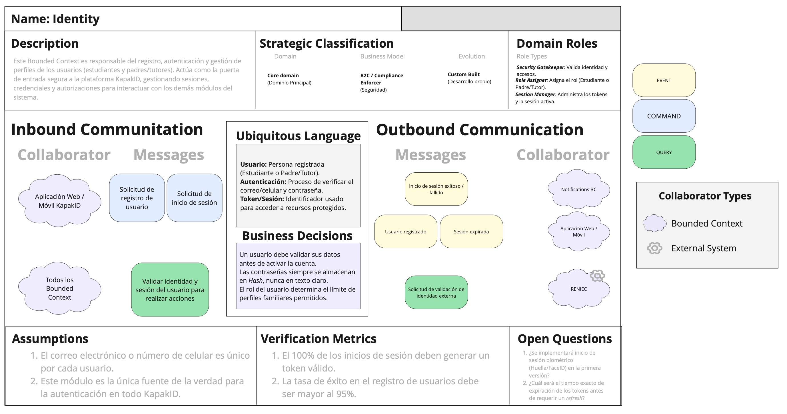

#### Documents (Gestión Documental)
Contexto encargado del ciclo de vida de los documentos digitales (DNI, carné universitario, pasaportes). Maneja la carga segura, el almacenamiento de metadatos, la validación de autenticidad y la orquestación de la caché local para permitir el acceso offline.

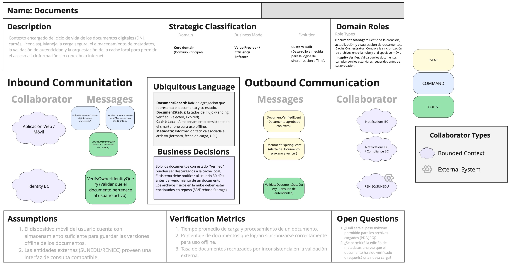

#### Transport (Transporte y Recargas)
Abarca la gestión de las tarjetas de transporte urbano (Metropolitano, Línea 1) y la ejecución de recargas. Funciona como un integrador entre la aplicación móvil y los sistemas de transporte o pasarelas de pago externas.

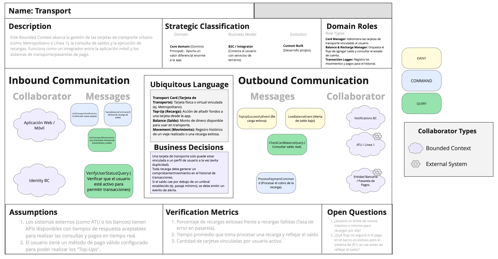

#### Notifications (Notificaciones y Alertas)
Se encarga de gestionar y despachar todas las comunicaciones hacia los usuarios. Centraliza el envío de alertas push y correos electrónicos sobre saldos bajos, vencimientos de documentos y confirmaciones de trámites.

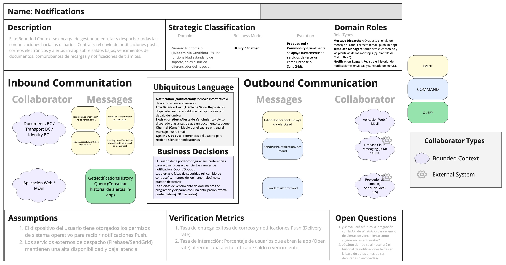

#### Compliance (Cumplimiento Normativo y Auditoría)
Responsable de garantizar que todas las operaciones cumplan con las normativas legales de privacidad (Ley 29733). Registra de forma inmutable las acciones críticas y gestiona el consentimiento del usuario sobre el manejo de sus datos.

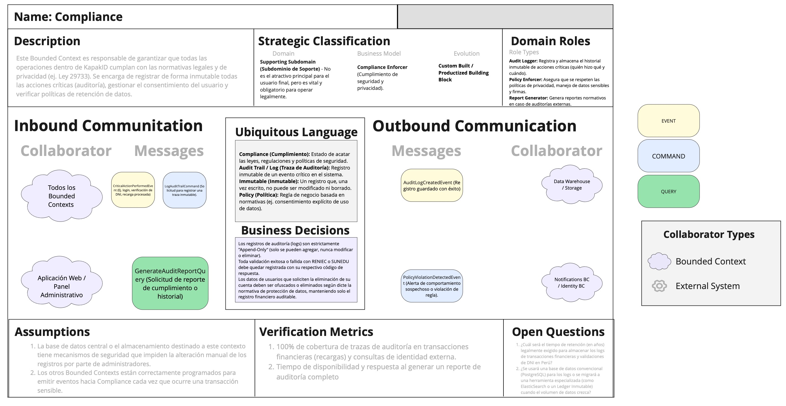
#### 2.5.2. Context Mapping
En esta sección se explica el proceso de elaboración de los context maps de **KapakID**. Asimismo, se permite la visualización de las relaciones estructurales entre Bounded Contexts, junto a los patrones de relaciones establecidos en Domain Driven Design (DDD), como Anti-corruption Layer (ACL), Customer/Supplier, Shared Kernel y Conformist.

Posterior al debate grupal para la contextualización del proyecto de identidad digital y transporte, nos hemos proyectado los siguientes Bounded Contexts:
* **Identity and Access Management (IAM)**
* **User Profiles (UP)**
* **Digital Identity & Documents (DID)**
* **Payments & Subscriptions (PAS)**
* **Transport & NFC Management (TNM)**
* **Notifications (NTF)**

#### **Relaciones Detalladas:**

**User Profiles (UP) - Identity and Access Management (IAM)**
En la presente imagen se puede identificar la relación entre **User Profiles** e **Identity and Access Management (IAM)**, los cuales están enfocados en lógicas similares y comparten un subconjunto del modelo de dominio común para evitar la duplicación de código. Se utiliza el patrón **Shared Kernel** para la entidad "Usuario", la cual comparte lógica de credenciales y segmentación básica de clientes.

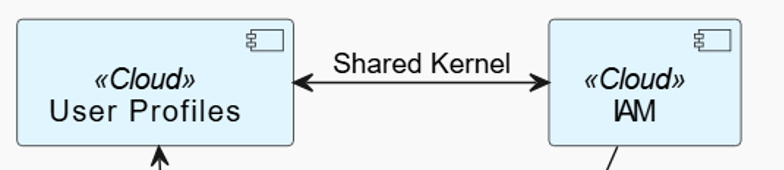

**Identity and Access Management (IAM) - Payments & Subscriptions (PAS)**
En la presente imagen se puede identificar la relación entre **IAM** y **Payments & Subscriptions (PAS)**, enfocada en la comunicación por medio de un **ACL (Anti-corruption Layer)** hacia el contexto de pagos por el uso de **Stripe** como servicio externo. Este se comunica mediante **OHS** y **PL**, lo que permite la validación de suscripciones sin comprometer la seguridad del sistema.

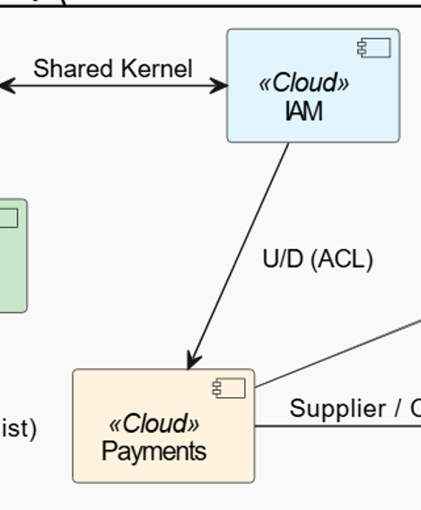

**Payments & Subscriptions (PAS) - Transport & NFC Management (TNM)**
En la presente imagen se puede identificar la relación entre **PAS** y **Transport & NFC Management (TNM)** por medio del patrón **Customer / Supplier**. El Bounded Context de transporte actúa bajo la influencia de pagos, ya que la activación de saldos en tarjetas NFC genera una dependencia directa de la validación exitosa de la transacción.

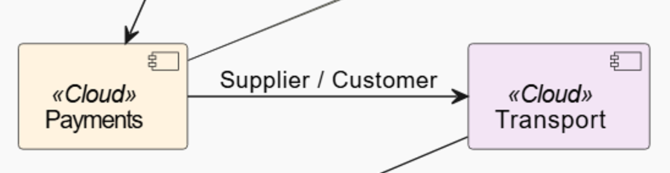

**Digital Identity & Documents (DID) - User Profiles (UP)**
En la presente imagen se puede identificar el patrón **Partnership** debido al trabajo coordinado entre estos dos contextos. **Digital Identity** se encarga de la gestión de validación legal, mientras que **User Profiles** se actualiza constantemente con el estatus de "Verificado" para permitir el acceso a servicios de transporte con tarifa preferencial.

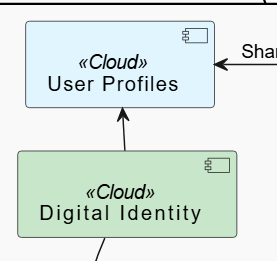

**Digital Identity & Documents (DID) - Notifications (NTF)**
En la presente imagen se puede identificar el patrón **Conformista**, de manera que el downstream (**Notifications**) adopta el modelo del upstream (**DID**) tal cual. Las alertas de validación o vencimiento de documentos son dependientes de la lógica de negocio de los certificados digitales.

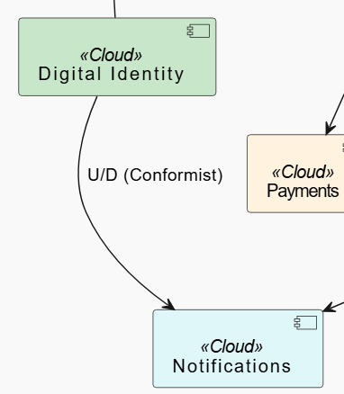

#### **Final Context Map**
Posteriormente, se presenta el mapa de contextos final de **KapakID**, integrando todas las relaciones y patrones mencionados anteriormente para ofrecer una visión global de la arquitectura del sistema.

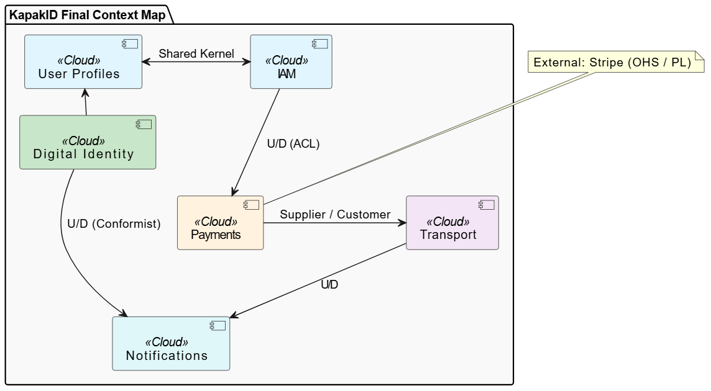

#### 2.5.3. Software Architecture
- **2.5.3.1. Software Architecture Context Level Diagrams**
- **2.5.3.2. Software Architecture Container Level Diagrams**
### 2.5.3.3. Software Architecture Deployment Diagrams

A continuación, se presenta el diagrama de despliegue para el sistema **KapakID**, el cual ilustra la topología de la infraestructura de hardware y software donde se ejecutarán los componentes del sistema.

Este diagrama visualiza la distribución física de la plataforma, detallando la interacción entre las aplicaciones cliente, los servicios de backend alojados en la nube, la capa de persistencia de datos y la integración con servicios de terceros fundamentales para el negocio. El principal objetivo de este modelo es proporcionar al equipo de desarrollo y operaciones una visión clara de la arquitectura de red, los protocolos de comunicación y la estrategia de alojamiento (Cloud Hosting) para facilitar el despliegue continuo, el mantenimiento y la escalabilidad del sistema.

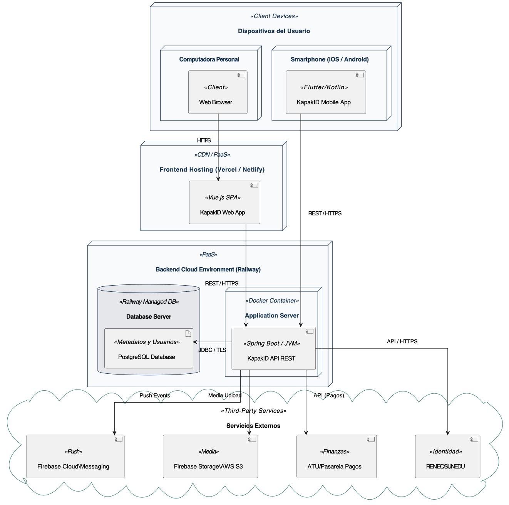

#### Descripción de los Nodos de Despliegue

La arquitectura se divide en cuatro entornos físicos/virtuales principales:

**1. Client Devices (Dispositivos del Usuario)**
Representa los entornos finales desde donde los usuarios interactúan con KapakID.
* **Smartphone (iOS / Android):** Dispositivos móviles donde se ejecuta la *KapakID Mobile App* (desarrollada en Flutter/Kotlin). Se comunica directamente con la API en la nube a través de peticiones **REST / HTTPS**.
* **Computadora Personal:** Equipos de escritorio o laptops donde el usuario utiliza un navegador web estándar (*Web Browser*) para acceder a la plataforma mediante protocolo seguro **HTTPS**.

**2. Frontend Hosting (CDN / PaaS)**
Entorno en la nube (proveedores como **Vercel o Netlify**) optimizado para el alojamiento y la distribución rápida de contenido estático global.
* Aloja la **KapakID Web App**, la cual está construida como una *Single Page Application (SPA)* utilizando **Vue.js**. Desde aquí, la aplicación web realiza llamadas asíncronas (**REST / HTTPS**) hacia el servidor backend.

**3. Backend Cloud Environment (PaaS - Railway)**
Es el núcleo de procesamiento y almacenamiento de la plataforma, desplegado de manera ágil utilizando la infraestructura como servicio de **Railway**. Se compone de dos nodos fuertemente cohesionados:
* **Application Server:** Un contenedor Docker que encapsula el entorno de ejecución (JVM) para la **KapakID API REST** (construida con Spring Boot). Este nodo centraliza la lógica de negocio y enruta las solicitudes.
* **Database Server:** Una instancia de base de datos gestionada (Managed DB) de **PostgreSQL**, encargada de persistir metadatos de documentos, información de usuarios e historial de pagos. La comunicación entre la API y la base de datos se realiza de forma interna y encriptada mediante **JDBC / TLS**.

**4. Third-Party Services (Servicios Externos)**
Representa el ecosistema de APIs e integraciones de terceros que KapakID consume para externalizar responsabilidades críticas, conectándose siempre mediante **API / HTTPS**:
* **Firebase Cloud Messaging (Push):** Motor encargado de despachar notificaciones push a los smartphones (ej. alertas de vencimiento).
* **Firebase Storage / AWS S3 (Media):** Buckets de almacenamiento en la nube donde se guardan físicamente los documentos subidos por el usuario de forma segura.
* **ATU / Pasarelas de Pagos (Finanzas):** Entidades financieras y de transporte con las que se interactúa para validar saldos y procesar recargas.
* **RENIEC / SUNEDU (Identidad):** Entidades gubernamentales peruanas consultadas para validar la autenticidad de los documentos (DNI, carné universitario) ingresados a la plataforma.

### 2.6. Tactical-Level Domain-Driven Design
#### 2.6.x. Bounded Context: <Nombre del Bounded Context>
- **2.6.x.1. Domain Layer**
- **2.6.x.2. Interface Layer**
- **2.6.x.3. Application Layer**
- **2.6.x.4. Infrastructure Layer**
- **2.6.x.5. Bounded Context Software Architecture Component Level Diagrams**
- **2.6.x.6. Bounded Context Software Architecture Code Level Diagrams**
    - 2.6.x.6.1. Bounded Context Domain Layer Class Diagrams
    - 2.6.x.6.2. Bounded Context Database Design Diagram
---
### 2.6. Tactical-Level Domain-Driven Design
#### 2.6.1. Bounded Context: <Documents>

Este Bounded Context es responsable de la gestión integral de los documentos de identidad y universitarios del usuario dentro de la aplicación móvil KapakID. Su enfoque principal radica en el almacenamiento seguro, la verificación de los archivos y, crucialmente para el entorno móvil, la gestión de la caché y persistencia local para garantizar la disponibilidad de los documentos en modo offline.

- **2.6.1.1. Domain Layer**

La capa de dominio contiene el núcleo del negocio y las reglas fundamentales para la gestión de documentos. Aquí se definen las entidades, objetos de valor y raíces de agregación sin depender de ninguna tecnología de persistencia o framework externo.

| Tipo              | Nombre                | Descripción |
|-------------------|-----------------------|-------------|
| Entity            | Document              | Representa el archivo físico o digital subido por el usuario (ej. carnet universitario, DNI) y su metadata base. |
| Entity            | DocumentCache         | Representa el estado de almacenamiento local del documento en el dispositivo móvil para habilitar el soporte offline. |
| Value Object      | DocumentId            | Identificador único e inmutable del documento. |
| Value Object      | DocumentStatus        | Define el estado de verificación del documento (ej. Pending, Verified, Rejected, Expired). |
| Value Object      | FileUrl               | Ruta o enlace de acceso seguro donde se aloja el archivo físico en la nube o en el almacenamiento local. |
| Aggregate Root    | DocumentRecord        | Entidad principal que agrupa el Document y su DocumentCache, asegurando la consistencia entre el estado en la nube y el estado en el dispositivo. |

- **2.6.1.2. Interface Layer**

Esta capa actúa como el punto de entrada a la lógica de la aplicación. En el contexto de la aplicación móvil y su conexión con el backend, gestiona cómo se reciben las peticiones (ej. desde las pantallas de UI) y cómo se devuelven los datos mediante el uso de DTOs (Data Transfer Objects).

| Componente       | Nombre                      | Descripción |
|------------------|-----------------------------|-------------|
| Controller / API | DocumentController          | Expone los endpoints RESTful para subir, actualizar, consultar y sincronizar los documentos del usuario. |
| DTO              | DocumentUploadResource      | Objeto que transporta los datos necesarios desde la aplicación móvil para registrar un nuevo documento. |
| DTO              | DocumentResponseResource    | Objeto que devuelve la información consolidada de un documento, formateada para ser consumida por la interfaz de usuario. |
| DTO              | CacheSyncResource           | Transporta los metadatos necesarios para validar si la caché local de la aplicación móvil está desactualizada respecto al servidor. |

- **2.6.1.3. Application Layer**

La capa de aplicación orquesta los casos de uso del sistema. No contiene reglas de negocio, sino que coordina tareas, delegando el trabajo a los objetos de dominio y a los servicios de infraestructura mediante comandos y consultas (CQRS).

| Componente          | Nombre                        | Descripción |
|---------------------|-------------------------------|-------------|
| Command             | UploadDocumentCommand         | Comando que encapsula la intención de subir un nuevo documento para su validación. |
| Command             | SyncDocumentCacheCommand      | Comando ejecutado por la app móvil para descargar y guardar un documento localmente y permitir su lectura offline. |
| Query               | GetDocumentByIdQuery          | Consulta para recuperar los detalles de un documento específico. |
| Application Service | DocumentCommandService        | Orquesta el flujo de operaciones transaccionales de escritura, como la subida, actualización de estado o eliminación de un documento. |
| Application Service | DocumentQueryService          | Coordina las operaciones de lectura, obteniendo los datos solicitados de forma optimizada. |

- **2.6.1.4. Infrastructure Layer**

Esta capa proporciona las implementaciones técnicas concretas para las interfaces definidas en el dominio. Se encarga de la persistencia de datos (tanto en la nube como en el móvil) y la comunicación con servicios externos.

| Componente       | Nombre                    | Descripción |
|------------------|---------------------------|-------------|
| Repository       | DocumentRepository        | Implementación de la persistencia de la metadata de los documentos, comunicándose con la base de datos principal (ej. PostgreSQL o MySQL). |
| Repository       | LocalCacheRepository      | Gestión de la persistencia local en el dispositivo móvil (utilizando tecnologías como Room para bases de datos SQLite) para brindar el soporte offline. |
| External Service | CloudStorageService       | Integración con un proveedor de almacenamiento en la nube (ej. AWS S3, Firebase Storage) para alojar y recuperar los archivos de manera segura. |

- **2.6.1.5. Bounded Context Software Architecture Component Level Diagrams**

- **2.6.1.6. Bounded Context Software Architecture Code Level Diagrams**
    - 2.6.1.6.1. Bounded Context Domain Layer Class Diagrams
        - El diagrama de clases de la capa de dominio representa el núcleo lógico del Bounded Context de Documents. En este nivel, la estructura se centra exclusivamente en las reglas de negocio y los modelos conceptuales, permaneciendo agnóstica a cualquier tecnología de persistencia o infraestructura externa. En este diagrama se pueden identificar los siguientes elementos clave:

            * <strong>DocumentRecord (Aggregate Root):</strong> Actúa como la puerta de entrada para todas las operaciones del contexto. Es el encargado de mantener la integridad y consistencia entre la información del documento y su estado de sincronización local.

            * <strong>Entidades (Entities):</strong> Se definen Document, que encapsula los atributos dinámicos del archivo (estado y URL), y DocumentCache, que es fundamental para la estrategia móvil de KapakID, ya que gestiona la disponibilidad del documento sin conexión a internet.

            * <strong>Objetos de Valor (Value Objects):</strong> Se utilizan para representar atributos inmutables que definen características del dominio, como DocumentStatus (para el flujo de validación), DocumentType (para categorizar carnets, DNI o tarjetas) y FileUrl.

            * <strong>DocumentRepository (Interface):</strong> Se incluye la interfaz del repositorio, la cual define el contrato para la persistencia del agregado, permitiendo que la capa de dominio se comunique con la infraestructura mediante la inversión de dependencias.
            
             

    

    - 2.6.1.6.2. Bounded Context Database Design Diagram
        - El diseño de la base de datos para el contexto de Documents ha sido proyectado para soportar tanto la integridad de la información en la nube como la eficiencia en el acceso local desde dispositivos móviles. El esquema sigue una estructura normalizada que facilita el seguimiento del ciclo de vida de cada documento cargado por el usuario. El diagrama se compone de las siguientes tablas principales:

            * <strong>Tabla documents:</strong> Es la entidad central de persistencia. Almacena la metadata crítica, incluyendo el user_id para la trazabilidad, el tipo de documento y el estado actual del proceso de verificación. Esta tabla sirve como la "fuente de verdad" para el perfil digital del usuario.

            * <strong>Tabla document_caches:</strong> Diseñada específicamente para optimizar la experiencia móvil. Registra la ubicación física de los archivos en el almacenamiento interno del smartphone (local_path) y marca si el documento está listo para ser visualizado en modo offline, además de registrar la fecha de la última sincronización.

            * <strong>Tabla external_validations:</strong> Funciona como un historial de auditoría e integración. Cada vez que KapakID interactúa con sistemas externos (como RENIEC o SUNEDU), se registra el resultado de la validación, el proveedor consultado y la respuesta obtenida. Esto permite una trazabilidad completa en caso de errores de verificación o auditorías de seguridad.
            
             

    

---

---
#### 2.6.2. Bounded Context Notifications: <Notifications>

Este Bounded Context es responsable de centralizar y gestionar todas las comunicaciones salientes hacia los usuarios de KapakID. En el ecosistema móvil, su rol principal es la administración de los tokens de dispositivos (para enviar notificaciones Push) y el registro del historial de alertas sobre vencimiento de documentos, validaciones de identidad y saldos de transporte.

##### 2.6.2.1. Domain Layer

La capa de dominio encapsula las reglas de negocio sobre cómo, cuándo y a quién se envían los mensajes, asegurando que la estructura de la notificación sea válida antes de intentar su despacho.

| Tipo | Nombre | Descripción |
| :--- | :--- | :--- |
| **Entity** | `Notification` | Representa el mensaje en sí (título, cuerpo, fecha de creación) y su estado de lectura. |
| **Entity** | `UserDevice` | Representa el dispositivo móvil del usuario, almacenando el token necesario para recibir notificaciones Push. |
| **Value Object** | `NotificationId` | Identificador único de la notificación. |
| **Value Object** | `NotificationType` | Define el canal de entrega (ej. PUSH, EMAIL, SMS). |
| **Value Object** | `NotificationStatus` | Define el estado de la entrega (ej. PENDING, SENT, FAILED, READ). |
| **Aggregate Root** | `NotificationRecord` | Entidad raíz que asocia el dispositivo del usuario con el historial de notificaciones que se le han enviado. |

##### 2.6.2.2. Interface Layer

Esta capa maneja las peticiones que llegan desde la aplicación móvil KapakID, principalmente para registrar el dispositivo para alertas Push y consultar el buzón de notificaciones.

| Componente | Nombre | Descripción |
| :--- | :--- | :--- |
| **Controller / API** | `NotificationController` | Expone endpoints REST para registrar tokens de dispositivos y obtener el historial de alertas. |
| **DTO** | `DeviceTokenResource` | Objeto que recibe el token generado por el sistema operativo móvil (FCM/APNs) al iniciar sesión. |
| **DTO** | `NotificationInboxResource` | Objeto que devuelve la lista de notificaciones formateada para la bandeja de entrada de la app. |

##### 2.6.2.3. Application Layer

Orquesta los flujos de comunicación. Recibe comandos desde otros Bounded Contexts (ej. cuando Documents avisa que un DNI fue rechazado) y coordina el envío.

| Componente | Nombre | Descripción |
| :--- | :--- | :--- |
| **Command** | `RegisterDeviceCommand` | Comando que indica la intención de vincular un token Push a un usuario. |
| **Command** | `DispatchNotificationCommand` | Comando interno para construir y encolar un mensaje para su envío. |
| **Query** | `GetUnreadNotificationsQuery` | Consulta para cargar la burbuja roja de notificaciones no leídas en la app móvil. |
| **Application Service** | `NotificationCommandService` | Orquesta el guardado del mensaje y delega el envío físico a la infraestructura. |

##### 2.6.2.4. Infrastructure Layer

Se encarga de la comunicación con los proveedores externos de mensajería y la base de datos de historial.

| Componente | Nombre | Descripción |
| :--- | :--- | :--- |
| **Repository** | `NotificationRepository` | Implementación para guardar el historial de mensajes en la base de datos PostgreSQL. |
| **External Service** | `FirebaseMessagingAdapter` | Integración con Firebase Cloud Messaging (FCM) para disparar las notificaciones Push nativas a iOS y Android. |
| **External Service** | `EmailServiceAdapter` | Integración con servicios SMTP (ej. SendGrid o AWS SES) para enviar correos formales. |

##### 2.6.2.5. Bounded Context Software Architecture Component Level Diagrams

Este diagrama de nivel de componentes detalla la estructura interna del microservicio de Notificaciones. Al tratarse de un sistema con enfoque móvil, este componente se encarga de recibir los tokens generados por los dispositivos (iOS/Android) y orquestar el envío de alertas utilizando servicios externos especializados en mensajería Push y correo electrónico.

##### 2.6.2.6. Bounded Context Software Architecture Code Level Diagrams
###### 2.6.2.6.1. Bounded Context Domain Layer Class Diagrams
El diagrama de clases para el contexto de Notifications modela la relación entre los dispositivos móviles y los mensajes. El NotificationRecord actúa como Aggregate Root garantizando que no se envíen notificaciones a dispositivos no registrados. Se destaca la entidad UserDevice, que es crítica en el desarrollo móvil para almacenar el identificador de notificaciones push (Device Token). Además, se incluyen los Value Objects que tipifican el estado del envío (NotificationStatus) y el canal (NotificationType).

    
###### 2.6.3.6.2. Bounded Context Database Design Diagram

El diseño de base de datos para este contexto es altamente transaccional y optimizado para lecturas rápidas, dado que la bandeja de notificaciones se consulta constantemente desde la app móvil. La tabla user_devices es el núcleo de la integración móvil, almacenando los tokens de Firebase/APNs. La tabla notifications funciona como el historial inmutable de alertas, mientras que notification_templates permite estandarizar los mensajes recurrentes (ej. "Su documento [Documento] ha sido validado con éxito").

#### 2.6.3. Bounded Context Transportation: <Transportation>

El Bounded Context de Transport es el encargado de gestionar la integración de KapakID con los sistemas de movilidad urbana y servicios financieros. Su responsabilidad principal es permitir que el usuario (Estudiante o Padre de Familia) vincule sus tarjetas físicas (Metropolitano, Lima Pass, carnets universitarios con chip) al ecosistema móvil, consulte saldos en tiempo real y ejecute recargas seguras mediante pasarelas de pago.

##### 2.6.3.1. Domain Layer

  La capa de dominio contiene la lógica pura del negocio de transporte y finanzas personales, asegurando la integridad de los saldos y la validez de las tarjetas antes de cualquier operación.

| Tipo | Nombre | Descripción |
| :--- | :--- | :--- |
| **Aggregate Root** | `TransportCard` | Entidad raíz que representa la tarjeta vinculada; controla el acceso al saldo y las transacciones. |
| **Entity** | `CardBalance` | Representa el saldo monetario disponible, gestionando las reglas de actualización y moneda. |
| **Entity** | `TransitTransaction` | Registro inmutable de cada evento (consumo de pasaje o recarga de saldo). |
| **Value Object** | `CardId` | Identificador único interno generado por KapakID para la gestión de la tarjeta. |
| **Value Object** | `CardNumber` | Representación segura y validada del número físico de la tarjeta. |
| **Value Object** | `MoneyAmount` | Encapsula el valor numérico y el tipo de moneda (PEN) para evitar errores de precisión. |
| **Value Object** | `CardType` | Define si la tarjeta es universitaria, general, de transporte o bancaria. |

##### 2.6.3.2. Interface Layer

  Gestiona la comunicación entre la aplicación móvil y el backend, transformando los datos de la interfaz en comandos y consultas procesables.

| Componente | Nombre | Descripción |
| :--- | :--- | :--- |
| **Controller** | `TransportCardController` | Endpoints para el registro, listado y desvinculación de tarjetas. |
| **Controller** | `BalanceController` | Endpoints para la consulta de saldos y ejecución de procesos de recarga. |
| **DTO** | `LinkCardRequest` | Datos enviados por el móvil para asociar una nueva tarjeta (número y tipo). |
| **DTO** | `BalanceResponse` | Datos formateados que devuelven el saldo y la última fecha de sincronización al usuario. |
##### 2.6.3.3. Application Layer

  Orquesta los casos de uso específicos del transporte, como la validación externa de saldos y la coordinación de pagos bancarios.

| Componente | Nombre | Descripción |
| :--- | :--- | :--- |
| **Command** | `RegisterCardCommand` | Procesa la solicitud inicial de vinculación de una tarjeta al perfil. |
| **Command** | `ProcessTopUpCommand` | Coordina el flujo de pago con el banco y la posterior actualización del saldo en la tarjeta. |
| **Query** | `FetchCardDetailsQuery` | Obtiene la información completa y el historial de una tarjeta específica. |
| **Application Service** | `TransportCommandService` | Maneja la lógica transaccional de escritura para tarjetas y saldos. |

##### 2.6.3.4. Infrastructure Layer

  Implementa la comunicación técnica con los sistemas externos y la persistencia de datos en la base de datos central.

| Componente | Nombre | Descripción |
| :--- | :--- | :--- |
| **Repository** | `TransportCardRepository` | Implementación JPA/Hibernate para persistir las tarjetas y transacciones. |
| **Adapter** | `AtuApiAdapter` | Cliente técnico que se conecta a los servicios de la ATU para validar saldos reales. |
| **Adapter** | `BankPaymentAdapter` | Adaptador para la integración con pasarelas de pago (Niubiz/Izipay) para recargas. |

##### 2.6.3.5. Bounded Context Software Architecture Component Level Diagrams
  
  Este diagrama de componentes ilustra la estructura interna del contenedor Transport Service. La interacción comienza en el Transport Controller, que recibe las peticiones desde la aplicación móvil a través del API Gateway.

  La lógica central es orquestada por el Transport Application Service, el cual coordina el flujo de las operaciones apoyándose en tres pilares:

  - El Transport Repository para persistir los saldos en la base de datos.

  - El ATU Integration Adapter para consultar el estado real de la tarjeta en el sistema del Metropolitano.

  - El Payment Gateway Adapter para procesar los cobros de las recargas con las entidades bancarias.

##### 2.6.3.6. Bounded Context Software Architecture Code Level Diagrams
###### 2.6.3.6.1. Bounded Context Domain Layer Class Diagrams
    
  El diagrama de clases de dominio ha sido diseñado siguiendo los principios tácticos de DDD, centrando la lógica en el Aggregate Root TransportCard. A diferencia de un modelo tradicional, aquí las conexiones representan propiedad y límites de consistencia: las entidades CardBalance y TransitTransaction son gestionadas exclusivamente por la raíz, garantizando que el saldo nunca se modifique sin un registro transaccional previo.

  Se han implementado Value Objects como MoneyAmount y CardNumber para encapsular lógica de validación y formato (como el enmascaramiento por seguridad), asegurando que los objetos de dominio sean "ricos" en comportamiento y no simples contenedores de datos.

  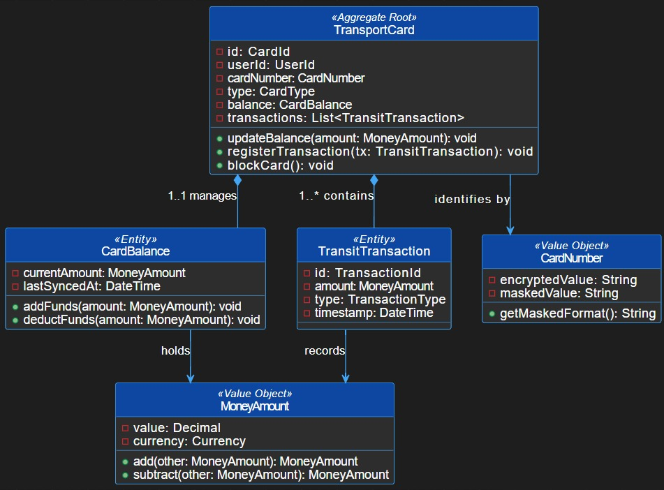
###### 2.6.3.6.2. Bounded Context Database Design Diagram
    
  El diseño físico de la base de datos refleja la estructura del dominio, garantizando la integridad referencial y la trazabilidad financiera. La tabla principal transport_cards actúa como el eje central, mientras que card_balances permite un acceso rápido al saldo actual sin necesidad de recalcular todo el historial.

  La tabla transit_transactions funciona como un libro mayor (ledger) inmutable, registrando cada recarga y consumo con su respectivo código de referencia bancaria o de transporte, lo cual es vital para la resolución de disputas y auditoría de cumplimiento (Compliance).

  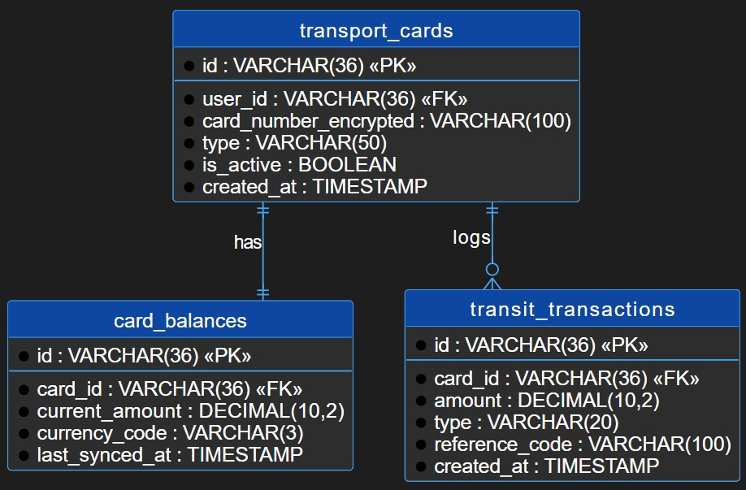

#### 2.6.4. Bounded Context: <>

#### 2.6.5. Bounded Context: <>

## Capítulo III: Solution UI/UX Design

### 3.1. Product design
#### 3.1.1. Style Guidelines
- **3.1.1.1. General Style Guidelines**
#### 3.1.2. Information Architecture
- **3.1.2.1. Organization Systems**
- **3.1.2.2. Labelling Systems**
- **3.1.2.3. SEO Tags and Meta Tags**
- **3.1.2.4. Searching Systems**
- **3.1.2.5. Navigation Systems**
#### 3.1.3. Landing Page UI Design
- **3.1.3.1. Landing Page Wireframe**
- **3.1.3.2. Landing Page Mock-up**
#### 3.1.4. Mobile Applications UX/UI Design
- **3.1.4.1. Mobile Applications Wireframes**
- **3.1.4.2. Mobile Applications Wireflow Diagrams**
- **3.1.4.3. Mobile Applications Mock-ups**
- **3.1.4.4. Mobile Applications User Flow Diagrams**
- **3.1.4.5. Mobile Applications Prototyping**

---

## Capítulo IV: Product Implementation & Validation

### 4.1. Software Configuration Management
#### 4.1.1. Software Development Environment Configuration
#### 4.1.2. Source Code Management
#### 4.1.3. Source Code Style Guide & Conventions
#### 4.1.4. Software Deployment Configuration

### 4.2. Landing Page & Mobile Application Implementation
#### 4.2.1. Sprint n
- **4.2.1.1. Sprint Planning n**
- **4.2.1.2. Sprint Backlog n**
- **4.2.1.3. Development Evidence for Sprint Review**
- **4.2.1.4. Testing Suite Evidence for Sprint Review**
- **4.2.1.5. Execution Evidence for Sprint Review**
- **4.2.1.6. Services Documentation Evidence for Sprint Review**
- **4.2.1.7. Software Deployment Evidence for Sprint Review**
- **4.2.1.8. Team Collaboration Insights during Sprint**

### 4.3. Validation Interviews
#### 4.3.1. Diseño de Entrevistas
#### 4.3.2. Registro de Entrevistas
#### 4.3.3. Evaluaciones según heurísticas

---

## Conclusiones y recomendaciones

## Video App Validation
- [Video About the product](#)
- [Video About the team](#)

## Glosario

## Bibliografía

## Anexos
