<!--* caratula -->

<div align="center">

# Informe Trabajo Final 📙


### Universidad Peruana de Ciencias Aplicadas ♨️

🧑‍💻 Ingeniería de software - 2026-10

**Sección:** 3690

**Docente:** Jorge Luis Mayta Guillermo

**StartUp:** F1nTrack

**Producto:** KapakID

<div align='left'>	

~~~C#
static string[] Integrantes() {
    return new string[] {
        "🧑‍💻 Villanueva Andrade, Ysaac Ligorio - U20231C168",
        "👩‍💻 Tasayco Osorio, Raul Hiroshi - U202319415",
        "👩‍💻 Vega Coronado, Fabricio Samir - U202317000",
        "👩‍💻 Tasayco Almonacid, Rafael Augusto - U20231F226",
        "👩‍💻 Quiroz Zambrano, Fabrizio Javier - u202213406", 
    };
}
~~~


## Registro de Versiones del Informe

| Versión | Fecha        | Autor              | Descripción |
| :---    | :---         | :---               | :---        |
| 1.0     | [20/04/2026] | [Raul Tasayco]     | Inclusión de los segmentos objetivo, planificación y registro de las entrevistas, historias de usuario, diseño de la arquitectura de software y el *Bounded Context* de Resource. |
| 1.1     | [21/04/2026] | [Fabrizio Quiroz]  | Creación de las declaraciones de hipótesis *Lean UX*, perfiles de usuario (*User Personas*), mapas de empatía, historias de usuario, *Bounded Context Canvases* y los *Bounded Contexts* de IAM y Profiles. |
| 1.2     | [22/04/2026] | [Fabricio Vega]    | Desarrollo del análisis de la competencia, historias de usuario, lenguaje ubicuo, *Product Backlog*, diagramas de despliegue arquitectónico y los *Bounded Contexts* de Planning y Monitoring. |
| 1.3     | [23/04/2026] | [Ysaac Villanueva] | Redacción de los *Problem Statements* y *Assumptions* de *Lean UX*, historias de usuario, *Context Mapping*, mapeo de escenarios *As-Is/To-Be* y los *Bounded Contexts* de Analytics y Subscriptions. |
| 1.4     | [24/04/2026] | [Rafael Tasayco]   | Integración del *Lean UX Canvas*, evaluación de competidores, evidencia de entrevistas, *Impact Mapping*, historias de usuario, dinámica de *Event Storming* y el *Bounded Context* de Resource. |
## Project Report Collaboration Insights

### Hito TB1 - Fundamentos y Diseño de Arquitectura (Semanas 1 - 4)

Durante esta fase inicial, el equipo se enfocó en asentar las bases del producto y diseñar la arquitectura técnica de KapakID. Los entregables consolidados en este hito incluyeron:

* **Estructura base:** Creación de la carátula, registro de versiones y la tabla de contenidos.
* **Capítulo I (Presentación):** Definición del perfil de la startup (F1nTrack), la propuesta de valor de KapakID, los perfiles del equipo y la delimitación de los segmentos objetivo (estudiantes y padres de familia).
* **Capítulo II (Requirements & Software Design):** * Análisis exhaustivo de competidores y ejecución de entrevistas de validación.
    * Elaboración del Needfinding (User Personas, Task Matrix, Journey Mapping).
    * Diseño a Nivel Estratégico y Táctico utilizando *Domain-Driven Design (DDD)*, incluyendo el Bounded Context Canvas, Context Mapping y diagramas C4 (Contexto, Contenedores, Componentes y Base de Datos) para los contextos clave como Identity (IAM) y Documents.

### Distribución de Esfuerzos (Commits)

La carga de trabajo se distribuyó de manera equitativa, logrando aportes sustanciales de cada integrante en sus respectivas áreas asignadas (investigación, redacción técnica y diagramación):

* **Fabricio Samir Vega Coronado:** 2 commits
* **Raul Hiroshi Tasayco Osorio:** 18 commits
* **Rafael Augusto Tasayco Almonacid:** 5 commits
* **Ysaac Ligorio Villanueva Andrade:** 3 commits
* **Fabrizio Javier Quiroz Zambrano:** 11 commits

**Total de commits en la fase TB1:** 39

### Evidencia Gráfica (GitHub Insights)

A continuación, se adjuntan las capturas del panel de *Insights / Contributors* de nuestro repositorio en GitHub, las cuales respaldan el trabajo colaborativo del equipo durante este hito:

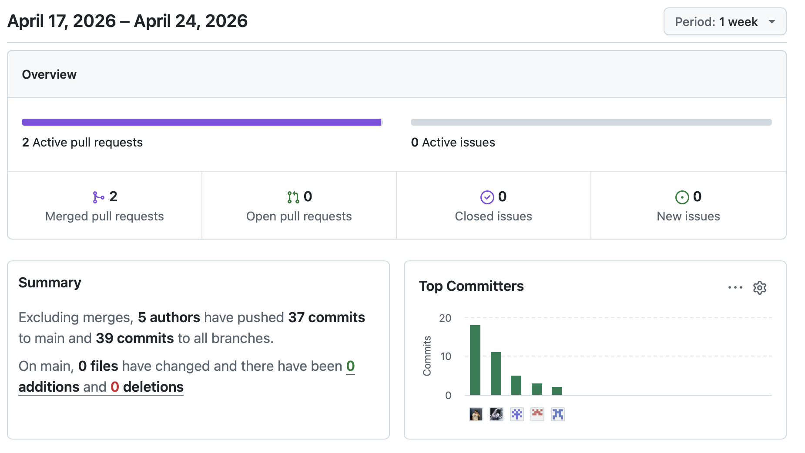

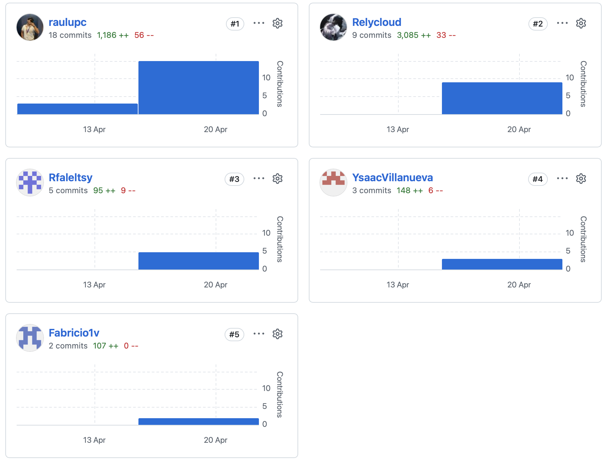

---

## Contenido
- [Student Outcome](#student-outcome)
- [Objetivos SMART](#objetivos-smart)
- [Capítulo I: Presentación](#capítulo-i-presentación)
    - [1.1. Startup Profile](#11-startup-profile)
    - [1.2. Solution Profile](#12-solution-profile)
    - [1.3. Segmentos objetivo](#13-segmentos-objetivo)
- [Capítulo II: Requirements Development and Software Solution Design](#capítulo-ii-requirements-development-and-software-solution-design)
    - [2.1. Competidores](#21-competidores)
    - [2.2. Entrevistas](#22-entrevistas)
    - [2.3. Needfinding](#23-needfinding)
    - [2.4. Requirements specification](#24-requirements-specification)
    - [2.5. Strategic-Level Domain-Driven Design](#25-strategic-level-domain-driven-design)
    - [2.6. Tactical-Level Domain-Driven Design](#26-tactical-level-domain-driven-design)
- [Capítulo III: Solution UI/UX Design](#capítulo-iii-solution-uiux-design)
    - [3.1. Product design](#31-product-design)
- [Capítulo IV: Product Implementation & Validation](#capítulo-iv-product-implementation--validation)
    - [4.1. Software Configuration Management](#41-software-configuration-management)
        - [4.1.1 Software Development Environment Configuration](#411-software-development-environment-configuration)
        - [4.1.2 Source Code Management](#412-source-code-management)
        - [4.1.3 Source Code Style Guide & Conventions](#413-source-code-style-guide--conventions)
        - [4.1.4 Software Deployment Configuration](#414-software-deployment-configuration)
    - [4.2. Landing Page & Mobile Application Implementation](#42-landing-page--mobile-application-implementation)
        - [4.2.1 Sprint 1](#421-sprint-1)
            - [4.2.1.1 Sprint Planning 1](#4211-sprint-planning-1)
            - [4.2.1.2 Sprint Backlog 1](#4212-sprint-backlog-1)
            - [4.2.1.3 Development Evidence for Sprint Review](#4213-development-evidence-for-sprint-review)
            - [4.2.1.4 Testing Suite Evidence for Sprint Review](#4214-testing-suite-evidence-for-sprint-review)
            - [4.2.1.5 Execution Evidence for Sprint Review](#4215-execution-evidence-for-sprint-review)
            - [4.2.1.6 Services Documentation Evidence for Sprint Review](#4216-services-documentation-evidence-for-sprint-review)
            - [4.2.1.7 Software Deployment Evidence for Sprint Review](#4217-software-deployment-evidence-for-sprint-review)
            - [4.2.1.8 Team Collaboration Insights during Sprint](#4218-team-collaboration-insights-during-sprint)
        - [4.2.2 Sprint 2](#422-sprint-2)
            - [4.2.2.1 Sprint Planning 2](#4221-sprint-planning-2)
            - [4.2.2.2 Sprint Backlog 2](#4222-sprint-backlog-2)
            - [4.2.2.3 Development Evidence for Sprint Review](#4223-development-evidence-for-sprint-review)
            - [4.2.2.4 Testing Suite Evidence for Sprint Review](#4224-testing-suite-evidence-for-sprint-review)
            - [4.2.2.5 Execution Evidence for Sprint Review](#4225-execution-evidence-for-sprint-review)
            - [4.2.2.6 Services Documentation Evidence for Sprint Review](#4226-services-documentation-evidence-for-sprint-review)
            - [4.2.2.7 Software Deployment Evidence for Sprint Review](#4227-software-deployment-evidence-for-sprint-review)
            - [4.2.2.8 Team Collaboration Insights during Sprint](#4228-team-collaboration-insights-during-sprint)
        - [4.2.3 Sprint 3](#423-sprint-3)
            - [4.2.3.1 Sprint Planning 3](#4231-sprint-planning-3)
            - [4.2.3.2 Sprint Backlog 3](#4232-sprint-backlog-3)
            - [4.2.3.3 Development Evidence for Sprint Review](#4233-development-evidence-for-sprint-review)
            - [4.2.3.4 Testing Suite Evidence for Sprint Review](#4234-testing-suite-evidence-for-sprint-review)
            - [4.2.3.5 Execution Evidence for Sprint Review](#4235-execution-evidence-for-sprint-review)
            - [4.2.3.5 Execution Evidence for Sprint Review](#4235-execution-evidence-for-sprint-review)
            - [4.2.3.6 Services Documentation Evidence for Sprint Review](#4236-services-documentation-evidence-for-sprint-review)
            - [4.2.3.7 Software Deployment Evidence for Sprint Review](#4237-software-deployment-evidence-for-sprint-review)
            - [4.2.3.8 Team Collaboration Insights during Sprint](#4238-team-collaboration-insights-during-sprint)
    - [4.3. Validation Interviews](#43-validation-interviews)
        - [4.3.1 Diseño de Entrevistas](#431-diseño-de-entrevistas)
        - [4.3.2 Registro de Entrevistas](#432-registro-de-entrevistas)
        - [4.3.3 Evaluaciones según heurísticas](#433-evaluaciones-según-heurísticas)
- [Conclusiones y Recomendaciones](#conclusiones-y-recomendaciones)
- [Video App Validation](#video-app-validation)
- [Glosario](#glosario)
- [Bibliografía](#bibliografía)
- [Anexos](#anexos)

---

## Student Outcome
*(Ver anexo A)*

| Criterio específico | Acciones realizadas (AV1, TP1, TB2, TF1) | Conclusión |
|---|---|---|
| **Trabaja en equipo para proporcionar liderazgo en forma conjunta** | **Fabricio Vega – AV1:** Alineó investigación, diseñó lineamientos visuales y arquitectura de información. <br> **TP1:** <br> **TF1:** <br><br> **Raúl Tasayco – AV1:** Organizó repositorios, fechas y tareas. <br> **TP1:** <br> **TB2:** <br> **TF1:** <br><br> **Ysaac Ligorio – AV1:** Gestionó SDCM/SCM, control de versiones y despliegues. <br> **TP1:** <br> **TB2:** <br> **TF1:** <br><br> **Rafael Tasayco – AV1:** Lideró el análisis de requerimientos funcionales y la propuesta de valor. <br> **TP1:** <br> **TB2:** <br> **TF1:** <br><br> **Fabrizio Quiroz – AV1:** Fortaleció el trabajo colaborativo y la integración de módulos documentales. <br> **TP1:** <br> **TB2:** <br> **TF1:** | **El equipo mantuvo un liderazgo distribuido y coordinado durante todas las entregas. En AV1 se consolidó un liderazgo maduro, logrando integrar diseño, Front-End, Back-End y documentación en un producto final cohesionado.** |
| **Crea un entorno colaborativo e inclusivo, establece metas, planifica tareas y cumple objetivos** | **Fabricio Vega – AV1:** Definió metas claras y prioridades del MVP. <br> **TP1:** <br> **TB2:** <br> **TF1:** <br><br> **Raúl – AV1:** Planificó tareas por semanas y definió segmentos de mercado. <br> **TP1:** <br> **TB2:** <br> **TF1:** <br><br> **Ysaac Ligorio – AV1:** Estableció el entorno de trabajo en GitHub y políticas de contribución. <br> **TP1:** <br> **TB2:** <br> **TF1:** <br><br> **Rafael Tasayco – AV1:** Participó en definición estratégica del producto y casos de uso. <br> **TP1:** <br> **TB2:** <br> **TF1:** <br><br> **Fabrizio – AV1:** Revisó entregables intermedios y aseguró la calidad de los reportes. <br> **TP1:** <br> **TB2:** <br> **TF1:** | **El equipo demostró una colaboración sólida y creciente, alcanzando un entorno altamente organizado. En AV1 lograron la planificación y ejecución completa del ciclo de vida, cumpliendo objetivos y dejando el producto integrado, documentado y listo para presentación final.** |


## Objetivos SMART


- Raúl Tasayco:

    Especializarme en el desarrollo de interfaces de usuario modernas y de alto rendimiento, logrando el dominio avanzado de frameworks como Angular y Vue a través de la publicación de tres proyectos personales optimizados en buenas prácticas de maquetación y rendimiento web en el próximo año.

- Ysaac Villanueva:

    Desarrollar competencias avanzadas como Arquitecto de Software, enfocándome en el diseño técnico estratégico a través de metodologías como Domain-Driven Design (DDD), logrando liderar técnicamente la conceptualización de un ecosistema digital y su correcto mapeo modular en código antes de finalizar el próximo año académico.

- Fabricio Vega:

    Consolidar mi perfil como desarrollador Backend escalable mediante el dominio y aplicación avanzada de principios SOLID y Clean Code en entornos de producción, logrando diseñar e implementar al menos dos APIs REST robustas utilizando arquitecturas limpias y tecnologías en la nube al término de los próximos 6 meses.

- Rafael Tasayco:

    Desarrollar una sólida base técnica en seguridad de la información, enfocándome en la obtención de una certificación reconocida en la industria (como CompTIA Security+ o equivalente) en un plazo no mayor a 12 meses tras culminar el ciclo académico, orientando mi carrera profesional hacia el campo de la ciberseguridad.

- Fabrizio Quiroz:

    Construir un perfil competitivo como desarrollador Fullstack con enfoque centrado en las personas, logrando dominar herramientas modernas de frontend (Vue) y backend (SQL/Python) para conceptualizar, programar y desplegar de forma autónoma una aplicación web funcional y escalable en los próximos 8 meses.

<div style="page-break-after: always;"></div>

## Capítulo I: Presentación

<section id="startup-profile">
  <h2>1.1 Startup Profile</h2>

  <!-- 1.1.1 Descripción de la Startup -->
 <article id="descripcion-startup" aria-labelledby="descripcion-startup-title">
  <h3 id="descripcion-startup-title">1.1.1 Descripción de la Startup</h3>

  <p>
    <strong>KapakID</strong> es una startup enfocada en desarrollar soluciones
    tecnológicas para la <strong>gestión personal de documentos e identidad digital</strong>. 
    Nuestro objetivo es ayudar a los usuarios a centralizar, proteger y acceder de forma segura 
    a sus documentos esenciales desde cualquier dispositivo conectado a internet.
  </p>

  <h4>Propuesta de valor</h4>
  <ul>
    <li><strong>Seguridad:</strong> reducción del riesgo de pérdida o robo de documentos físicos.</li>
    <li><strong>Ahorro de tiempo:</strong> búsqueda rápida y consolidación de información en un solo lugar.</li>
    <li><strong>Acceso inmediato:</strong> disponibilidad de documentos en situaciones de emergencia.</li>
    <li><strong>Gestión eficiente:</strong> recordatorios automáticos para fechas de vencimiento.</li>
    <li><strong>Integración:</strong> conexión con sistemas de pago y recarga de servicios.</li>
  </ul>

  <h4>Misión</h4>
  <p>
    Proporcionar soluciones digitales accesibles e innovadoras que permitan a estudiantes, 
    profesionales y familias <strong>gestionar de forma centralizada y segura sus documentos personales</strong>, 
    facilitando el acceso, la organización y la protección de su identidad digital.
  </p>

  <h4>Visión</h4>
  <p>
    Convertirnos en la <strong>plataforma líder en gestión de documentos e identidad digital en Latinoamérica</strong>, 
    reconocida por brindar seguridad, confianza y accesibilidad, contribuyendo al bienestar 
    de las personas y al avance hacia sociedades más digitales y organizadas.
  </p>
</article>

</div>
<div align='left'>
<h3>1.1.2. Perfiles de los integrantes del grupo</h3>
<div align='center'>
   <!--TODO: integrante 1 -->
  > 🧑‍💻 <strong>Fabricio Samir Vega Coronado</strong> 
   

   <div align='center'>
     
   

   ~~~txt

   Estudiante de 7mo ciclo de Ingeniería de Software en la Universidad Peruana de Ciencias Aplicadas (UPC), con interés en el desarrollo backend y la arquitectura de aplicaciones escalables. Me enfoco en construir soluciones eficientes, aplicando buenas prácticas como Clean Code, principios SOLID y metodologías ágiles.

    Tengo experiencia académica y proyectos personales trabajando con tecnologías como C#, Python y JavaScript, así como frameworks modernos. He participado en el desarrollo de aplicaciones web y APIs REST, integrando bases de datos relacionales y no relacionales.
   ~~~

   </div>
  
   <!--TODO: integrante 2 -->
**> 🧑‍💻 <strong>Raul Hiroshi Tasayco Osorio**</strong>
   <div align='center'>

   

   ~~~txt
   Soy un estudiante de Ingeniería de Software de la Universidad Peruana de Ciencias Aplicadas (UPC),
   actualmente me encuentro cursando el 7mo ciclo de la carrera.
    
    A lo largo del tiempo que me encuentro en la carrera pude aprender diferentes tecnologías, tanto lenguajes de programación, buenas prácticas de desarrollo, estructuras de datos, finalmente Frameworks como mi Angular en el cual me desempeño en el Frontend:
      1️⃣ C++     
      2️⃣ Python  
      3️⃣ SQL     
      4️⃣ Angular & Vue   
      5️⃣ HTML,CSS & TS     
    Me considero una persona responsable, listo para trabajar en equipo brindando mi apoyo y con un fuerte compromiso con todos mis deberes. 
    
    Mis expectativas para el curso de Aplicaciones Móviles son muy altas, puesto que es un curso en el cual aprenderé diferentes habilidades tanto frontend como backend 📱
   ~~~

   </div>

   <!--TODO: integrante 3 -->
**> 🧑‍💻 <strong>Rafael Augusto Tasayco Almonacid**</strong>
   <div align='center'>
     

   ~~~txt
Soy estudiante de la carrera de Ingeniería de Software y actualmente estoy cursando el sexto ciclo de mi carrera universitaria. Entre mis hobbies se encuentran jugar básquet, disfrutar de los videojuegos y escuchar música en mis momentos libres.
Cuando culmine mis estudios, me encantaría especializarme y concentrarme en el campo de la ciberseguridad, un área que me apasiona y en la que deseo desarrollarme profesionalmente.
   ~~~
   </div>

   <!--TODO: integrante 4 -->
**> 🧑‍💻<strong>Ysaac Ligorio Villanueva Andrade**</strong>
   <div align='center'>

   
  
   ~~~txt
   Soy estudiante del 7mo ciclo de la carrera de Ingeniería de Software en la UPC. 

    Durante estos años en la universidad y ahora enfocado en el desarrollo del ecosistema KapakID, he podido ganar experiencia práctica en varias tecnologías y formas de trabajo:
      🔵Backend & APIs: C#
      🔵Arquitectura: Domain-Driven Design (DDD) y Structurizr
      🔵Bases de Datos: MySQL
      🔵Frontend Móvil: [Flutter / Kotlin / Swift]

    Como parte del equipo, me gusta ser proactivo y enfocarme en que la arquitectura que diseñamos no se quede solo en papel, sino que funcione bien y de forma ordenada en el código.

    Mis expectativas para el curso de Aplicaciones Móviles son altas. Más allá de solo programar, quiero aprender a resolver los retos reales del entorno móvil, como el manejo de datos sin internet (modo offline) y lograr que la migración de nuestra plataforma web sea un éxito.
   ~~~


   </div>
   <!--TODO: integrante 5 -->

**> 🧑‍💻 Fabrizio Javier Quiroz Zambrano (U202213406)**
   <div align='center'>

   

   ~~~txt
    Actualmente curso el sexto ciclo de Ingeniería de Software en la Universidad Peruana de Ciencias Aplicadas (UPC), donde he venido desarrollando una sólida base técnica y una visión crítica
    sobre el desarrollo de soluciones digitales. Mi formación me ha permitido explorar distintos lenguajes y herramientas, desde la lógica estructurada de C++ hasta el dinamismo de frameworks
    modernos como Angular, con los que he trabajado principalmente en el frontend. También tengo experiencia en Python y SQL, lo que me ha ayudado a comprender mejor la gestión de datos y la
    construcción de aplicaciones más completas.

    Más allá de lo técnico, me considero una persona comprometida con el aprendizaje constante, con facilidad para adaptarme a nuevos entornos y colaborar en equipo. Me gusta enfrentar desafíos
    que me obliguen a pensar fuera de lo convencional y a buscar soluciones eficientes y sostenibles.

    Tengo grandes expectativas para el curso de Aplicaciones Web, ya que representa una oportunidad para fortalecer mis habilidades en el desarrollo fullstack y familiarizarme con nuevas tecnologías
    como Vue. Estoy convencido de que este tipo de experiencias me acercan cada vez más al perfil profesional que quiero construir: uno capaz de crear software útil, escalable y centrado en las personas.
   ~~~

   </div>
   
<!-- 1.2.1 Antecedentes y problemática -->
<div align='left'>
<article id="solution-profile">

<h2>1.2. Solution profile</h2>
<article id="antecedentes-problematica">
  <h3>1.2.1 Antecedentes y problemática</h3>
  <p>
    En la actualidad, muchas personas y pequeñas empresas enfrentan dificultades al momento de 
    <strong>gestionar, proteger y acceder a sus documentos importantes</strong>. 
    La dependencia de formatos físicos, el desorden en el almacenamiento digital y la ausencia de 
    herramientas tecnológicas accesibles generan pérdida de tiempo, riesgo de extravío y 
    complicaciones en trámites que requieren información inmediata. 
  </p>
  <p>
    Frente a esta problemática surge la necesidad de contar con soluciones digitales prácticas que 
    permitan a los usuarios centralizar, resguardar y disponer de sus documentos en cualquier momento 
    y lugar, de forma segura y confiable.
  </p>

  <h4>5“W”s + 2"H"</h4>
  <ul>
    <li>
      <strong>WHAT (QUÉ):</strong>  
      El problema principal es la dificultad para gestionar documentos personales y empresariales. Muchos usuarios no tienen un sistema ordenado para guardar DNI, contratos o certificados, ocasionando retrasos administrativos. En el contexto peruano, los ciudadanos pierden múltiples horas al año debido a la burocracia y la falta de interoperabilidad digital en las instituciones públicas (Presidencia del Consejo de Ministros [PCM], 2025).
    </li>
    <br>
    <li>
      <strong>WHEN (CUÁNDO):</strong>  
      Este problema ocurre de manera frecuente, especialmente en situaciones críticas como la renovación de documentos o el acceso a información en emergencias. De acuerdo con reportes de atención al ciudadano, los procesos de renovación presencial e identificación concentran los mayores picos de insatisfacción por demoras (Defensoría del Pueblo, 2024).
    </li>
    <br>
    <li>
      <strong>WHERE (DÓNDE):</strong>  
      El problema se da en el ámbito personal y profesional en Perú. Específicamente en Lima Metropolitana, el cuello de botella se traslada a los sistemas de transporte masivo, donde los usuarios experimentan largas colas cotidianas únicamente para la recarga física de tarjetas (Autoridad de Transporte Urbano para Lima y Callao [ATU], 2025).
    </li>
    <br>
    <li>
      <strong>WHO (QUIÉN):</strong>  
      Los principales afectados son:  
      - <strong>Personas naturales</strong> que dependen de trámites frecuentes.  
      - <strong>Estudiantes y profesionales</strong> que requieren tener certificados y documentos al día.  
      - <strong>Emprendedores y pequeñas empresas</strong> que no pueden costear soluciones corporativas 
        avanzadas de gestión documental.
    </li>
    <br>
    <li>
      <strong>WHY (POR QUÉ):</strong>  
      Porque actualmente no existen herramientas accesibles y adaptadas localmente. Las soluciones disponibles en el mercado no se alinean con las entidades reguladoras de certificación nacional ni respetan de forma estricta los marcos normativos de derechos digitales locales, estipulados en la Ley N° 29733 (Ley de Protección de Datos Personales).
    </li>
    <br>
    <li>
      <strong>HOW (CÓMO):</strong>  
      La solución se plantea mediante el desarrollo de una <strong>plataforma web</strong> que:  
      - Centralice el almacenamiento digital de documentos.  
      - Brinde recordatorios automáticos para fechas de vencimiento.  
      - Permita acceso inmediato y seguro desde cualquier dispositivo.  
      - Ofrezca integración con pagos y recargas de servicios relacionados a la documentación.
    </li>
    <br>
    <li>
      <strong>HOW MUCH (CUÁNTO):</strong>  
      Contratar un gestor documental empresarial supone un costo prohibitivo. Adicionalmente, el costo de oportunidad del tiempo perdido por un ciudadano promedio de Lima haciendo filas físicas para recargar pasajes o validar carnés universitarios impacta directamente en su productividad académica y laboral, estimándose en pérdidas económicas millonarias a nivel macro (Instituto Peruano de Economía [IPE], 2024).
    </li>
  </ul>
</article>

___

### 1.2.2 Lean Ux Process
#### 1.2.2.1. Lean UX Problem Statements
 
Actualmente, las personas enfrentan grandes dificultades para gestionar y llevar consigo sus documentos personales y tarjetas, como DNI, pasaporte, tarjetas bancarias, licencias de conducir, carnés universitarios, entre otros, debido a la incomodidad de portar documentos físicos, el riesgo de pérdida o robo, y la falta de una solución digital integrada que facilite su uso y administración. Esto se debe a varios factores, como la ausencia de una plataforma centralizada para almacenar y verificar documentos, la complejidad de realizar trámites digitales como renovaciones o pagos, y la falta de acceso offline a información crítica, lo que resulta en inconvenientes, pérdida de tiempo y dificultades para gestionar trámites y pagos de manera eficiente.

Nosotros consideramos que estos usuarios necesitan una solución integral y segura que les permita centralizar, gestionar y utilizar sus documentos y tarjetas desde su celular, sin depender de llevar documentos físicos o acceder a múltiples plataformas para realizar trámites. Por ello, KapakID resuelve este problema mediante una aplicación web intuitiva desarrollada en Vue, que permite registrar y verificar documentos como DNI, pasaporte, tarjetas bancarias, licencias, carnés, certificados de vacunas, y más. Ofrece funcionalidades como recarga de tarjetas de transporte, pago de deudas, recarga de teléfono, renovación de documentos, consulta de saldos, historial de trámites y pagos, notificaciones de saldo bajo o vencimiento de documentos, modo offline para acceso limitado a documentos verificados, y una opción premium para gestionar múltiples perfiles (por ejemplo, documentos de hijos). Sabremos que hemos tenido éxito cuando los usuarios reporten una reducción significativa en el uso de documentos físicos, un aumento en la eficiencia al realizar trámites digitales, y una mejora en la satisfacción con la gestión de sus documentos y pagos dentro de los primeros tres meses de uso.

#### 1.2.2.2. Lean UX Assumptions

#### Business Outcomes :


* **🔵 Crecimiento de la Base de Usuarios** <br>


     KapakID busca atraer a personas que desean gestionar sus documentos y tarjetas de manera digital con campañas de marketing que resalten la facilidad de uso de la plataforma. Su diseño intuitivo y herramientas como el registro de DNI, pasaporte, tarjetas bancarias y notificaciones fomentarán una adopción amplia y sostenida.


* **🔵 Alta Retención de Usuarios** <br>


     Buscamos retener a los usuarios comprometidos con una experiencia fluida y funcionalidades valiosas como consulta de saldos, historial de trámites y notificaciones de vencimiento. El dashboard principal, claro y accesible, asegurará que los usuarios integren KapakID en su rutina diaria.


* **🔵 Ingresos por Suscripciones Premium** <br>


     Generaremos ingresos a través de suscripciones premium, con funciones avanzadas como soporte para múltiples perfiles (por ejemplo, para gestionar documentos de hijos). Estas herramientas motivarán a los usuarios a optar por planes pagos para una mayor comodidad en la gestión de documentos.


* **🔵 Minimización del Churn Rate** <br>


     Reducir la pérdida de usuarios es clave para KapakID. Con un dashboard principal útil y herramientas como modo offline y notificaciones de vencimiento, la plataforma ofrecerá valor continuo, manteniendo a los usuarios leales y comprometidos a largo plazo.


* **🔵 Satisfacción del Usuario (NPS)** <br>


     KapakID maximizará la satisfacción con una interfaz intuitiva y funciones prácticas como recarga de tarjetas, renovación de documentos y modo offline. La retroalimentación constante permitirá ajustar la plataforma para superar las expectativas de los usuarios.


* **🔵 Adopción de Funciones de Gestión de Documentos** <br>


     Fomentaremos el uso de herramientas para registrar y verificar documentos como DNI, pasaporte, licencias y carnés, accesibles desde el dashboard principal. Estas funcionalidades serán clave para que los usuarios reemplacen documentos físicos por la app.


* **🔵 Establecimiento de Hábitos de Gestión Digital** <br>


     Buscaremos motivar a los usuarios a gestionar trámites y pagos, como recargas de teléfono o renovación de documentos, con una interfaz sencilla y notificaciones motivadoras en el dashboard principal. Esto convertirá a KapakID en un aliado para la organización personal.


* **🔵 Optimización de Trámites Digitales** <br>


     KapakID ayudará a los usuarios a optimizar trámites con herramientas de renovación de documentos, consulta de saldos y historial de pagos, accesibles desde el dashboard principal. Notificaciones personalizadas apoyarán la eficiencia y la organización.


* **🔵 Precisión en Notificaciones de Vencimiento** <br>


     KapakID mejorará la experiencia con notificaciones precisas sobre vencimientos de documentos o saldos bajos, integradas en el dashboard principal. Esto permitirá a los usuarios planificar y actuar con anticipación.


* **🔵 Usuarios Activos en Familias** <br>


     KapakID atraerá a familias con la opción premium para gestionar múltiples perfiles, como documentos de hijos, desde un dashboard principal intuitivo. Su enfoque práctico y escalable lo convertirá en la opción ideal para la gestión documental familiar.


* **🔵 Uso de Funciones de Pago y Recarga** <br>


     KapakID promoverá el uso de herramientas para recargar tarjetas de transporte, pagar deudas y recargar teléfonos desde el dashboard principal. Esto facilitará una gestión financiera responsable y aumentará la confianza en la plataforma.


* **🔵 Asociaciones con Entidades Gubernamentales y Financieras** <br>


     KapakID establecerá alianzas con entidades gubernamentales y financieras para integrar servicios como renovación de documentos y pagos de tarjetas. Estas colaboraciones, accesibles desde el dashboard principal, enriquecerán la experiencia y el valor para los usuarios.


* **🔵 Frecuencia de Uso del Dashboard Principal** <br>


     KapakID incentivará el uso frecuente del dashboard principal, que muestra documentos, saldos, historial de trámites y notificaciones de forma clara. Su diseño atractivo asegurará que los usuarios lo consulten regularmente para gestionar sus documentos y pagos.


* **🔵 Precisión en Notificaciones de Saldo Bajo**<br>

     KapakID fortalecerá la confianza con notificaciones precisas de saldos bajos en tarjetas, integradas en el dashboard principal. Estas alertas ayudarán a los usuarios a identificar necesidades de recarga y tomar medidas rápidas.


* **🔵 Reducción de Costos de Soporte**<br>

     KapakID minimizará los costos de soporte con tutoriales interactivos y FAQs integrados en la plataforma. Esto permitirá a los usuarios resolver dudas de forma autónoma, mejorando la experiencia general.

### User Outcomes 

* **🟢 Control Documental Personal Mejorado**<br>

     Los usuarios de KapakID lograrán un mayor control sobre sus documentos personales y tarjetas, como DNI, pasaporte, licencias y carnés, al utilizar herramientas de registro y verificación digital. El dashboard principal les proporcionará una visión clara de sus documentos, saldos y trámites, permitiéndoles gestionar todo desde su celular y reducir la dependencia de documentos físicos.

* **🟢 Organización Eficiente para Familias**<br>

     Los usuarios, especialmente familias, usarán KapakID para organizar documentos de múltiples perfiles (como los de sus hijos) con la opción premium. El dashboard principal les ofrecerá una vista consolidada de documentos y trámites, ayudándoles a anticipar vencimientos y gestionar renovaciones de manera eficiente.

* **🟢 Optimización de Trámites Digitales**<br>

     Los usuarios optimizarán sus trámites con KapakID, utilizando herramientas para renovar documentos, recargar tarjetas de transporte y pagar deudas desde el dashboard principal. Esto les permitirá ahorrar tiempo, reducir la necesidad de acudir a oficinas físicas y mantener un historial organizado de sus gestiones.

* **🟢 Confianza en la Gestión de Pagos**<br>

     Los usuarios que realizan pagos encontrarán en KapakID una herramienta confiable para recargar tarjetas, pagar deudas o recargar teléfonos. Desde el dashboard principal, podrán consultar saldos y revisar el historial de pagos, tomando decisiones informadas sin comprometer su organización financiera.

* **🟢 Adopción de Gestión Documental Digital**<br>

     KapakID empoderará a los usuarios para gestionar documentos digitalmente, como DNI, pasaporte o certificados, con una interfaz sencilla y notificaciones de vencimiento en el dashboard principal. Esto les ayudará a mantenerse organizados y reducir el uso de documentos físicos con facilidad.

* **🟢 Reducción del Estrés Documental**<br>

     Los usuarios experimentarán menos estrés al gestionar documentos gracias a la claridad que ofrece el dashboard principal y las notificaciones de vencimiento o saldo bajo. Estas funcionalidades les permitirán monitorear sus documentos en tiempo real, reaccionar ante alertas y mantener el control sin esfuerzo.

* **🟢 Mayor Confianza en la Seguridad de Documentos**<br>

     KapakID aumentará la confianza de los usuarios al proporcionar un entorno seguro para almacenar y verificar documentos, con acceso offline a documentos verificados desde el dashboard principal. Esto permitirá a los usuarios sentirse protegidos y acceder a su información incluso sin conexión.

* **🟢 Experiencia de Uso Intuitiva**<br>

     Los usuarios disfrutarán de una experiencia fluida y accesible con KapakID, gracias a su interfaz intuitiva y al dashboard principal que centraliza documentos, saldos y trámites. Esto facilitará la adopción de la plataforma, incluso para aquellos con poca experiencia digital, integrándola en su rutina diaria.

* **🟢 Gestión Colaborativa de Documentos Familiares**<br>

     Las familias se beneficiarán de la opción premium de KapakID, que permite gestionar documentos de varios miembros desde el dashboard principal. Esto fomentará una organización coordinada, asegurando que todos los documentos estén centralizados y accesibles.

* **🟢 Acceso a Servicios de Trámites Externos**<br>

     A través de asociaciones con entidades gubernamentales y financieras, los usuarios de KapakID accederán a servicios como renovación de documentos o pagos directamente desde la plataforma. Esto, integrado en el dashboard principal, enriquecerá su experiencia y les proporcionará recursos adicionales para gestionar sus documentos.

* **🟢 Monitoreo Frecuente de Documentos y Pagos**<br>

     KapakID incentivará a los usuarios a monitorear sus documentos y pagos regularmente a través del dashboard principal, que presenta documentos, saldos, historial de trámites y notificaciones de forma clara. Este hábito les permitirá mantenerse informados y tomar medidas rápidas para mantener todo en orden.

* **🟢 Resolución Autónoma de Dudas**<br>

     Los usuarios resolverán dudas de manera autónoma con los tutoriales interactivos y FAQs integrados en KapakID. Esta funcionalidad reducirá la necesidad de soporte externo, permitiéndoles aprovechar al máximo la plataforma con confianza y facilidad.

* **🟢 Mayor Claridad en Trámites y Pagos**<br>

     KapakID ayudará a los usuarios a comprender mejor sus trámites y pagos mediante reportes claros en el dashboard principal. Esta claridad les permitirá ajustar sus hábitos de gestión y alinear sus decisiones con sus necesidades personales o familiares.

* **🟢 Motivación para Mantener Documentos Actualizados**<br>

     Los usuarios se sentirán motivados para mantener sus documentos actualizados con las notificaciones de vencimiento y recordatorios de KapakID, integrados en el dashboard principal. Esta funcionalidad les ayudará a mantenerse organizados y celebrar sus logros en la gestión documental.

* **🟢 Reducción de Errores en Gestión Documental**<br>

     KapakID minimizará los errores en la gestión documental al automatizar el registro de documentos y ofrecer notificaciones precisas en el dashboard principal. Esto permitirá a los usuarios evitar equivocaciones costosas y mantener registros precisos con menos esfuerzo.

#### 1.2.2.3. Lean UX Hypothesis Statements

Creemos que digitalizar y centralizar todos los documentos personales y tarjetas en KapakID facilitará la vida diaria de los usuarios al reducir la dependencia de llevar documentos físicos.

Sabremos que esto es cierto cuando los usuarios reporten un uso reducido de su billetera física para trámites o pagos cotidianos en el primer mes de uso.
___
Creemos que las notificaciones automatizadas sobre vencimientos de documentos y saldos bajos ayudarán a los usuarios a mantenerse proactivos y a evitar inconvenientes o estrés por no tener sus documentos al día.

Sabremos que esto es cierto cuando el 90% de los usuarios que reciban una notificación de vencimiento inicien el trámite de renovación directamente desde la app, y cuando el uso de la función de recarga aumente un 15% tras las alertas de saldo bajo.
___
Creemos que la función de modo offline proporcionará un valor esencial y aumentará la confianza del usuario, asegurando que siempre tengan acceso a sus documentos verificados, incluso sin conexión a internet.

Sabremos que esto es cierto cuando al menos el 20% de los usuarios acceda a la app en modo offline en un periodo de 30 días, y cuando los comentarios sobre la seguridad y la conveniencia de esta función sean consistentemente positivos.
___
Creemos que el plan premium con soporte para múltiples perfiles motivará a los usuarios a suscribirse, ya que les permitirá administrar de forma eficiente los documentos de sus hijos y otros miembros de la familia.

Sabremos que esto es cierto cuando al menos el 10% de los usuarios que usen la prueba gratuita del plan premium decidan pagar por la suscripción en el primer mes.
___
Creemos que una interfaz de usuario intuitiva y los tutoriales interactivos permitirán a usuarios con poca familiaridad tecnológica adoptar la app y completar tareas clave como el registro de documentos y los trámites sin necesitar soporte técnico directo.

Sabremos que esto es cierto cuando el 85% de los usuarios nuevos completen su perfil y registren al menos tres documentos personales en la primera semana sin abrir un ticket de soporte.
___
Creemos que la integración con entidades gubernamentales para la renovación de documentos y el acceso a servicios como el pago de impuestos o multas facilitará la adopción masiva, ya que los usuarios verán la app como una plataforma oficial y confiable para realizar trámites importantes.

Sabremos que esto es cierto cuando al menos el 25% de los usuarios que hayan registrado un documento con fecha de vencimiento próxima intenten iniciar el proceso de renovación a través de la app.
___
Creemos que la capacidad de pagar deudas y servicios básicos (como la recarga de teléfono) directamente desde KapakID aumentará la frecuencia de uso diario y posicionará a la app como una herramienta esencial para la gestión financiera personal.

Sabremos que esto es cierto cuando el 40% de los usuarios que tengan tarjetas bancarias registradas realicen al menos una transacción de pago o recarga en un periodo de 30 días.

#### 1.2.2.4. Lean UX Canvas


### 1.3. Segmentos objetivo
En KapakID, tenemos dos segmentos objetivos principales que se benefician de las funcionalidades de nuestra aplicación:

* **Estudiantes Universitarios (18–29)**

  Este segmento busca la conveniencia y eficiencia. Su principal problema es la necesidad de llevar múltiples tarjetas (universidad, transporte, débito), lo que aumenta el riesgo de pérdida. KapakID les permite centralizar todo en su celular para hacer consultas de saldo y recargas al instante, simplificando su rutina diaria y reduciendo el riesgo.

* **Padres/Madres o Tutores (25–45)**

  Este grupo se enfoca en la organización y la seguridad familiar. Su dolor es la gestión dispersa de los documentos de sus hijos, desde carnés escolares hasta certificados de vacunas. KapakID resuelve esto con su función premium de perfiles múltiples, que les permite centralizar de forma segura toda la información familiar en un solo lugar, brindándoles control total y tranquilidad.
---

<div style="page-break-after: always;"></div>

## Capítulo II: Requirements Development and Software Solution Design

## 2.1 Competidores


### ¿Por qué llevar a cabo este análisis?

El análisis de competidores es un paso esencial para el desarrollo estratégico de **KapakID**, ya que permite:

- **Identificar el panorama competitivo actual**: conocer qué aplicaciones ofrecen servicios similares (billeteras digitales, apps de identidad, apps de transporte) y cómo se posicionan en el mercado.
- **Detectar fortalezas y debilidades de la competencia**: entender qué hacen bien y en qué fallan, para aprovechar oportunidades y evitar errores.
- **Definir nuestra propuesta de valor diferencial**: garantizar que **KapakID** no sea “una app más”, sino una solución única que combine lo mejor de las demás y agregue funcionalidades innovadoras.
- **Optimizar la estrategia de marketing y producto**: orientar esfuerzos hacia segmentos desatendidos y necesidades no cubiertas por los competidores.
- **Reducir riesgos y anticipar amenazas**: prever cambios regulatorios, tendencias tecnológicas y movimientos de la competencia que puedan impactar el proyecto.


---

### 2.1.1 Análisis competitivo (Comparativa)

**¿Por qué llevar a cabo este análisis?**  
El análisis competitivo de **KapakID** permite entender el panorama actual de billeteras digitales e identidades electrónicas en Perú, identificar qué hacen bien los competidores y en qué fallan, y posicionar a KapakID como una solución integral que combina pagos, identidad y gestión de documentos.

---

| **Aspecto** | **KapakID** | **Yape** | **Plin** | **IDPerú (RENIEC)** | **Google Wallet** |
|-------------|-------------|----------|----------|----------------------|-------------------|
| **Perfil** |||||  
| **Overview** | Plataforma digital que integra identidad, pagos, transporte y gestión de documentos. | Billetera digital bancaria popular en Perú. | Billetera digital interoperable entre bancos. | Plataforma estatal de identidad digital. | Billetera digital global de Google. | 
| **Ventaja competitiva / Valor ofrecido** | Centralización de documentos + pagos + alertas + transporte en una sola app. | Confianza y popularidad entre usuarios peruanos. | Interoperabilidad bancaria amplia. | Identidad digital oficial. | Integración global en dispositivos Android. |
| **Nivel de Marketing** ||||| 
| **Mercado objetivo** | Estudiantes, familias y ciudadanos que requieren gestionar trámites, transporte y pagos en Perú. | Jóvenes y adultos bancarizados en Perú. | Usuarios de banca digital en Perú. | Ciudadanos peruanos que requieren autenticación oficial. | Usuarios globales de Android interesados en pagos digitales. |
| **Estrategias de marketing** | Diferenciación por seguridad, centralización y adaptación local (Metropolitano, Línea 1, SUNEDU, CONADIS). Campañas digitales y alianzas institucionales. | Marketing masivo, respaldo bancario. | Posicionamiento en interoperabilidad y simplicidad. | Difusión estatal y obligatoriedad en trámites oficiales. | Estrategia global en Google Pay y servicios Android. |
| **Perfil de Producto** |||||  
| **Productos & Servicios** | Identidad digital, pagos, recargas de transporte, alertas inteligentes, asistente de trámites. | Pagos y transferencias. | Pagos y transferencias entre bancos. | Autenticación y certificados digitales. | Pagos digitales y almacenamiento de tarjetas. |
| **Precios & Costos** | Modelo freemium: básico gratis, premium con alertas avanzadas y perfiles múltiples. | Gratis para usuarios. | Gratis para usuarios. | Gratis para ciudadanos (respaldado por el Estado). | Gratis, requiere dispositivos Android. |
| **Canales de distribución (Web/Móvil)** | App móvil (Android/iOS) con integración a servicios locales. | App móvil Android/iOS. | App móvil Android/iOS. | Plataforma digital oficial, apps de gobierno. | App móvil preinstalada en Android. |
| **Análisis SWOT** |||||  
| **Fortalezas** | Centralización total de documentos, alertas inteligentes, perfiles múltiples, modo offline, asistente de trámites. | Popularidad masiva, confianza en respaldo bancario. | Interoperabilidad bancaria, simplicidad. | Respaldo oficial del Estado, obligatoriedad en trámites. | Integración global y masiva en Android. |
| **Debilidades** | Requiere generar confianza inicial en usuarios para almacenar documentos sensibles. | No gestiona documentos ni transporte. | No maneja alertas ni documentos. | No cubre pagos ni transporte. | No adaptado al contexto peruano, sin enfoque en trámites locales. |
| **Oportunidades** | Creciente digitalización de trámites en Perú, necesidad de integración transporte + pagos + identidad. | Crecer en funcionalidades más allá de pagos. | Mejorar experiencia de usuario e incluir servicios adicionales. | Ampliar servicios digitales más allá de identidad. | Expandirse en mercados emergentes con servicios locales. |
| **Amenazas** | Competidores bancarios consolidados, desconfianza en gestión digital de documentos sensibles. | Aparición de apps más completas en Perú. | Nuevos competidores fintech más versátiles. | Baja adopción si usuarios prefieren soluciones privadas. | Regulaciones locales que limiten su alcance. |

---

### **¿Por qué KapakID es superior?**
- **Integra lo mejor de todos los competidores**: pagos (como Yape/Plin), identidad segura (como IDPerú), y almacenamiento de tarjetas (como Google Wallet).
- **Agrega valor único**: centralización de documentos, alertas inteligentes, perfiles múltiples, modo offline y asistentes de trámites.
- **Diseñada para el contexto peruano**: compatible con Metropolitano, Línea 1, SUNEDU y CONADIS.


---

### 2.1.2 Estrategias y tácticas frente a competidores

**Estrategias:**
- Diferenciación por **centralización y seguridad** (cifrado, biometría).
- Experiencia **adaptada al contexto peruano** (Metropolitano, Línea 1, SUNEDU, CONADIS).
- Cumplimiento **Ley 29733** para generar confianza.

**Tácticas:**
- **Alianzas** con universidades y colectivos de transporte.
- **Campañas digitales**: “Olvídate de cargar documentos físicos, usa KapakID”.
- **Modelo freemium**: básico gratis, premium con alertas avanzadas y perfiles múltiples.

---

### 2.2. Entrevistas
#### 2.2.1. Diseño de entrevistas

**Segmentos objetivo:**
- **Estudiantes universitarios (18–29)** que usan transporte público.
- **Padres/madres o tutores (25–45)** que gestionan documentos de hijos.

**Objetivo:** Validar confianza, fricciones en trámites y pagos, valor de alertas y perfiles múltiples para **KapakID**.

---

#### Preguntas:

1. **¿Qué documentos y tarjetas llevas contigo a diario?** (DNI, carné universitario, tarjetas de transporte, bancarias). De todos ellos, ¿cuáles preferirías tener a la mano en tu celular para no tener que sacar tu billetera física?

2. **¿Has perdido u olvidado algún documento importante en el último año?** Si hubieras tenido una copia de respaldo segura y accesible desde tu teléfono en ese momento, ¿cómo habría cambiado la situación?

3. **¿Cómo recargas actualmente tu tarjeta del Metropolitano o Línea 1?** ¿Te resultaría útil recargar tu saldo acercando tu tarjeta al celular (mediante tecnología NFC) o pagando con un par de toques desde la app?

4. **¿Qué parte de renovar documentos (DNI, carné universitario, CONADIS) te genera más estrés?** ¿Crees que poder escanear los requisitos con la cámara de tu celular o subir fotos directamente desde tu galería agilizaría estos trámites?

5. **Si la app te avisara del vencimiento de un documento o de un saldo bajo,** ¿cómo preferirías enterarte a través de tu celular? (¿Notificación *push*, un *widget* en tu pantalla de inicio, un mensaje de WhatsApp?) ¿Con cuánta anticipación?

6. **¿Confiarías en una app móvil para guardar copias digitales de tus documentos más importantes?** ¿Qué medidas de seguridad propias del celular te darían más tranquilidad (huella dactilar, reconocimiento facial, un PIN exclusivo, almacenamiento cifrado sin internet)?

7. **Si pudieras administrar los documentos de tus hijos o familiares desde tu celular,** ¿qué funciones serían imprescindibles para ti? (¿Acceso sin conexión a internet, cambiar ágilmente entre perfiles, compartir documentos rápidamente por apps de mensajería?)

8. **¿Qué tan útil sería tener un asistente en tu bolsillo con un *checklist* interactivo para trámites?** ¿Te gustaría que las fechas límite y los pasos se sincronicen automáticamente con la app de calendario de tu teléfono?

9. **Pensando en una experiencia móvil rápida y fluida, ¿qué funciones priorizarías en la app?** (Acceso biométrico, *widgets* para ver el saldo rápido, alertas *push*, recargas directas, modo *offline* para cuando no hay señal).

10. **¿Estarías dispuesto a pagar una suscripción (a través de la Play Store o App Store) por funciones premium?** ¿Qué características exclusivas harían que valga la pena el pago para ti?


#### 2.2.2. Registro de entrevistas

#### Entrevistas a estudiantes universitarios

| Campo         | Información                                                                                         |
|---------------|-----------------------------------------------------------------------------------------------------|
| Entrevistado 1| Sebastian Delgado                                                                                   |
| Edad          | 21 años                                                                                             |
| Distrito      | San Borja                                                                                           |
| Foto          |                     |
| Timing        | [Ver grabación](https://drive.google.com/file/d/1L56VeFgJNXZNlBG1SJi8R2q2ly_IwkGr/view?usp=sharing) |
---


| Campo         | Información                                                                                         |
|---------------|-----------------------------------------------------------------------------------------------------|
| Entrevistado 2 | Jose Rodrigo Rodriguez                                                                              |
| Edad          | 21                                                                                                  |
| Distrito      | Villa Maria del Triunfo                                                                             |
| Foto          |                          |
| Timing        | [Ver grabación](https://drive.google.com/file/d/1NJMvMY5To5xtlis-if2pwjwBhdjVMOpi/view?usp=sharing) |

---

| Campo          | Información                                                                                         |
|----------------|-----------------------------------------------------------------------------------------------------|
| Entrevistado 3 | Daniel Paolo Ita Rojas                                                                              |
| Edad           | 22                                                                                                  |
| Distrito       | Villa Maria del Triunfo                                                                             |
| Foto           | 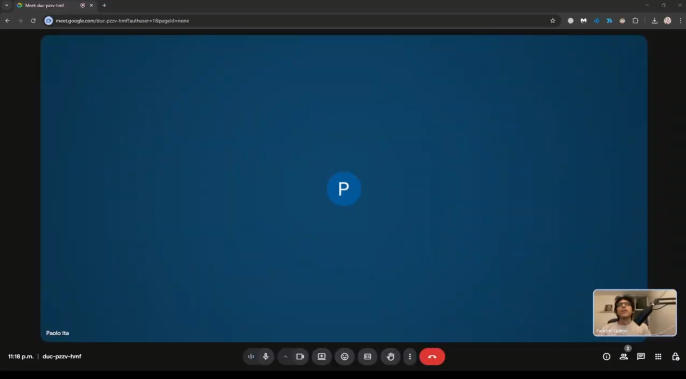                            |
| Timing         | [Ver grabación](https://drive.google.com/file/d/16iohQr01hyAhS6zoUO3Td08Vxon0hDhe/view?usp=sharing) |

---

#### Entrevistas a padres/madres o tutores
| Campo         | Información |
|---------------|-------------|
| Entrevistado 1 |  Freddy Jesus Torre Valverde    |
| Edad          | 35            |
| Distrito      | Surco         |
| Foto          |  |
| Timing        | [Ver grabación](https://youtu.be/LSnkTj_Xj1Q) |

---

### **2.2.3. Análisis de entrevistas**

**Segmento 1: Jóvenes universitarios usuarios de transporte y documentos digitales**

#### **Entrevistado 1: Sebastian Delgado (Enfoque en Eficiencia de Procesos)**
* **Perfil**
    * Sebastian, estudiante de 21 años residente de San Borja. Su rutina diaria implica el uso constante de DNI, carné universitario, tarjeta del Metropolitano y tarjeta de débito para movilización y consumo en tiendas.
* **Insights clave**
    * La mayor fricción en el transporte urbano no es el traslado, sino la recarga física; las colas en estaciones y las fallas técnicas en los módulos de recarga generan una pérdida de tiempo crítica.
    * Existe una disposición real de pago por una suscripción premium (entre 10 y 15 soles mensuales) si la plataforma garantiza la eliminación de trámites físicos y colas.
* **Problemas y frustraciones**
    * Incomodidad y sobrecosto al tener que pagar pasajes en efectivo en transporte informal por olvido de la tarjeta física.
    * Estrés e incertidumbre por no conocer con exactitud los requisitos de renovación de documentos estatales (RENIEC/SUNEDU), los cuales percibe como cambiantes.
* **Necesidades**
    * Un sistema de recarga de transporte 100% digital que elimine la dependencia del efectivo y los módulos de estación.
    * Alertas proactivas de saldo bajo (con un umbral de 5 soles) y de vencimiento de documentos con un mes de anticipación.
* **Oportunidades para KapakID**
    * **Recarga Digital Integrada:** Implementar la recarga directa de tarjetas de transporte para optimizar el tiempo del estudiante.
    * **Asistente de Trámites:** Incluir un checklist interactivo que guíe al usuario paso a paso en procesos de renovación documental.

#### **Entrevistado 2: Jose Rodrigo Rodriguez (Enfoque en Seguridad y Disponibilidad)**
* **Perfil**
    * Jose Rodrigo, de 21 años, vive en Villa María del Triunfo. Depende de documentos físicos para controles de identidad y acceso a beneficios universitarios durante sus traslados.
* **Insights clave**
    * La seguridad es el factor decisivo para la adopción; el usuario exige medidas como biometría (huella) o PIN y cifrado de datos para confiar información sensible a la app.
    * El acceso offline es considerado "imprescindible" debido a la inestabilidad de la señal de datos en ciertos puntos de la ciudad.
* **Problemas y frustraciones**
    * La pérdida de documentos físicos (como el carné universitario) conlleva procesos de reposición tediosos que pueden demorar hasta una semana.
    * Tedio generalizado ante la necesidad de sacar citas presenciales y hacer colas para trámites de identificación básica.
* **Necesidades**
    * Garantía de privacidad mediante el cifrado de datos para evitar el acceso no autorizado en caso de robo o pérdida del smartphone.
    * Disponibilidad constante de copias digitales verificadas que sirvan como respaldo inmediato ante la ausencia del documento físico.
* **Oportunidades para KapakID**
    * **Bóveda Biométrica:** Implementar seguridad de nivel bancario para el acceso a la carpeta de documentos digitales.
    * **Soporte Offline:** Desarrollar una arquitectura de caché local que permita visualizar documentos críticos sin conexión a internet.

#### **Entrevistado 3: Daniel Paolo Ita Rojas (Enfoque en Gestión Organizacional)**
* **Perfil**
    * Daniel Paolo, de 22 años y residente de Villa María del Triunfo. Muestra un perfil orientado a la planificación y organización tanto personal como de su entorno cercano.
* **Insights clave**
    * La gestión documental se extiende más allá del individuo; la capacidad de administrar documentos de hijos o dependientes (vacunas, documentos escolares) es una funcionalidad de alto valor.
    * El historial de trámites y pagos es vital para mantener un control ordenado de las responsabilidades administrativas anuales.
* **Problemas y frustraciones**
    * Desorientación en los pasos a seguir para completar un trámite, lo que genera retrasos y olvido de requisitos.
    * Falta de un sistema centralizado que permita ver, en una sola pantalla, el estado de todos los documentos y saldos disponibles.
* **Necesidades**
    * Funcionalidad de perfiles múltiples que permita separar la documentación personal de la familiar de forma clara y accesible.
    * Notificaciones push directas que actúen como recordatorios preventivos de fechas límite de pago o renovación.
* **Oportunidades para KapakID**
    * **Gestión Multi-perfil:** Ofrecer en la versión Premium la posibilidad de administrar documentos de terceros (hijos/familiares).
    * **Dashboard Centralizado:** Crear una interfaz de usuario que priorice la visualización rápida de alertas, recargas y documentos pendientes.


## 2.3. Needfinding
### 2.3.1. User Personas

- **Estudiante universitario**  
<td></td>

- **Madre de familia**  
<td></td>

### 2.3.2. User Task Matrix
### Task Matrix

| **Task** | **Estudiante universitario (Luis, 21 años)** | | **Madre de familia (Patricia, 39 años)** | |
|----------|---------------------------------------------|-------------------------------------------|------------------------------------------|------------------------------------------|
|          | Frequency                                   | Importance                                | Frequency                                | Importance                               |
| Centralizar documentos digitales | Often | High | Always | High |
| Recargar tarjeta de transporte | Always | High | Often | Medium |
| Recibir alertas de saldo bajo / vencimiento | Always | High | Always | High |
| Configurar y gestionar perfiles múltiples | Rarely | Medium | Often | High |
| Acceso offline a documentos | Sometimes | Medium | Often | High |
| Asistente para trámites (checklist, pasos guiados) | Sometimes | Medium | Often | High |
| Historial de transacciones (pagos, recargas, trámites) | Sometimes | Medium | Often | Medium |
| Seguridad y validación biométrica | Often | High | Always | High |
| Vincular billeteras digitales (Yape, Plin, Google Wallet) | Often | High | Sometimes | Medium |
| Compartir documentos verificados (ej. envío digital de DNI) | Sometimes | Medium | Often | High |
| Configurar notificaciones personalizadas (push, correo, WhatsApp) | Often | Medium | Often | High |
| Renovar documentos en línea (DNI, carné universitario, CONADIS) | Rarely | High | Sometimes | High |
| Gestionar pagos de servicios (teléfono, agua, luz, internet) | Rarely | Medium | Often | High |
| Monitorear gastos y generar reportes | Rarely | Medium | Often | Medium |

El análisis de las tareas de estudiantes universitarios y madres de familia muestra enfoques distintos en el uso de KapakID. Los estudiantes se orientan a actividades operativas y cotidianas, como recargar la tarjeta de transporte, recibir alertas de saldo bajo, centralizar documentos y acceder en modo offline. Su prioridad es evitar olvidos, ahorrar tiempo y simplificar la movilidad diaria, con alto valor en funciones de seguridad biométrica y vinculación con billeteras digitales. Sin embargo, relegan a un segundo plano tareas menos frecuentes como renovación de documentos o generación de reportes. Las madres de familia, en contraste, priorizan la gestión integral y el control familiar, enfocándose en administrar múltiples perfiles, recibir alertas de vencimientos, acceder a documentos de manera segura y simplificar trámites repetitivos. Además, otorgan gran importancia al seguimiento financiero, utilizando historial de transacciones, pagos de servicios y reportes como parte de su rol en la organización del hogar. Mientras ambos segmentos coinciden en valorar la centralización documental, las alertas inteligentes y la seguridad, difieren en su enfoque: el estudiante busca rapidez y autonomía personal, mientras que la madre necesita organización, control y previsión familiar, consolidando a KapakID como una solución versátil para ambos perfiles.

### 2.3.3. User Journey Mapping
- **Empathy Map Estudiante Universitario**

<td></td>

- **Empathy Map Madre de Familia**
<td></td>

### 2.3.4. Empathy Mapping
**User Journey Mapping Estudiante Universitario** 
 <td></td>
 
**User Journey Mapping Madre de Familia**  

<td></td>

#### 2.3.5. Big Picture EventStorming

<td>
  
</td>

#### 2.3.6. Ubiquitous Language

En esta sección se presenta el glosario de términos y conceptos contemplados por el Bussiness  Domain.
Los términos están definidos en inglés (con su equivalente en español entre paréntesis) y su definición en español.  
Este lenguaje ubicuo debe ser utilizado de forma consistente por todos los miembros del equipo.

---

### Identity & Documents (Identidad y Documentos)
- **National ID (DNI – Documento Nacional de Identidad):** Documento oficial de identidad emitido por RENIEC, utilizado para acreditar identidad en Perú.  
- **Passport (Pasaporte):** Documento emitido por la autoridad competente que permite viajar al extranjero.  
- **Driver’s License (Licencia de Conducir):** Documento emitido por el MTC que autoriza a una persona a conducir vehículos.  
- **University ID (Carné Universitario):** Documento emitido por SUNEDU o universidades, utilizado para identificar a estudiantes en Perú.  
- **Disability ID (Carné CONADIS):** Documento oficial que acredita a una persona con discapacidad en Perú.  
- **Digital Document (Documento Digital):** Versión electrónica y certificada de un documento físico almacenado en KapakID.  

### Transportation & Cards (Transporte y Tarjetas)
- **Metro Card (Tarjeta del Tren):** Tarjeta recargable utilizada para acceder al Tren Electrico de Lima.  
- **Metropolitano Card (Tarjeta del Metropolitano):** Tarjeta recargable utilizada en el sistema de transporte público Metropolitano de Lima.  
- **Transport Balance (Saldo de Transporte):** Monto disponible en tarjetas de transporte registrado en KapakID.  
- **Top-Up (Recarga):** Acción de añadir saldo a una tarjeta de transporte o celular desde KapakID.  

### Payments & Transactions (Pagos y Transacciones)
- **Debt Payment (Pago de Deuda):** Transacción realizada para cancelar obligaciones pendientes como servicios, multas o préstamos.  
- **Phone Top-Up (Recarga Telefónica):** Proceso de añadir saldo a un número de celular desde KapakID.  
- **Transaction History (Historial de Transacciones):** Registro detallado de recargas, pagos y movimientos financieros realizados en la app.  
- **Service Renewal (Renovación de Documento/Servicio):** Trámite para actualizar o extender la vigencia de un documento desde KapakID.  

### Governance & Voting (Gobernanza y Votaciones)
- **Presidential Election (Elección Presidencial):** Proceso electoral nacional para elegir al Presidente del Perú, habilitado en KapakID mediante identificación única.  
- **Municipal Election (Elección Municipal):** Proceso electoral local para elegir alcaldes y autoridades municipales.  
- **Digital Vote (Voto Digital):** Emisión de voto certificado y único a través de KapakID utilizando la identidad verificada del usuario.  

### Notifications & Alerts (Notificaciones y Alertas)
- **Low Balance Alert (Alerta de Saldo Bajo):** Notificación enviada al usuario cuando el saldo de una tarjeta de transporte o celular es insuficiente.  
- **Expiration Alert (Alerta de Vencimiento):** Notificación enviada cuando un documento o tarjeta está próximo a caducar.  
- **Reminder (Recordatorio):** Aviso programado para acciones importantes como renovaciones, votaciones o recargas.  

### Access & Profiles (Acceso y Perfiles)
- **Offline Mode (Modo Offline):** Acceso limitado a documentos previamente verificados cuando no hay conexión a internet.  
- **Verified Document (Documento Verificado):** Documento validado oficialmente en la app para uso legal y seguro.  
- **User Profile (Perfil de Usuario):** Identidad principal del dueño de la cuenta en KapakID.  
- **Family Profile (Perfil Familiar):** Espacio dentro de la app que permite administrar documentos de hijos u otros dependientes.  


### 2.4. Requirements specification
#### 2.4.1. User Stories

**Tabla de Epics**

| Epic ID | Título                       | Descripción                                                                 |
|---------|------------------------------|-----------------------------------------------------------------------------|
| E1      | Gestión de Usuarios y Perfiles | Administración de usuarios, autenticación y creación de múltiples perfiles familiares. |
| E2      | Gestión de Documentos Digitales | Registro, validación, visualización y renovación de documentos oficiales en la app. |
| E3      | Pagos y Recargas             | Recarga de tarjetas de transporte y celulares, pagos de deudas y registro de historial de transacciones. |
| E4      | Votaciones Digitales         | Emisión de votos únicos y seguros en procesos electorales mediante identificación digital. |
| E5      | Notificaciones y Alertas     | Envío de recordatorios y notificaciones sobre saldos bajos y vencimiento de documentos. |
| E6      | Acceso Offline               | Permitir acceso limitado a documentos previamente verificados sin conexión a internet. |
| E7      | Landing Page Informativa     | Presentar la propuesta de valor de KapakID, funcionalidades clave, guías de descarga y contacto. |
| E8      | API REST Backend             | Servicios técnicos para manejar autenticación, gestión de documentos, pagos y notificaciones. |

**Tabla de US**

| US ID | Título                     | Descripción | Criterios de Aceptación (Gherkin) | Epic Relacionada |
|-------|-----------------------------|-------------|----------------------------------|------------------|
| US1   | Registro de usuario         | Como **usuario**, quiero registrarme con mi correo o celular para crear mi cuenta en KapakID. | **Scenario 1:**<br>Given un usuario no registrado <br>When ingresa sus datos válidos <br>Then el sistema crea la cuenta y confirma el registro.<br><br>**Scenario 2:**<br>Given un usuario intenta registrarse <br>When ingresa datos inválidos o incompletos <br>Then el sistema rechaza el registro y muestra el motivo. | E1 |
| US2   | Creación de perfiles familiares | Como **usuario**, quiero agregar perfiles de mis hijos para administrar sus documentos desde mi cuenta. | **Scenario 1:**<br>Given un usuario autenticado <br>When agrega un nuevo perfil familiar <br>Then el sistema registra el perfil vinculado a la cuenta.<br><br>**Scenario 2:**<br>Given un usuario intenta crear un perfil <br>When excede el límite permitido <br>Then el sistema rechaza la acción con un mensaje. | E1 |
| US3   | Registro de documentos      | Como **usuario**, quiero registrar mi DNI, pasaporte y otros documentos para tenerlos disponibles en la app. | **Scenario 1:**<br>Given un usuario autenticado <br>When registra un documento válido <br>Then el sistema almacena el documento digitalmente.<br><br>**Scenario 2:**<br>Given un usuario ingresa un documento inválido <br>When intenta registrarlo <br>Then el sistema rechaza la operación con justificación. | E2 |
| US4   | Renovación de documentos    | Como **usuario**, quiero renovar mis documentos vencidos desde la app para evitar trámites presenciales. | **Scenario 1:**<br>Given un documento próximo a vencer <br>When el usuario solicita renovación <br>Then el sistema envía la solicitud a la entidad correspondiente.<br><br>**Scenario 2:**<br>Given un documento ya vencido <br>When el usuario intenta renovarlo <br>Then el sistema informa si la renovación aún es posible. | E2 |
| US5   | Recarga de transporte       | Como **usuario**, quiero recargar mi tarjeta del Metropolitano para no quedarme sin saldo. | **Scenario 1:**<br>Given un usuario autenticado <br>When selecciona una tarjeta válida y monto de recarga <br>Then el sistema procesa el pago y actualiza el saldo.<br><br>**Scenario 2:**<br>Given una tarjeta inválida <br>When el usuario intenta recargar <br>Then el sistema rechaza la operación. | E3 |
| US6   | Pago de deudas              | Como **usuario**, quiero pagar mis deudas de servicios o multas desde la app para evitar filas. | **Scenario 1:**<br>Given un usuario autenticado <br>When selecciona una deuda pendiente <br>Then el sistema procesa el pago y registra la operación.<br><br>**Scenario 2:**<br>Given un pago realizado <br>When el usuario consulta el historial <br>Then el sistema muestra el registro de pago exitoso. | E3 |
| US7   | Registro de transacciones          | Como **usuario**, quiero registrar los movimientos de los documentos que he realizado desde la aplicacion. | **Scenario 1:**<br>Given un usuario autenticado <br>When ingresa para revisar sus movimientos <br>Then el sistema le muestra los movimientos registrados de sus documentos.<br><br>**Scenario 2:**<br>Given un usuario autenticado <br>When accede a un documento vencido <br>Then el sistema le alerta que el documento vencio | E3 |
| US8   | Voto digital único          | Como **ciudadano**, quiero emitir mi voto en elecciones mediante KapakID para participar de manera segura. | **Scenario 1:**<br>Given un ciudadano autenticado <br>When emite su voto en el proceso electoral vigente <br>Then el sistema registra el voto de forma cifrada.<br><br>**Scenario 2:**<br>Given un ciudadano ya votó <br>When intenta hacerlo nuevamente <br>Then el sistema rechaza el intento.<br><br> **Scenario 3:** Given un cuidadano votante <br> When intenta votar con un Documento de Identidad Vencido <br> Then el sistema rechaza la solicitd y le informa que su documento vencio| E4 |
| US9   | Alerta de vencimiento       | Como **usuario**, quiero recibir una notificación cuando mis documentos estén próximos a vencer. | **Scenario 1:**<br>Given un documento con 30 días antes de su vencimiento <br>When el sistema procesa la verificación <br>Then envía una alerta al usuario.<br><br>**Scenario 2:**<br>Given un documento vencido <br>When el sistema detecta la fecha caducada <br>Then notifica al usuario inmediatamente. | E5 |
| US10   | Notificacion de Tramite       | Como **usuario**, quiero recibir una notificación cuando se haya cumplido una solicitu de tramite. | **Scenario 1:**<br>Given un documento puede ser recogido <br>When el sistema procesa la verificación <br>Then envía una alerta al usuario.<br><br>**Scenario 2:**<br>Given un documento nuevo <br>When el sistema detecta la generacion del documento <br>Then notifica al usuario inmediatamente. | E5 |
| US11   | Acceso a documentos offline | Como **usuario**, quiero acceder a mis documentos verificados incluso sin conexión a internet. | **Scenario 1:**<br>Given un usuario autenticado previamente <br>When no tiene conexión <br>Then el sistema permite visualizar documentos validados.<br><br>**Scenario 2:**<br>Given un usuario sin conexión <br>When intenta realizar una recarga <br>Then el sistema informa que la función no está disponible. | E6 |
| US12  | Información de funcionalidades | Como **visitante**, quiero ver en la landing page las funcionalidades principales de KapakID para entender sus beneficios. | **Scenario 1:**<br>Given un visitante accede a la landing <br>When navega a la sección de funcionalidades <br>Then visualiza la lista con descripciones claras.<br><br>**Scenario 2:**<br>Given un visitante explora la página <br>When busca información de seguridad <br>Then encuentra detalles sobre la protección de datos. | E7 |
| US13  | Visualizar términos y políticas | Como **visitante**, quiero acceder fácilmente a los **términos legales y políticas de privacidad** desde la landing page para conocer las condiciones de uso. | **Scenario 1:**<br>Given un visitante accede a la landing <br>When hace click en “Términos y Políticas” en el footer <br>Then se abre una página con los documentos legales.<br><br> **Scenario 2:**<br>Given un visitante accede a la landing <br>When hace scroll hasta el final <br>Then encuentra enlaces visibles a términos legales y políticas de privacidad.<br><br> | E7 |
| US14  | Visualizar reseñas de usuarios  | Como **visitante**, quiero ver **reseñas de usuarios satisfechos (casos de éxito)** en la landing page para confiar en la calidad del servicio ofrecido.       | **Scenario 1:**<br>Given un visitante accede a la landing <br>When navega por la sección de testimonios <br>Then visualiza un carrusel con reseñas de usuarios reales.<br><br> **Scenario 2:**<br>Given un visitante accede a la landing <br>When da click en “Ver más casos de éxito” <br>Then se redirecciona a una página con testimonios ampliados.<br><br> | E7 |
| US15  | Acceso a la app          | Como **visitante**, quiero encontrar enlaces de acceso de KapakID en la landing page para acceder a la aplicación. | **Scenario 1:**<br>Given un visitante no registrado accede a la landing <br>When hace click en registrate <br>Then redirecciona al signin.<br><br> **Scenario 2:**<br>Given un visitante registrado accede a la landing <br>When hace click en ingresa <br>Then redirecciona al login.<br><br> | E7 |
| US16  | API de autenticación        | Como **developer**, quiero consumir un endpoint de autenticación para validar credenciales de usuarios. | **Scenario 1:**<br>Given un request con credenciales válidas <br>When se envía al endpoint de login <br>Then el sistema responde con un token válido.<br><br>**Scenario 2:**<br>Given un request con credenciales inválidas <br>When se procesa en el backend <br>Then el sistema devuelve un error 401 Unauthorized. | E8 |
| US17  | API de documentos           | Como **developer**, quiero consumir un endpoint para registrar y consultar documentos de un usuario. | **Scenario 1:**<br>Given un request válido con documento y metadatos <br>When se envía al endpoint correspondiente <br>Then el sistema responde confirmando el registro.<br><br>**Scenario 2:**<br>Given un request de consulta con un ID de documento válido <br>When se procesa en el backend <br>Then el sistema devuelve la información del documento. | E8 |

#### 2.4.2. Impact Mapping

<td></td>

#### 2.4.3. Product Backlog

| Order | US ID | Título | Descripción | Story Points |
|-------|-------|--------|-------------|--------------|
| 1 | US12 | Información de funcionalidades | Como **visitante**, quiero ver en la landing page las funcionalidades principales de KapakID para entender sus beneficios. | 3 |
| 2 | US13 | Acceso a la app | Como **visitante**, quiero encontrar enlaces de acceso de KapakID en la landing page para acceder a la aplicación. | 2 |
| 3 | US13 | Visualizar términos y políticas | Como **visitante**, quiero acceder fácilmente a los **términos legales y políticas de privacidad** desde la landing page para conocer las condiciones de uso. | 2 |
| 4 | US14 | Visualizar reseñas de usuarios | Como **visitante**, quiero ver **reseñas de usuarios satisfechos (casos de éxito)** en la landing page para confiar en la calidad del servicio ofrecido. | 3 |
| 5 | US1 | Registro de usuario | Como **usuario**, quiero registrarme con mi correo o celular para crear mi cuenta en KapakID. | 5 |
| 6 | US2 | Creación de perfiles familiares | Como **usuario**, quiero agregar perfiles de mis hijos para administrar sus documentos desde mi cuenta. | 3 |
| 7 | US3 | Registro de documentos | Como **usuario**, quiero registrar mi DNI, pasaporte y otros documentos para tenerlos disponibles en la app. | 5 |
| 8 | US4 | Renovación de documentos | Como **usuario**, quiero renovar mis documentos vencidos desde la app para evitar trámites presenciales. | 3 |
| 9 | US5 | Recarga de transporte | Como **usuario**, quiero recargar mi tarjeta del Metropolitano para no quedarme sin saldo. | 3 |
| 10 | US6 | Pago de deudas | Como **usuario**, quiero pagar mis deudas de servicios o multas desde la app para evitar filas. | 3 |
| 11 | US7 | Registro de transacciones | Como **usuario**, quiero registrar los movimientos de los documentos que he realizado desde la aplicación. | 3 |
| 12 | US8 | Voto digital único | Como **ciudadano**, quiero emitir mi voto en elecciones mediante KapakID para participar de manera segura. | 5 |
| 13 | US9 | Alerta de vencimiento | Como **usuario**, quiero recibir una notificación cuando mis documentos estén próximos a vencer. | 2 |
| 14 | US10 | Notificación de trámite | Como **usuario**, quiero recibir una notificación cuando se haya cumplido una solicitud de trámite. | 2 |
| 15 | US11 | Acceso a documentos offline | Como **usuario**, quiero acceder a mis documentos verificados incluso sin conexión a internet. | 3 |
| 16 | US16 | API de autenticación | Como **developer**, quiero consumir un endpoint de autenticación para validar credenciales de usuarios. | 3 |
| 17 | US17 | API de documentos | Como **developer**, quiero consumir un endpoint para registrar y consultar documentos de un usuario. | 3 |

En el siguiente apartado se mostrara el product Backlog generado en Jira, que ayudara al equipo durante el desarrollo de este proyecto

 <td>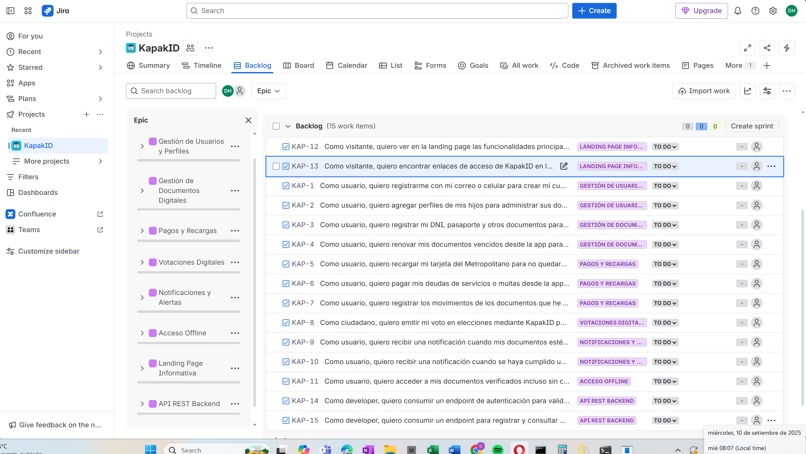</td>


### 2.5. Strategic-Level Domain-Driven Design

En esta sección se describe el enfoque utilizado para la toma de decisiones estratégicas en el desarrollo de la aplicación móvil KapakID, aplicando los principios de Domain-Driven Design (DDD). El propósito central fue reconocer y delimitar los límites naturales del dominio enfocado en la gestión personal de documentos e identidad digital, dividiendo la solución en Bounded Contexts.

Para esta descomposición, el equipo hizo uso de herramientas colaborativas como Event Storming, que permitió representar de manera visual y dinámica los flujos de eventos, comandos y actores del dominio, tales como estudiantes universitarios y padres de familia; y el Bounded Context Canvas, mediante el cual se definieron los aspectos clave de cada contexto, tales como objetivos, modelos, responsabilidades y sus interacciones con otros.

Este enfoque estratégico no solo favoreció una organización más clara y coherente de la arquitectura móvil, sino que también facilitó la alineación de las decisiones técnicas con las metas del negocio, optimizando la comunicación técnica y funcional entre los distintos participantes del proyecto.

#### 2.5.1. EventStorming

En esta sección se expone el proceso de EventStorming aplicado como técnica de exploración del dominio de KapakID, cuyo objetivo fue identificar los eventos más relevantes del sistema y comprender cómo estos se relacionan con los actores y las reglas de negocio. La dinámica permitió representar de manera visual y secuencial los hechos clave, como la validación de documentos oficiales, recargas de transporte y envío de notificaciones de vencimiento.

Asimismo, se mapearon los comandos desde la interfaz de la aplicación móvil que originan dichos eventos, facilitando las conversaciones entre los participantes y generando un entendimiento común sobre el comportamiento esperado. Este enfoque posibilitó construir una visión compartida del ecosistema digital, sentando las bases para etapas posteriores de modelado más detallado y la delimitación de responsabilidades en contextos como Identity, Documents, Transport y Notifications.

<td></td>

**2.5.1.1. Candidate Context Discovery**

A partir del análisis temporal y lógico de los eventos de dominio obtenidos en la sesión de EventStorming, el equipo procedió a agrupar los comportamientos y procesos de negocio que presentaban una alta cohesión. El objetivo de esta fase fue descubrir los límites naturales (Candidate Contexts) dentro del ecosistema de KapakID, garantizando que cada módulo tenga una responsabilidad única y una baja dependencia funcional con los demás.

El análisis de la línea de tiempo de los eventos, comandos, actores y políticas dio como resultado la identificación de los siguientes contextos candidatos:

Identity Context:
Se derivó del análisis del flujo de inicio del usuario. Al identificar comandos como Registrar Cuenta KapakID y eventos resultantes como Cuenta Registrada, se hizo evidente la necesidad de un límite que gestione exclusivamente la autenticación, los perfiles de los actores principales (Estudiante y Padre de Familia) y el control de acceso a la plataforma móvil.

Documents Context:
Surgió como el núcleo central del dominio. La agrupación de comandos como Subir Carnet Universitario y agregados como DocumentRecord definió este contexto. Se delimitó aquí toda la lógica de validación oficial, encapsulando las políticas que exigen que todo documento subido sea contrastado contra sistemas externos (como SUNEDU o RENIEC), y gestionando los eventos de Documento Subido a Caché y Carnet Verificado/Rechazado.

Transport Context:
El análisis reveló un subdominio transaccional claramente separado de la gestión documental pura. Los comandos de Vincular Tarjeta Metropolitano y Recargar Saldo de Hijo agruparon las necesidades de movilidad urbana. Este contexto encapsula las integraciones financieras y operativas con sistemas externos como la ATU y Entidades Bancarias, gestionando eventos críticos como Tarjeta Transporte Vinculada y Saldo de Transporte Incrementado.

Notifications Context:
Se descubrió como un contexto de soporte a partir de las políticas reactivas del sistema. Por ejemplo, la política "Cuando la cuenta se registra, se debe enviar un correo de bienvenida" demostró que el envío de mensajes (comandos como Enviar Correo y eventos como Correo Enviado) no debe residir en el módulo de Identidad, sino en un servicio centralizado que escuche eventos de distintos módulos y despache notificaciones (Push, Email) de forma asíncrona.

Compliance Context:
Este contexto emergió al analizar el comportamiento de la aplicación en entornos de baja conectividad. A partir del comando Abrir App Offline y la interacción con el agregado DocumentCache, se identificó la política de registrar accesos para cuando la conexión regrese. Esto definió un límite enfocado en la auditoría y el cumplimiento normativo (generando eventos como Acceso Offline Auditado), separando la trazabilidad legal de la funcionalidad principal de la aplicación.

Esta agrupación inicial en Candidate Contexts proporcionó una arquitectura base robusta, alineada estrechamente con el Ubiquitous Language y los flujos de valor reales de los usuarios de KapakID.
  
- **2.5.1.2. Domain Message Flows Modeling**

Los Domain Message Flows modelan las interacciones entre los diferentes bounded contexts, mostrando cómo se comunican entre sí mediante comandos, eventos y consultas. A continuación, se muestran los flujos de mensaje para los escenarios clave del negocio:

  * **Subir y verificar documento:** En este flujo se muestra la interacción del bounded context Documents al momento en que un usuario registra un documento oficial para su validación.

  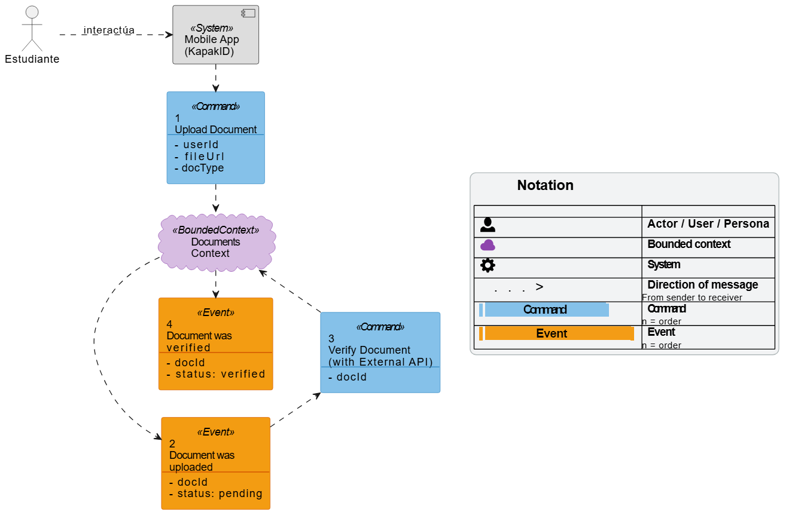

  * **Acceso y registro a la plataforma:** En este flujo se muestra la interacción del bounded context Identity al momento en que un usuario crea su cuenta y accede a la aplicación móvil.

  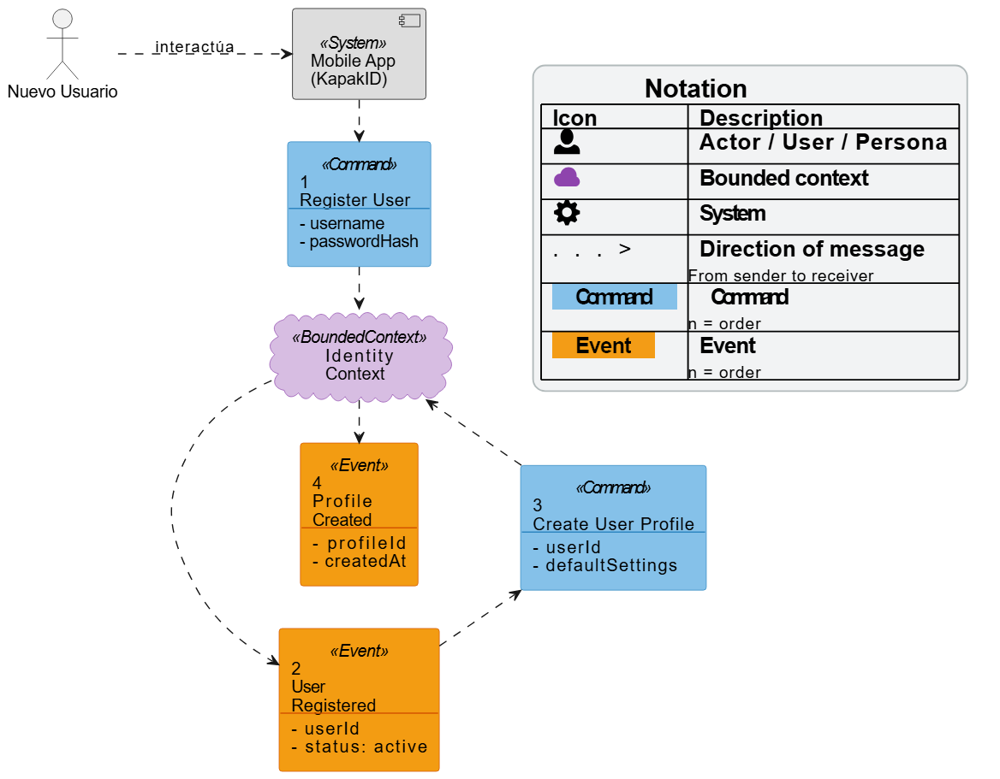

  * **Vincular tarjeta de transporte:** En este flujo se muestra la interacción del bounded context Transport al momento en que un usuario registra una tarjeta (ej. Metropolitano) para consultar sus saldos.

  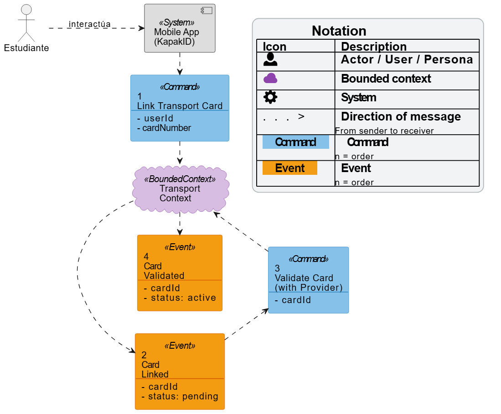

  Adicionalmente, se presentan flujos de escenarios relevantes para los usuarios y el sistema, pero en los que no se produce interacción compleja entre distintos bounded contexts:

  * **Envío de alertas:** En este flujo se muestra el proceso mediante el cual el sistema despacha alertas al usuario, modelado en el bounded context Notifications.

 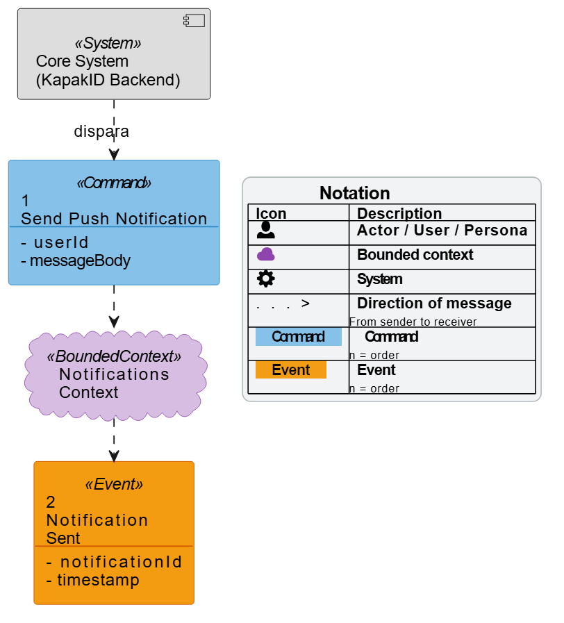

  * **Registro de auditoría:** En este flujo se modela el proceso mediante el cual el sistema guarda un registro inmutable de acciones críticas, modelado en el bounded context Compliance.

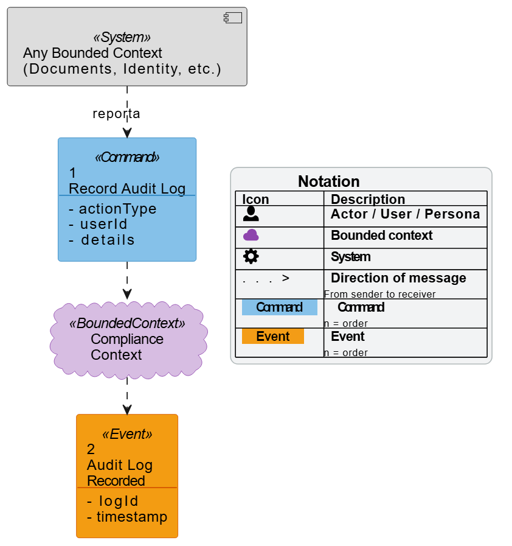

### 2.5.1.3. Bounded Context Canvases

Para mejorar la organización del dominio y facilitar una comunicación consistente, se elaboraron Bounded Context Canvases para cada subdominio. Estos canvases delimitan claramente las responsabilidades, establecen el lenguaje ubicuo y los modelos clave, y describen los puntos de integración y los flujos de mensajes entre contextos. Los diagramas que siguen consolidan estas decisiones y sirvieron como guía para alinear la arquitectura, las interfaces y la evolución del sistema.

#### Identity (Identidad y Accesos)
Este Bounded Context gestiona la autenticación, autorización y asignación de roles. Emite y valida tokens JWT, administra el ciclo de vida de las credenciales y publica eventos hacia otros contextos para garantizar un acceso controlado y seguro a nivel de toda la plataforma.

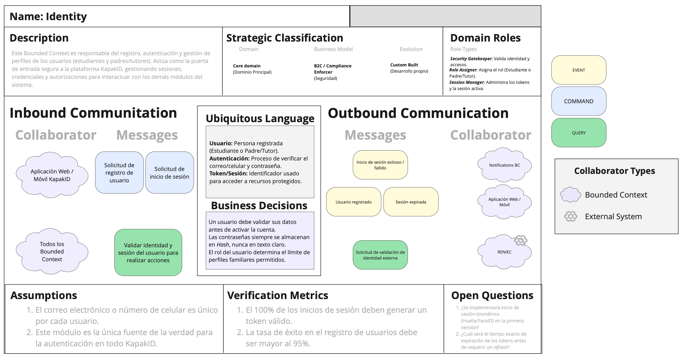

#### Documents (Gestión Documental)
Contexto encargado del ciclo de vida de los documentos digitales (DNI, carné universitario, pasaportes). Maneja la carga segura, el almacenamiento de metadatos, la validación de autenticidad y la orquestación de la caché local para permitir el acceso offline.

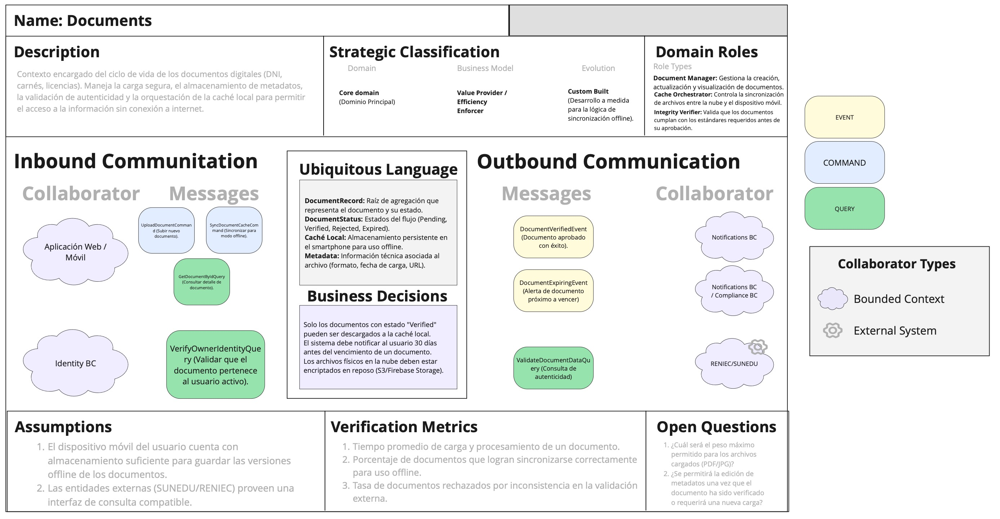

#### Transport (Transporte y Recargas)
Abarca la gestión de las tarjetas de transporte urbano (Metropolitano, Línea 1) y la ejecución de recargas. Funciona como un integrador entre la aplicación móvil y los sistemas de transporte o pasarelas de pago externas.

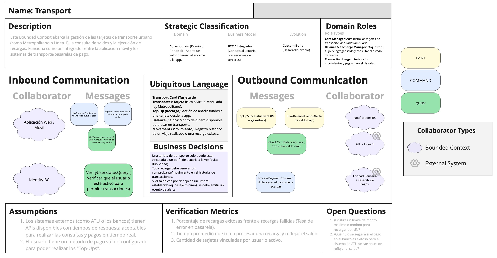

#### Notifications (Notificaciones y Alertas)
Se encarga de gestionar y despachar todas las comunicaciones hacia los usuarios. Centraliza el envío de alertas push y correos electrónicos sobre saldos bajos, vencimientos de documentos y confirmaciones de trámites.

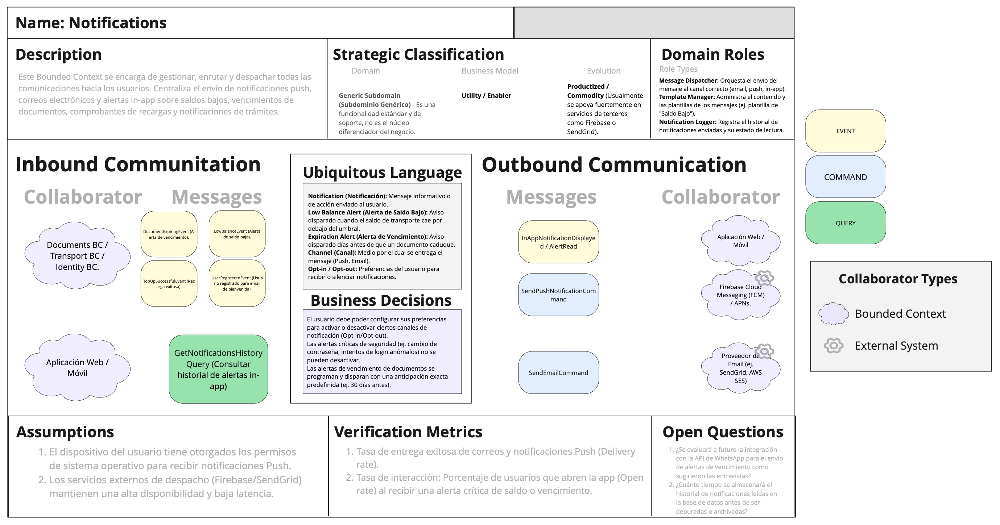

#### Compliance (Cumplimiento Normativo y Auditoría)
Responsable de garantizar que todas las operaciones cumplan con las normativas legales de privacidad (Ley 29733). Registra de forma inmutable las acciones críticas y gestiona el consentimiento del usuario sobre el manejo de sus datos.

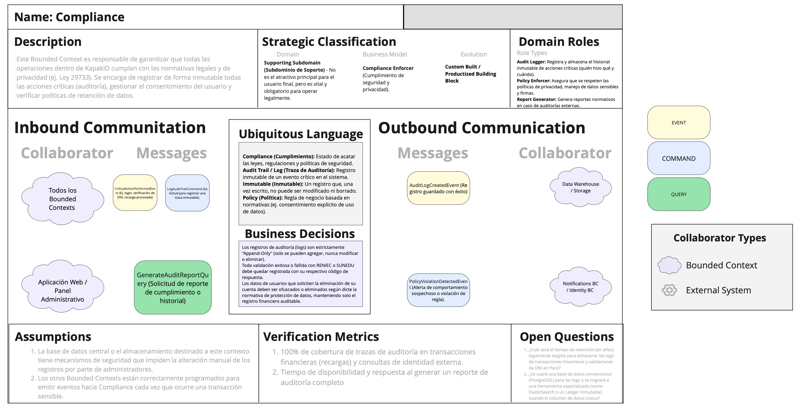
#### 2.5.2. Context Mapping
En esta sección se explica el proceso de elaboración de los context maps de **KapakID**. Asimismo, se permite la visualización de las relaciones estructurales entre Bounded Contexts, junto a los patrones de relaciones establecidos en Domain Driven Design (DDD), como Anti-corruption Layer (ACL), Customer/Supplier, Shared Kernel y Conformist.

Posterior al debate grupal para la contextualización del proyecto de identidad digital y transporte, nos hemos proyectado los siguientes Bounded Contexts:
* **Identity and Access Management (IAM)**
* **User Profiles (UP)**
* **Digital Identity & Documents (DID)**
* **Payments & Subscriptions (PAS)**
* **Transport & NFC Management (TNM)**
* **Notifications (NTF)**

#### **Relaciones Detalladas:**

**User Profiles (UP) - Identity and Access Management (IAM)**
En la presente imagen se puede identificar la relación entre **User Profiles** e **Identity and Access Management (IAM)**, los cuales están enfocados en lógicas similares y comparten un subconjunto del modelo de dominio común para evitar la duplicación de código. Se utiliza el patrón **Shared Kernel** para la entidad "Usuario", la cual comparte lógica de credenciales y segmentación básica de clientes.

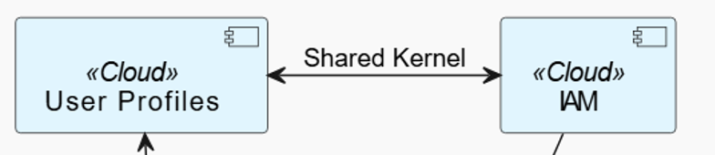

**Identity and Access Management (IAM) - Payments & Subscriptions (PAS)**
En la presente imagen se puede identificar la relación entre **IAM** y **Payments & Subscriptions (PAS)**, enfocada en la comunicación por medio de un **ACL (Anti-corruption Layer)** hacia el contexto de pagos por el uso de **Stripe** como servicio externo. Este se comunica mediante **OHS** y **PL**, lo que permite la validación de suscripciones sin comprometer la seguridad del sistema.

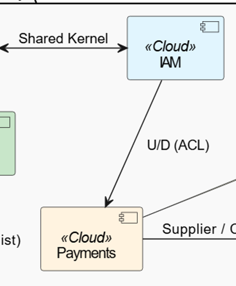

**Payments & Subscriptions (PAS) - Transport & NFC Management (TNM)**
En la presente imagen se puede identificar la relación entre **PAS** y **Transport & NFC Management (TNM)** por medio del patrón **Customer / Supplier**. El Bounded Context de transporte actúa bajo la influencia de pagos, ya que la activación de saldos en tarjetas NFC genera una dependencia directa de la validación exitosa de la transacción.

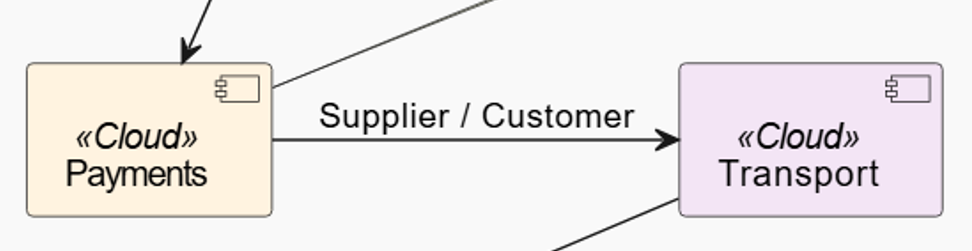

**Digital Identity & Documents (DID) - User Profiles (UP)**
En la presente imagen se puede identificar el patrón **Partnership** debido al trabajo coordinado entre estos dos contextos. **Digital Identity** se encarga de la gestión de validación legal, mientras que **User Profiles** se actualiza constantemente con el estatus de "Verificado" para permitir el acceso a servicios de transporte con tarifa preferencial.

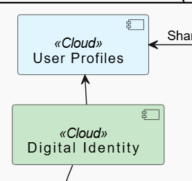

**Digital Identity & Documents (DID) - Notifications (NTF)**
En la presente imagen se puede identificar el patrón **Conformista**, de manera que el downstream (**Notifications**) adopta el modelo del upstream (**DID**) tal cual. Las alertas de validación o vencimiento de documentos son dependientes de la lógica de negocio de los certificados digitales.

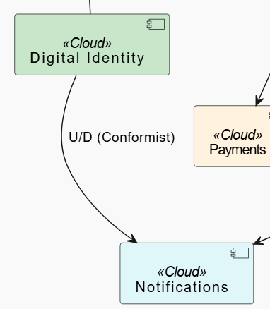

#### **Final Context Map**
Posteriormente, se presenta el mapa de contextos final de **KapakID**, integrando todas las relaciones y patrones mencionados anteriormente para ofrecer una visión global de la arquitectura del sistema.

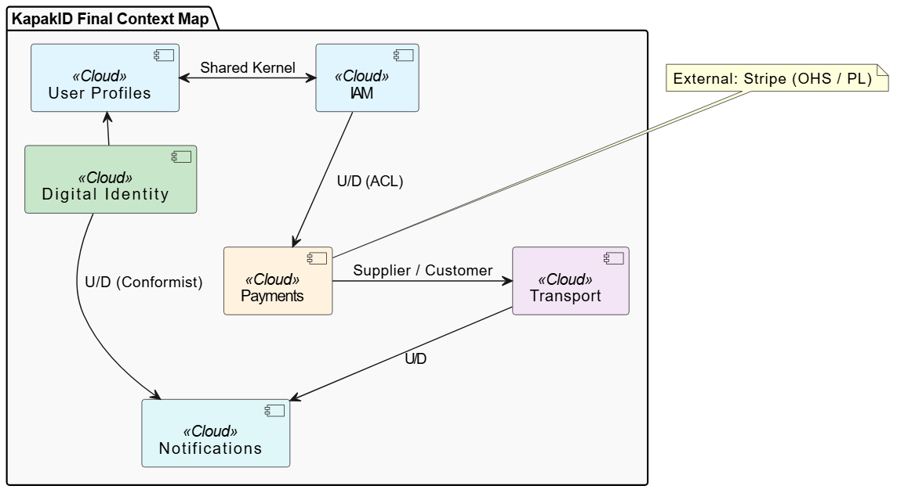

#### 2.5.3. Software Architecture
- **2.5.3.1. Software Architecture Context Level Diagrams**


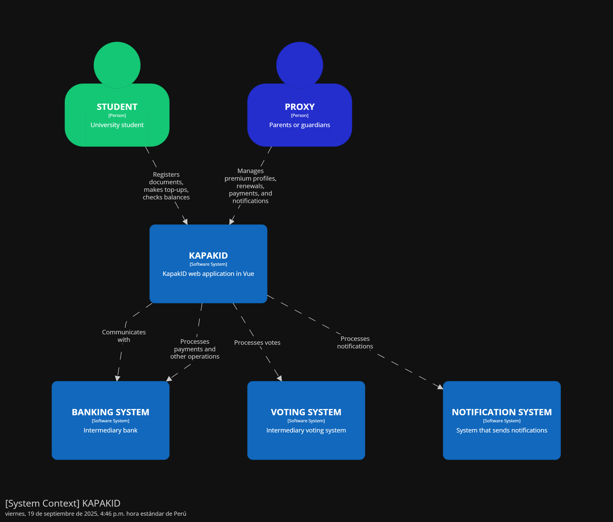

- **2.5.3.2. Software Architecture Container Level Diagrams**

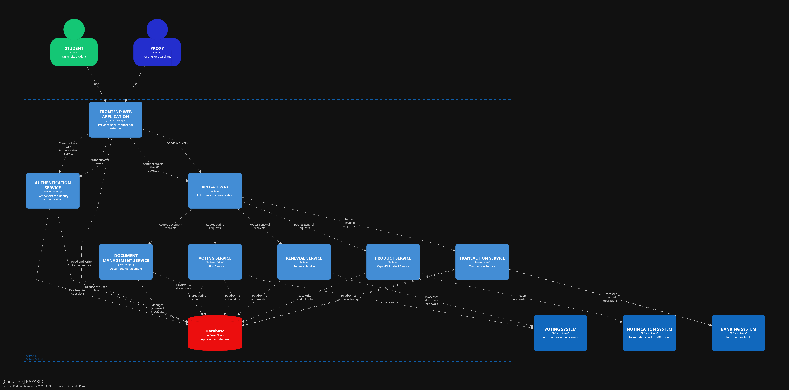

- **2.5.3.2.1. Software Architecture Component Level Diagrams**

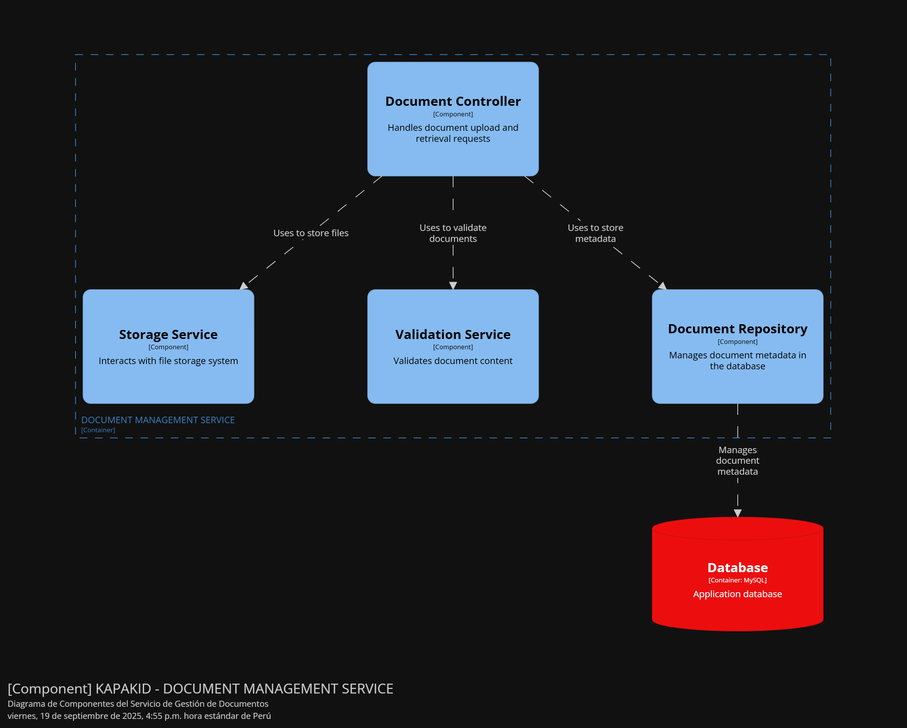

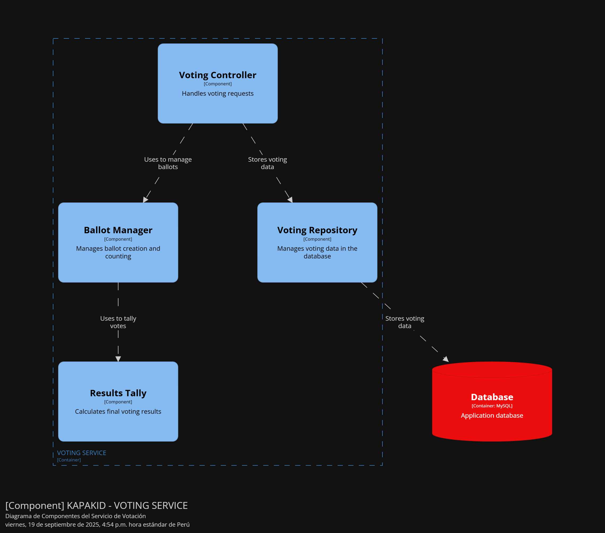

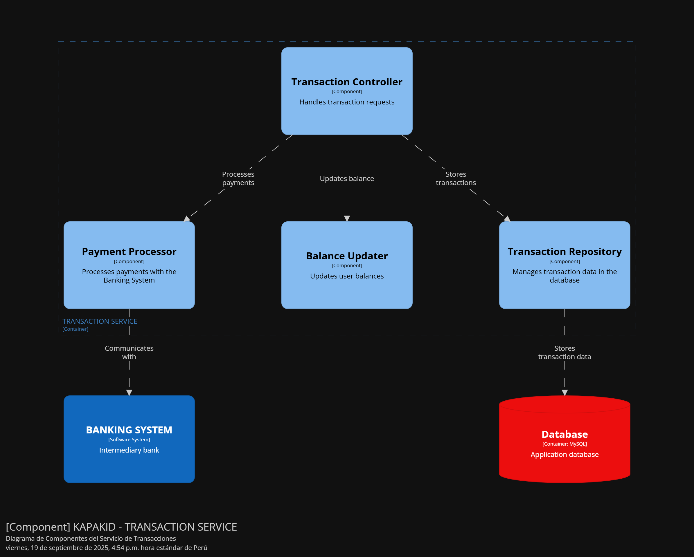

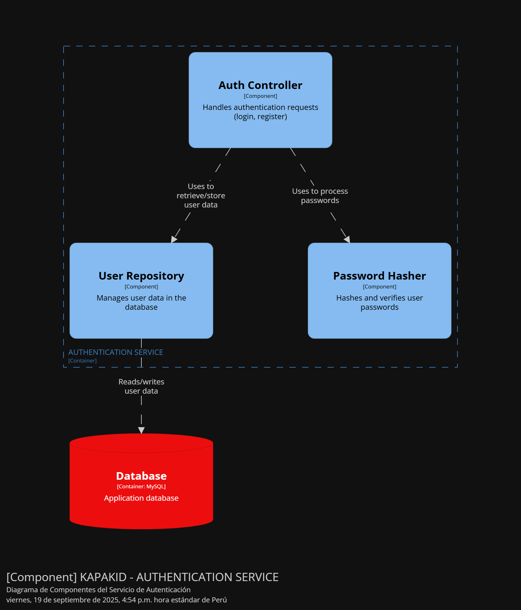

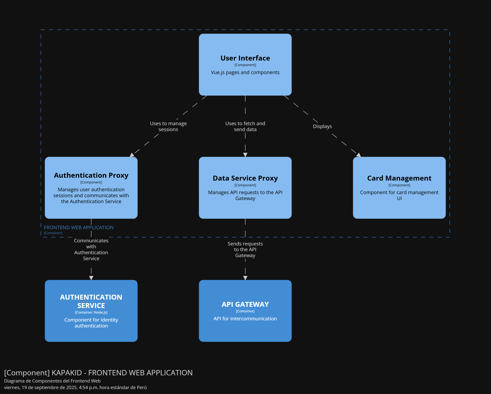


### 2.5.3.3. Software Architecture Deployment Diagrams

A continuación, se presenta el diagrama de despliegue para el sistema **KapakID**, el cual ilustra la topología de la infraestructura de hardware y software donde se ejecutarán los componentes del sistema.

Este diagrama visualiza la distribución física de la plataforma, detallando la interacción entre las aplicaciones cliente, los servicios de backend alojados en la nube, la capa de persistencia de datos y la integración con servicios de terceros fundamentales para el negocio. El principal objetivo de este modelo es proporcionar al equipo de desarrollo y operaciones una visión clara de la arquitectura de red, los protocolos de comunicación y la estrategia de alojamiento (Cloud Hosting) para facilitar el despliegue continuo, el mantenimiento y la escalabilidad del sistema.

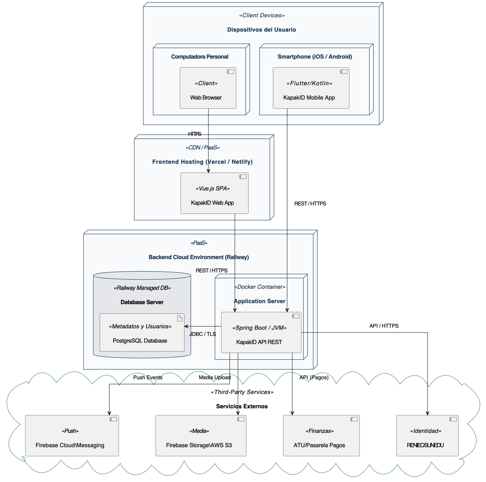

#### Descripción de los Nodos de Despliegue

La arquitectura se divide en cuatro entornos físicos/virtuales principales:

**1. Client Devices (Dispositivos del Usuario)**
Representa los entornos finales desde donde los usuarios interactúan con KapakID.
* **Smartphone (iOS / Android):** Dispositivos móviles donde se ejecuta la *KapakID Mobile App* (desarrollada en Flutter/Kotlin). Se comunica directamente con la API en la nube a través de peticiones **REST / HTTPS**.
* **Computadora Personal:** Equipos de escritorio o laptops donde el usuario utiliza un navegador web estándar (*Web Browser*) para acceder a la plataforma mediante protocolo seguro **HTTPS**.

**2. Frontend Hosting (CDN / PaaS)**
Entorno en la nube (proveedores como **Vercel o Netlify**) optimizado para el alojamiento y la distribución rápida de contenido estático global.
* Aloja la **KapakID Web App**, la cual está construida como una *Single Page Application (SPA)* utilizando **Vue.js**. Desde aquí, la aplicación web realiza llamadas asíncronas (**REST / HTTPS**) hacia el servidor backend.

**3. Backend Cloud Environment (PaaS - Railway)**
Es el núcleo de procesamiento y almacenamiento de la plataforma, desplegado de manera ágil utilizando la infraestructura como servicio de **Railway**. Se compone de dos nodos fuertemente cohesionados:
* **Application Server:** Un contenedor Docker que encapsula el entorno de ejecución (JVM) para la **KapakID API REST** (construida con C#). Este nodo centraliza la lógica de negocio y enruta las solicitudes.
* **Database Server:** Una instancia de base de datos gestionada (Managed DB) de **PostgreSQL**, encargada de persistir metadatos de documentos, información de usuarios e historial de pagos. La comunicación entre la API y la base de datos se realiza de forma interna y encriptada mediante **JDBC / TLS**.

**4. Third-Party Services (Servicios Externos)**
Representa el ecosistema de APIs e integraciones de terceros que KapakID consume para externalizar responsabilidades críticas, conectándose siempre mediante **API / HTTPS**:
* **Firebase Cloud Messaging (Push):** Motor encargado de despachar notificaciones push a los smartphones (ej. alertas de vencimiento).
* **Firebase Storage / AWS S3 (Media):** Buckets de almacenamiento en la nube donde se guardan físicamente los documentos subidos por el usuario de forma segura.
* **ATU / Pasarelas de Pagos (Finanzas):** Entidades financieras y de transporte con las que se interactúa para validar saldos y procesar recargas.
* **RENIEC / SUNEDU (Identidad):** Entidades gubernamentales peruanas consultadas para validar la autenticidad de los documentos (DNI, carné universitario) ingresados a la plataforma.

---
### 2.6. Tactical-Level Domain-Driven Design
#### 2.6.1. Bounded Context: <Documents>

Este Bounded Context es responsable de la gestión integral de los documentos de identidad y universitarios del usuario dentro de la aplicación móvil KapakID. Su enfoque principal radica en el almacenamiento seguro, la verificación de los archivos y, crucialmente para el entorno móvil, la gestión de la caché y persistencia local para garantizar la disponibilidad de los documentos en modo offline.

- **2.6.1.1. Domain Layer**

La capa de dominio contiene el núcleo del negocio y las reglas fundamentales para la gestión de documentos. Aquí se definen las entidades, objetos de valor y raíces de agregación sin depender de ninguna tecnología de persistencia o framework externo.

| Tipo              | Nombre                | Descripción |
|-------------------|-----------------------|-------------|
| Entity            | Document              | Representa el archivo físico o digital subido por el usuario (ej. carnet universitario, DNI) y su metadata base. |
| Entity            | DocumentCache         | Representa el estado de almacenamiento local del documento en el dispositivo móvil para habilitar el soporte offline. |
| Value Object      | DocumentId            | Identificador único e inmutable del documento. |
| Value Object      | DocumentStatus        | Define el estado de verificación del documento (ej. Pending, Verified, Rejected, Expired). |
| Value Object      | FileUrl               | Ruta o enlace de acceso seguro donde se aloja el archivo físico en la nube o en el almacenamiento local. |
| Aggregate Root    | DocumentRecord        | Entidad principal que agrupa el Document y su DocumentCache, asegurando la consistencia entre el estado en la nube y el estado en el dispositivo. |

- **2.6.1.2. Interface Layer**

Esta capa actúa como el punto de entrada a la lógica de la aplicación. En el contexto de la aplicación móvil y su conexión con el backend, gestiona cómo se reciben las peticiones (ej. desde las pantallas de UI) y cómo se devuelven los datos mediante el uso de DTOs (Data Transfer Objects).

| Componente       | Nombre                      | Descripción |
|------------------|-----------------------------|-------------|
| Controller / API | DocumentController          | Expone los endpoints RESTful para subir, actualizar, consultar y sincronizar los documentos del usuario. |
| DTO              | DocumentUploadResource      | Objeto que transporta los datos necesarios desde la aplicación móvil para registrar un nuevo documento. |
| DTO              | DocumentResponseResource    | Objeto que devuelve la información consolidada de un documento, formateada para ser consumida por la interfaz de usuario. |
| DTO              | CacheSyncResource           | Transporta los metadatos necesarios para validar si la caché local de la aplicación móvil está desactualizada respecto al servidor. |

- **2.6.1.3. Application Layer**

La capa de aplicación orquesta los casos de uso del sistema. No contiene reglas de negocio, sino que coordina tareas, delegando el trabajo a los objetos de dominio y a los servicios de infraestructura mediante comandos y consultas (CQRS).

| Componente          | Nombre                        | Descripción |
|---------------------|-------------------------------|-------------|
| Command             | UploadDocumentCommand         | Comando que encapsula la intención de subir un nuevo documento para su validación. |
| Command             | SyncDocumentCacheCommand      | Comando ejecutado por la app móvil para descargar y guardar un documento localmente y permitir su lectura offline. |
| Query               | GetDocumentByIdQuery          | Consulta para recuperar los detalles de un documento específico. |
| Application Service | DocumentCommandService        | Orquesta el flujo de operaciones transaccionales de escritura, como la subida, actualización de estado o eliminación de un documento. |
| Application Service | DocumentQueryService          | Coordina las operaciones de lectura, obteniendo los datos solicitados de forma optimizada. |

- **2.6.1.4. Infrastructure Layer**

Esta capa proporciona las implementaciones técnicas concretas para las interfaces definidas en el dominio. Se encarga de la persistencia de datos (tanto en la nube como en el móvil) y la comunicación con servicios externos.

| Componente       | Nombre                    | Descripción |
|------------------|---------------------------|-------------|
| Repository       | DocumentRepository        | Implementación de la persistencia de la metadata de los documentos, comunicándose con la base de datos principal (ej. PostgreSQL o MySQL). |
| Repository       | LocalCacheRepository      | Gestión de la persistencia local en el dispositivo móvil (utilizando tecnologías como Room para bases de datos SQLite) para brindar el soporte offline. |
| External Service | CloudStorageService       | Integración con un proveedor de almacenamiento en la nube (ej. AWS S3, Firebase Storage) para alojar y recuperar los archivos de manera segura. |

- **2.6.1.5. Bounded Context Software Architecture Component Level Diagrams**

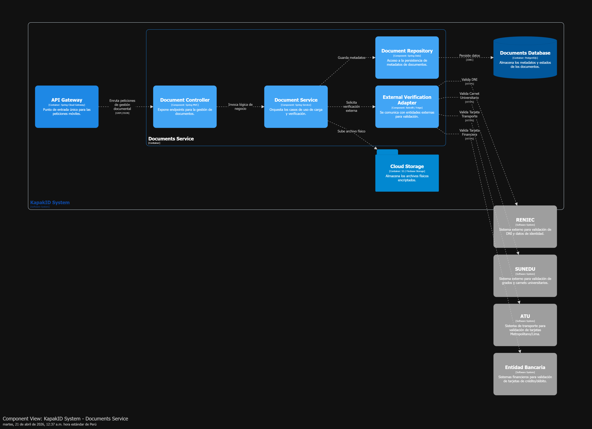

- **2.6.1.6. Bounded Context Software Architecture Code Level Diagrams**
    - 2.6.1.6.1. Bounded Context Domain Layer Class Diagrams
        - El diagrama de clases de la capa de dominio representa el núcleo lógico del Bounded Context de Documents. En este nivel, la estructura se centra exclusivamente en las reglas de negocio y los modelos conceptuales, permaneciendo agnóstica a cualquier tecnología de persistencia o infraestructura externa. En este diagrama se pueden identificar los siguientes elementos clave:

            * <strong>DocumentRecord (Aggregate Root):</strong> Actúa como la puerta de entrada para todas las operaciones del contexto. Es el encargado de mantener la integridad y consistencia entre la información del documento y su estado de sincronización local.

            * <strong>Entidades (Entities):</strong> Se definen Document, que encapsula los atributos dinámicos del archivo (estado y URL), y DocumentCache, que es fundamental para la estrategia móvil de KapakID, ya que gestiona la disponibilidad del documento sin conexión a internet.

            * <strong>Objetos de Valor (Value Objects):</strong> Se utilizan para representar atributos inmutables que definen características del dominio, como DocumentStatus (para el flujo de validación), DocumentType (para categorizar carnets, DNI o tarjetas) y FileUrl.

            * <strong>DocumentRepository (Interface):</strong> Se incluye la interfaz del repositorio, la cual define el contrato para la persistencia del agregado, permitiendo que la capa de dominio se comunique con la infraestructura mediante la inversión de dependencias.
            
            <br>

    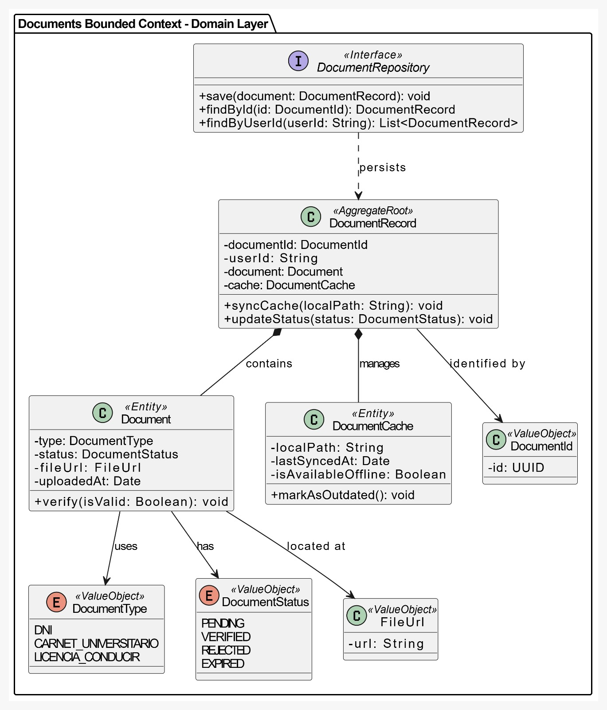

    - 2.6.1.6.2. Bounded Context Database Design Diagram
        - El diseño de la base de datos para el contexto de Documents ha sido proyectado para soportar tanto la integridad de la información en la nube como la eficiencia en el acceso local desde dispositivos móviles. El esquema sigue una estructura normalizada que facilita el seguimiento del ciclo de vida de cada documento cargado por el usuario. El diagrama se compone de las siguientes tablas principales:

            * <strong>Tabla documents:</strong> Es la entidad central de persistencia. Almacena la metadata crítica, incluyendo el user_id para la trazabilidad, el tipo de documento y el estado actual del proceso de verificación. Esta tabla sirve como la "fuente de verdad" para el perfil digital del usuario.

            * <strong>Tabla document_caches:</strong> Diseñada específicamente para optimizar la experiencia móvil. Registra la ubicación física de los archivos en el almacenamiento interno del smartphone (local_path) y marca si el documento está listo para ser visualizado en modo offline, además de registrar la fecha de la última sincronización.

            * <strong>Tabla external_validations:</strong> Funciona como un historial de auditoría e integración. Cada vez que KapakID interactúa con sistemas externos (como RENIEC o SUNEDU), se registra el resultado de la validación, el proveedor consultado y la respuesta obtenida. Esto permite una trazabilidad completa en caso de errores de verificación o auditorías de seguridad.
            
            <br>

    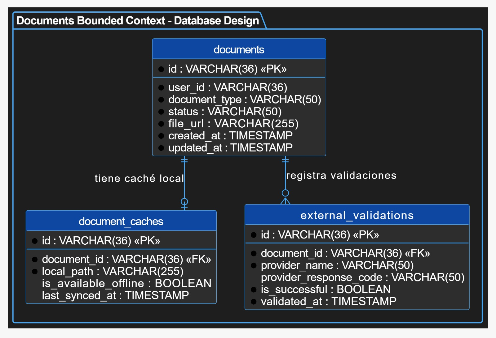

---

---
#### 2.6.2. Bounded Context Notifications: <Notifications>

Este Bounded Context es responsable de centralizar y gestionar todas las comunicaciones salientes hacia los usuarios de KapakID. En el ecosistema móvil, su rol principal es la administración de los tokens de dispositivos (para enviar notificaciones Push) y el registro del historial de alertas sobre vencimiento de documentos, validaciones de identidad y saldos de transporte.

##### 2.6.2.1. Domain Layer

La capa de dominio encapsula las reglas de negocio sobre cómo, cuándo y a quién se envían los mensajes, asegurando que la estructura de la notificación sea válida antes de intentar su despacho.

| Tipo | Nombre | Descripción |
| :--- | :--- | :--- |
| **Entity** | `Notification` | Representa el mensaje en sí (título, cuerpo, fecha de creación) y su estado de lectura. |
| **Entity** | `UserDevice` | Representa el dispositivo móvil del usuario, almacenando el token necesario para recibir notificaciones Push. |
| **Value Object** | `NotificationId` | Identificador único de la notificación. |
| **Value Object** | `NotificationType` | Define el canal de entrega (ej. PUSH, EMAIL, SMS). |
| **Value Object** | `NotificationStatus` | Define el estado de la entrega (ej. PENDING, SENT, FAILED, READ). |
| **Aggregate Root** | `NotificationRecord` | Entidad raíz que asocia el dispositivo del usuario con el historial de notificaciones que se le han enviado. |

##### 2.6.2.2. Interface Layer

Esta capa maneja las peticiones que llegan desde la aplicación móvil KapakID, principalmente para registrar el dispositivo para alertas Push y consultar el buzón de notificaciones.

| Componente | Nombre | Descripción |
| :--- | :--- | :--- |
| **Controller / API** | `NotificationController` | Expone endpoints REST para registrar tokens de dispositivos y obtener el historial de alertas. |
| **DTO** | `DeviceTokenResource` | Objeto que recibe el token generado por el sistema operativo móvil (FCM/APNs) al iniciar sesión. |
| **DTO** | `NotificationInboxResource` | Objeto que devuelve la lista de notificaciones formateada para la bandeja de entrada de la app. |

##### 2.6.2.3. Application Layer

Orquesta los flujos de comunicación. Recibe comandos desde otros Bounded Contexts (ej. cuando Documents avisa que un DNI fue rechazado) y coordina el envío.

| Componente | Nombre | Descripción |
| :--- | :--- | :--- |
| **Command** | `RegisterDeviceCommand` | Comando que indica la intención de vincular un token Push a un usuario. |
| **Command** | `DispatchNotificationCommand` | Comando interno para construir y encolar un mensaje para su envío. |
| **Query** | `GetUnreadNotificationsQuery` | Consulta para cargar la burbuja roja de notificaciones no leídas en la app móvil. |
| **Application Service** | `NotificationCommandService` | Orquesta el guardado del mensaje y delega el envío físico a la infraestructura. |

##### 2.6.2.4. Infrastructure Layer

Se encarga de la comunicación con los proveedores externos de mensajería y la base de datos de historial.

| Componente | Nombre | Descripción |
| :--- | :--- | :--- |
| **Repository** | `NotificationRepository` | Implementación para guardar el historial de mensajes en la base de datos PostgreSQL. |
| **External Service** | `FirebaseMessagingAdapter` | Integración con Firebase Cloud Messaging (FCM) para disparar las notificaciones Push nativas a iOS y Android. |
| **External Service** | `EmailServiceAdapter` | Integración con servicios SMTP (ej. SendGrid o AWS SES) para enviar correos formales. |

##### 2.6.2.5. Bounded Context Software Architecture Component Level Diagrams

Este diagrama de nivel de componentes detalla la estructura interna del microservicio de Notificaciones. Al tratarse de un sistema con enfoque móvil, este componente se encarga de recibir los tokens generados por los dispositivos (iOS/Android) y orquestar el envío de alertas utilizando servicios externos especializados en mensajería Push y correo electrónico.

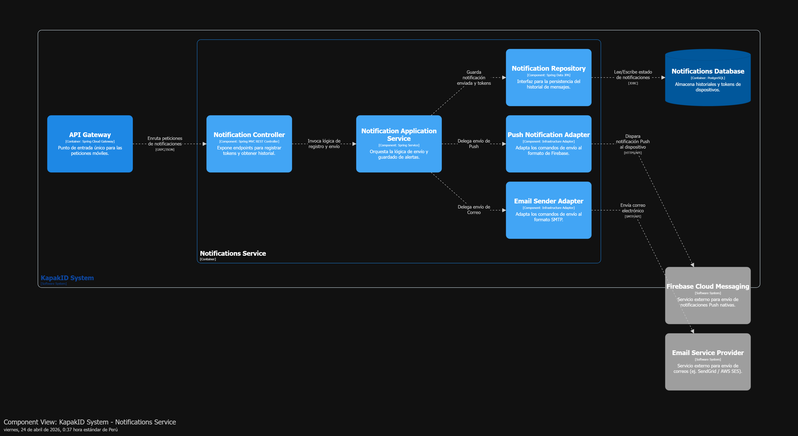

##### 2.6.2.6. Bounded Context Software Architecture Code Level Diagrams
###### 2.6.2.6.1. Bounded Context Domain Layer Class Diagrams
El diagrama de clases para el contexto de Notifications modela la relación entre los dispositivos móviles y los mensajes. El NotificationRecord actúa como Aggregate Root garantizando que no se envíen notificaciones a dispositivos no registrados. Se destaca la entidad UserDevice, que es crítica en el desarrollo móvil para almacenar el identificador de notificaciones push (Device Token). Además, se incluyen los Value Objects que tipifican el estado del envío (NotificationStatus) y el canal (NotificationType).

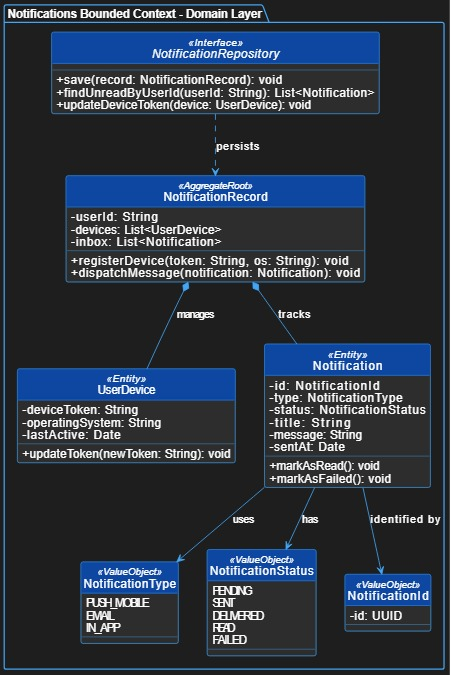
    
###### 2.6.3.6.2. Bounded Context Database Design Diagram

El diseño de base de datos para este contexto es altamente transaccional y optimizado para lecturas rápidas, dado que la bandeja de notificaciones se consulta constantemente desde la app móvil. La tabla user_devices es el núcleo de la integración móvil, almacenando los tokens de Firebase/APNs. La tabla notifications funciona como el historial inmutable de alertas, mientras que notification_templates permite estandarizar los mensajes recurrentes (ej. "Su documento [Documento] ha sido validado con éxito").

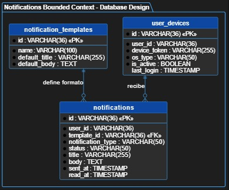


#### 2.6.3. Bounded Context Transportation: <Transportation>

El Bounded Context de Transport es el encargado de gestionar la integración de KapakID con los sistemas de movilidad urbana y servicios financieros. Su responsabilidad principal es permitir que el usuario (Estudiante o Padre de Familia) vincule sus tarjetas físicas (Metropolitano, Lima Pass, carnets universitarios con chip) al ecosistema móvil, consulte saldos en tiempo real y ejecute recargas seguras mediante pasarelas de pago.

##### 2.6.3.1. Domain Layer

  La capa de dominio contiene la lógica pura del negocio de transporte y finanzas personales, asegurando la integridad de los saldos y la validez de las tarjetas antes de cualquier operación.


| Tipo | Nombre | Descripción |
| :--- | :--- | :--- |
| **Aggregate Root** | `TransportCard` | Entidad raíz que representa la tarjeta vinculada; controla el acceso al saldo y las transacciones. |
| **Entity** | `CardBalance` | Representa el saldo monetario disponible, gestionando las reglas de actualización y moneda. |
| **Entity** | `TransitTransaction` | Registro inmutable de cada evento (consumo de pasaje o recarga de saldo). |
| **Value Object** | `CardId` | Identificador único interno generado por KapakID para la gestión de la tarjeta. |
| **Value Object** | `CardNumber` | Representación segura y validada del número físico de la tarjeta. |
| **Value Object** | `MoneyAmount` | Encapsula el valor numérico y el tipo de moneda (PEN) para evitar errores de precisión. |
| **Value Object** | `CardType` | Define si la tarjeta es universitaria, general, de transporte o bancaria. |

##### 2.6.3.2. Interface Layer

  Gestiona la comunicación entre la aplicación móvil y el backend, transformando los datos de la interfaz en comandos y consultas procesables.

| Componente | Nombre | Descripción |
| :--- | :--- | :--- |
| **Controller** | `TransportCardController` | Endpoints para el registro, listado y desvinculación de tarjetas. |
| **Controller** | `BalanceController` | Endpoints para la consulta de saldos y ejecución de procesos de recarga. |
| **DTO** | `LinkCardRequest` | Datos enviados por el móvil para asociar una nueva tarjeta (número y tipo). |
| **DTO** | `BalanceResponse` | Datos formateados que devuelven el saldo y la última fecha de sincronización al usuario. |
##### 2.6.3.3. Application Layer

  Orquesta los casos de uso específicos del transporte, como la validación externa de saldos y la coordinación de pagos bancarios.

| Componente | Nombre | Descripción |
| :--- | :--- | :--- |
| **Command** | `RegisterCardCommand` | Procesa la solicitud inicial de vinculación de una tarjeta al perfil. |
| **Command** | `ProcessTopUpCommand` | Coordina el flujo de pago con el banco y la posterior actualización del saldo en la tarjeta. |
| **Query** | `FetchCardDetailsQuery` | Obtiene la información completa y el historial de una tarjeta específica. |
| **Application Service** | `TransportCommandService` | Maneja la lógica transaccional de escritura para tarjetas y saldos. |

##### 2.6.3.4. Infrastructure Layer

  Implementa la comunicación técnica con los sistemas externos y la persistencia de datos en la base de datos central.

| Componente | Nombre | Descripción |
| :--- | :--- | :--- |
| **Repository** | `TransportCardRepository` | Implementación JPA/Hibernate para persistir las tarjetas y transacciones. |
| **Adapter** | `AtuApiAdapter` | Cliente técnico que se conecta a los servicios de la ATU para validar saldos reales. |
| **Adapter** | `BankPaymentAdapter` | Adaptador para la integración con pasarelas de pago (Niubiz/Izipay) para recargas. |


##### 2.6.3.5. Bounded Context Software Architecture Component Level Diagrams
  
  Este diagrama de componentes ilustra la estructura interna del contenedor Transport Service. La interacción comienza en el Transport Controller, que recibe las peticiones desde la aplicación móvil a través del API Gateway.

  La lógica central es orquestada por el Transport Application Service, el cual coordina el flujo de las operaciones apoyándose en tres pilares:

  - El Transport Repository para persistir los saldos en la base de datos.

  - El ATU Integration Adapter para consultar el estado real de la tarjeta en el sistema del Metropolitano.

  - El Payment Gateway Adapter para procesar los cobros de las recargas con las entidades bancarias.

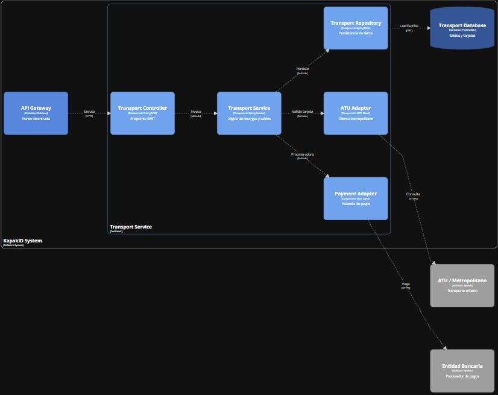

##### 2.6.3.6. Bounded Context Software Architecture Code Level Diagrams
###### 2.6.3.6.1. Bounded Context Domain Layer Class Diagrams
    
  El diagrama de clases de dominio ha sido diseñado siguiendo los principios tácticos de DDD, centrando la lógica en el Aggregate Root TransportCard. A diferencia de un modelo tradicional, aquí las conexiones representan propiedad y límites de consistencia: las entidades CardBalance y TransitTransaction son gestionadas exclusivamente por la raíz, garantizando que el saldo nunca se modifique sin un registro transaccional previo.

  Se han implementado Value Objects como MoneyAmount y CardNumber para encapsular lógica de validación y formato (como el enmascaramiento por seguridad), asegurando que los objetos de dominio sean "ricos" en comportamiento y no simples contenedores de datos.

  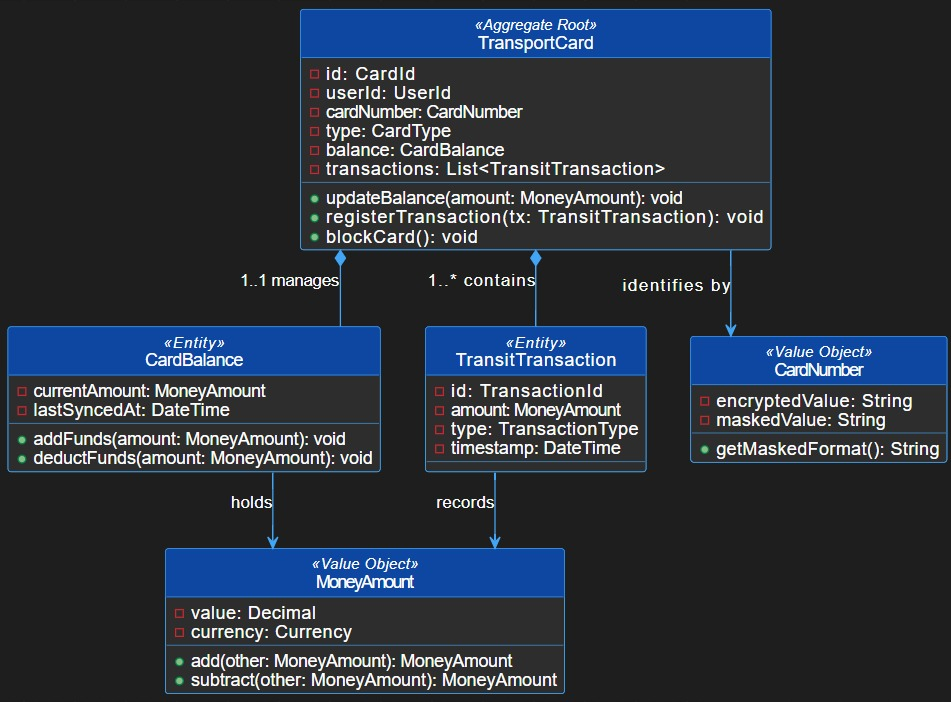
###### 2.6.3.6.2. Bounded Context Database Design Diagram
    
  El diseño físico de la base de datos refleja la estructura del dominio, garantizando la integridad referencial y la trazabilidad financiera. La tabla principal transport_cards actúa como el eje central, mientras que card_balances permite un acceso rápido al saldo actual sin necesidad de recalcular todo el historial.

  La tabla transit_transactions funciona como un libro mayor (ledger) inmutable, registrando cada recarga y consumo con su respectivo código de referencia bancaria o de transporte, lo cual es vital para la resolución de disputas y auditoría de cumplimiento (Compliance).

  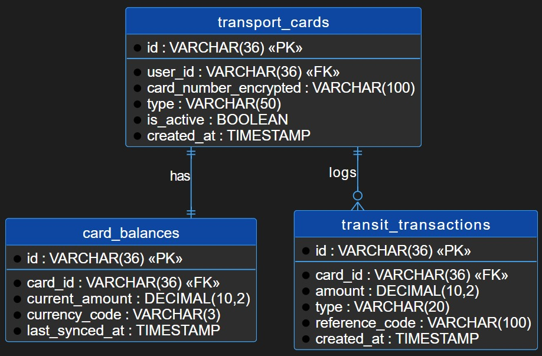

#### 2.6.4. Bounded Context: Identity and Access Management (IAM)

Este Bounded Context es el núcleo de seguridad de KapakID. Es responsable de la autenticación, autorización y la gestión de los perfiles de los usuarios (Estudiantes Universitarios y Padres/Tutores). Administra el ciclo de vida de las credenciales, emite y valida tokens JWT, y garantiza que cada interacción en la plataforma esté debidamente autorizada y registrada.

##### 2.6.4.1. Domain Layer

La capa de dominio encapsula las reglas fundamentales de seguridad y acceso al ecosistema de KapakID, garantizando la inmutabilidad de la identidad y la gestión de roles sin depender de frameworks externos.

| Tipo | Nombre | Descripción |
| :--- | :--- | :--- |
| **Aggregate Root** | `UserAccount` | Entidad raíz que centraliza la información del usuario, sus roles y sus credenciales activas. |
| **Entity** | `Session` | Representa una sesión activa de un usuario en un dispositivo, gestionando su ciclo de vida y caducidad. |
| **Value Object** | `UserId` | Identificador único e inmutable del usuario en todo el ecosistema KapakID. |
| **Value Object** | `Credentials` | Encapsula la lógica de la contraseña cifrada (hash) garantizando que nunca se exponga en texto claro. |
| **Value Object** | `UserRole` | Define el nivel de acceso y el segmento del usuario (ej. Student, Parent, Admin). |
| **Value Object** | `EmailAddress` | Encapsula la validación de formato del correo electrónico y asegura que sea único. |

##### 2.6.4.2. Interface Layer

Esta capa actúa como el puerto de entrada para las peticiones de los dispositivos cliente (aplicación móvil o web), exponiendo los endpoints seguros para el registro y el acceso.

| Componente | Nombre | Descripción |
| :--- | :--- | :--- |
| **Controller** | `AuthController` | Expone endpoints REST para iniciar sesión (`/auth/login`), registrarse y renovar tokens. |
| **Controller** | `UserProfileController` | Expone endpoints para consultar y editar la información básica del perfil. |
| **DTO** | `LoginRequestResource` | Objeto que transporta las credenciales ingresadas por el usuario desde la interfaz. |
| **DTO** | `AuthResponseResource` | Objeto de respuesta que incluye el Token JWT y los datos básicos de la sesión autorizada. |

##### 2.6.4.3. Application Layer

La capa de aplicación coordina las acciones de seguridad, validando reglas mediante servicios de dominio y emitiendo eventos de integración cuando un usuario se registra o inicia sesión.

| Componente | Nombre | Descripción |
| :--- | :--- | :--- |
| **Command** | `RegisterUserCommand` | Comando que encapsula los datos y la intención de crear una nueva cuenta en la plataforma. |
| **Command** | `AuthenticateUserCommand` | Comando que orquesta la verificación de credenciales y la generación de la sesión. |
| **Query** | `GetUserProfileQuery` | Consulta diseñada para retornar la información del perfil del usuario logueado. |
| **Application Service** | `IdentityCommandService` | Coordina la lógica transaccional de escritura, incluyendo el hash de contraseñas y el guardado en base de datos. |

##### 2.6.4.4. Infrastructure Layer

Proporciona las implementaciones técnicas concretas para el almacenamiento seguro de usuarios y la generación criptográfica de tokens.

| Componente | Nombre | Descripción |
| :--- | :--- | :--- |
| **Repository** | `UserRepository` | Implementación de persistencia para guardar y consultar usuarios en la base de datos PostgreSQL. |
| **Infra Service** | `JwtTokenProvider` | Implementación técnica encargada de firmar, emitir y validar la vigencia de los tokens JWT. |
| **Infra Service** | `PasswordHasher` | Componente de seguridad encargado de encriptar las contraseñas utilizando algoritmos fuertes (ej. BCrypt). |

##### 2.6.4.5. Bounded Context Software Architecture Component Level Diagrams

Este diagrama ilustra la arquitectura interna del microservicio de Identidad. El flujo comienza en el `AuthController`, que recibe peticiones del API Gateway. El `IdentityCommandService` procesa estas solicitudes apoyándose en el `PasswordHasher` para verificar credenciales y en el `JwtTokenProvider` para emitir el acceso. Finalmente, los datos se consultan y guardan a través del `UserRepository`.

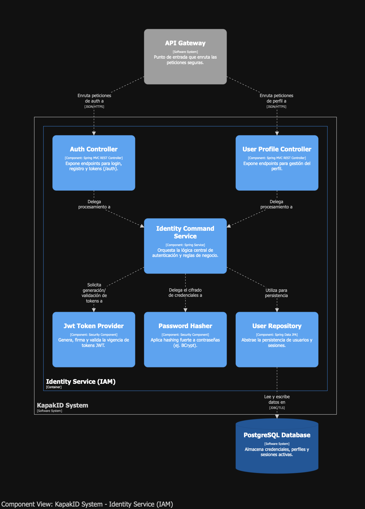

##### 2.6.4.6. Bounded Context Software Architecture Code Level Diagrams
###### 2.6.4.6.1. Bounded Context Domain Layer Class Diagrams

El diagrama de clases de la capa de dominio sitúa a `UserAccount` como la raíz de agregación. Esta entidad gestiona instancias de sus Value Objects correspondientes (`Credentials`, `UserRole`, `EmailAddress`). Esta separación garantiza que atributos críticos como la contraseña estén encapsulados y aislados de modificaciones accidentales desde otras partes del código.

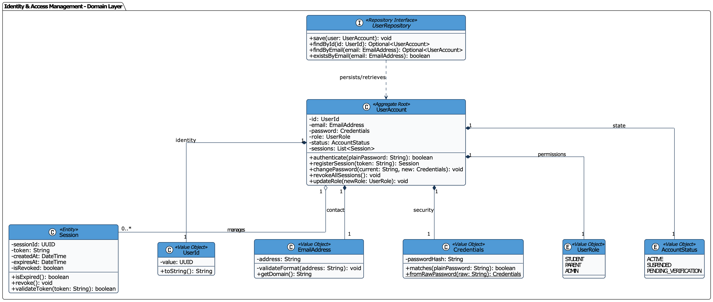

###### 2.6.4.6.2. Bounded Context Database Design Diagram

A nivel físico, la base de datos para IAM se mantiene estrictamente separada para evitar fugas de información. La tabla `users` contiene la información central e inmutable de autenticación (correo, password_hash, rol). Además, se incluye una tabla `user_sessions` para la gestión activa de tokens (permitiendo invalidar sesiones o implementar *refresh tokens*) y registrar los últimos accesos por motivos de seguridad y auditoría.

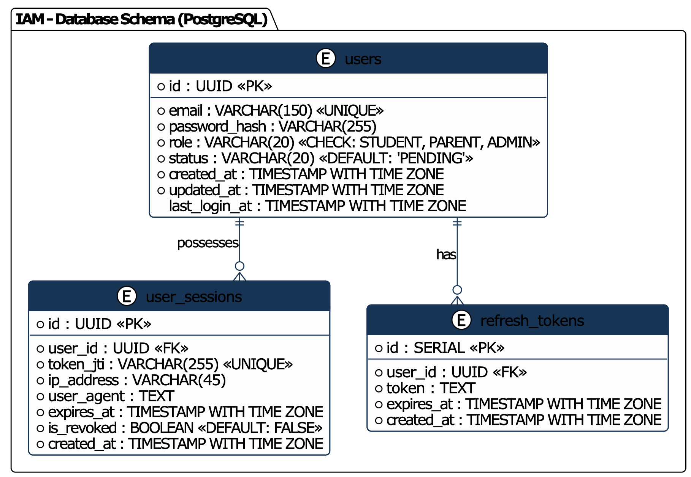

#### 2.6.5. Bounded Context Compliance: <Compliance>

El Bounded Context de Compliance es el motor de auditoría y gobernanza de KapakID. Su propósito exclusivo es garantizar que todas las transacciones críticas, el acceso a documentos oficiales y las recargas de saldo cumplan con las regulaciones de la Ley de Protección de Datos Personales. Este contexto opera principalmente en segundo plano, guardando un registro inmutable (append-only) de las actividades y gestionando el ciclo de vida del consentimiento del usuario sobre sus datos personales desde la aplicación móvil.

##### 2.6.5.1. Domain Layer

La capa de dominio de Compliance está diseñada bajo el principio de inmutabilidad. Una vez que un evento de auditoría se crea, las reglas de negocio prohíben estrictamente su modificación o eliminación, garantizando la integridad legal del ecosistema.

| Tipo | Nombre | Descripción |
| :--- | :--- | :--- |
| **Aggregate Root** | `AuditRecord` | Entidad central inmutable que registra una acción crítica ejecutada en el sistema. |
| **Aggregate Root** | `UserConsent` | Gestiona las aceptaciones legales del usuario (ej. Términos y Condiciones, Políticas de Privacidad). |
| **Value Object** | `ActionType` | Define la categoría del evento auditado (ej. DOCUMENT_VIEW, CARD_LINKED, LOGIN_ATTEMPT). |
| **Value Object** | `IpAddress` | Dirección de red desde donde se ejecutó la acción. |
| **Value Object** | `DeviceInfo` | Metadatos del smartphone (ej. iOS 16.4, iPhone 13) útiles para rastreo de accesos o posibles fraudes. |
| **Value Object** | `PolicyVersion` | Identificador de la versión exacta del documento legal que el usuario aceptó en un momento dado. |

##### 2.6.5.2. Interface Layer

Esta capa recibe peticiones síncronas desde la app móvil, pero también expone interfaces asíncronas para capturar acciones de otros microservicios sin afectar el rendimiento de la aplicación.

| Componente | Nombre | Descripción |
| :--- | :--- | :--- |
| **Controller** | `ConsentController` | Endpoints REST para que la app móvil consulte y actualice los consentimientos legales del usuario. |
| **Event Listener** | `AuditMessageConsumer` | Escucha eventos asíncronos (vía RabbitMQ o Kafka) provenientes de Documents o Transport para registrarlos sin latencia. |
| **DTO** | `AcceptPolicyRequest` | Datos enviados desde el móvil cuando el usuario hace clic en "Aceptar términos". |

##### 2.6.5.3. Application Layer

Orquesta el registro seguro de los eventos y la consulta de reportes de auditoría en caso de requerimientos legales o de soporte técnico.

| Componente | Nombre | Descripción |
| :--- | :--- | :--- |
| **Command** | `LogAuditActionCommand` | Comando interno para persistir un nuevo registro inmutable en el libro mayor de auditoría. |
| **Command** | `RecordConsentCommand` | Comando para registrar o actualizar la aceptación de una política legal por parte del usuario. |
| **Query** | `GetAuditTrailQuery` | Consulta restringida (generalmente para backoffice) para ver el historial de acciones críticas de una cuenta. |
| **Application Service** | `ComplianceCommandService` | Valida y ejecuta las reglas de inmutabilidad antes de persistir los datos de auditoría o consentimiento. |

##### 2.6.5.4. Infrastructure Layer

Implementa la persistencia con un enfoque en la seguridad extrema, configurando repositorios para rechazar modificaciones estructurales.

| Componente | Nombre | Descripción |
| :--- | :--- | :--- |
| **Repository** | `AuditRecordRepository` | Implementación de acceso a datos configurada para operaciones exclusivamente de inserción (INSERT-ONLY). |
| **Repository** | `ConsentRepository` | Persistencia del estado legal del usuario en la base de datos relacional. |

##### 2.6.5.5. Bounded Context Software Architecture Component Level Diagrams

Este diagrama de componentes ilustra la estructura interna del contenedor Compliance Service. La interacción es dual: recibe peticiones síncronas (HTTP) para gestionar términos legales desde la app, y consume eventos asíncronos (AMQP) desde un Message Broker para registrar auditorías sin bloquear las transacciones de otros módulos.

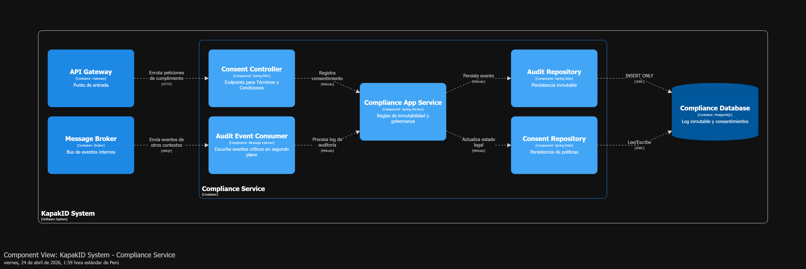

##### 2.6.5.6. Bounded Context Software Architecture Code Level Diagrams

###### 2.6.5.6.1. Bounded Context Domain Layer Class Diagrams

El diagrama de clases para Compliance destaca por la estricta ausencia de métodos mutadores (Setters) en AuditRecord. Se utilizan Value Objects detallados (DeviceInfo, IpAddress, ActionType) para capturar el contexto técnico de los dispositivos móviles, asegurando que la auditoría sea rica y trazable.

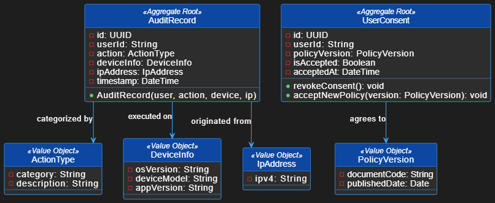

###### 2.6.5.6.2. Bounded Context Database Design Diagram

El diseño físico separa el historial de acciones (audit_logs) de la gestión legal (user_consents). audit_logs es una tabla aplanada diseñada para lecturas rápidas y operaciones exclusivas de inserción (Write-Once), mientras que user_consents se relaciona con legal_policies para llevar el control de qué versión de los términos aceptó el usuario.

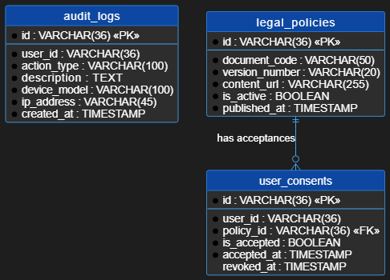

<div style="page-break-after: always;"></div>

## Capítulo III: Solution UI/UX Design

### 3.1. Product design

En este capítulo se describen las directrices de diseño del producto KapakID, estableciendo lineamientos visuales y de interacción que garanticen una experiencia de usuario coherente, accesible y adaptada al contexto peruano.
El objetivo es asegurar la consistencia estética y funcional en todas las plataformas (web y móvil), respetando tanto estándares internacionales de diseño como particularidades culturales y normativas locales.

#### 3.1.1. Style Guidelines

Las guías de estilo definen la identidad visual del producto, determinando los principios básicos de tipografía, color, iconografía, componentes y usabilidad.
Estas directrices buscan un equilibrio entre modernidad, simplicidad y confianza, elementos clave para una aplicación que gestiona documentos y pagos sensibles.

- **3.1.1.1. General Style Guidelines**

#### Branding

El nombre **KapakID** proviene del término quechua *Qhapaq*, que significa **importante o principal**.  
Esta raíz cultural refuerza la esencia de la aplicación: ser una identidad digital central, segura y confiable para las personas.  

La marca proyecta tres valores fundamentales:

- **Seguridad**: protección de datos y confianza.  
- **Centralidad**: ser el eje principal de la identidad digital del usuario.  
- **Cultura**: rescatar lo importante (*Qhapaq*) como base de la modernidad.  

El logo combina un **escudo** como símbolo de protección, con un sistema de **nodos inspirados en los quipus**, que representan la unión de distintos servicios (documentos, movilidad, transacciones y validaciones).  
Esta integración transmite innovación tecnológica con un fuerte vínculo a la herencia cultural andina.  


<td></td>


#### Paleta de Colores – KapakID

Los colores refuerzan los valores de **confianza, identidad cultural, seguridad y accesibilidad**.  
Se dividen en institucionales, de acción, alerta, neutrales y de acento cultural.  

<td>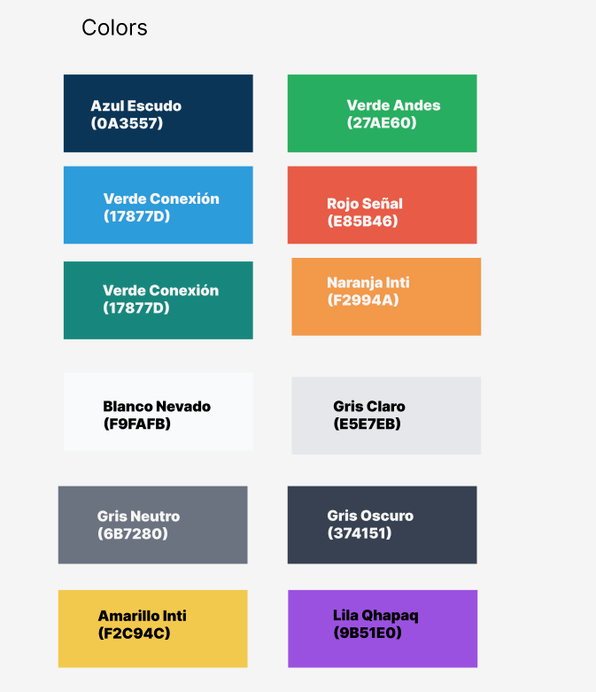</td>

**Colores institucionales**  
- Azul Escudo #0A3557: principal. Seguridad, headers, botones primarios.  
- Celeste Andino `#2D9CDB`: frescura, innovación, fondos alternativos.  

**Acción positiva**  
- Verde Conexión #17877D: validación, éxito, checkmarks.  
- Verde Andes #27AE60: energía, accesibilidad.  

**Alertas**  
- Rojo Señal #E85B46: errores críticos.  
- Naranja Inti #F2994A: advertencias preventivas.  

**Neutrales**  
- Blanco Nevado #F9FAFB: fondo principal.  
- Gris Claro #E5E7EB: fondos secundarios.  
- Gris Neutro #6B7280: textos secundarios, íconos inactivos.  
- Gris Oscuro #374151: textos principales.  

**Acento cultural**  
- Amarillo Inti #F2C94C: energía, resaltes, microinteracciones.  
- Lila Qhapaq #9B51E0: innovación, modernidad.  

#### Tipografía – KapakID

La tipografía es un eje central en la identidad visual. Se busca un estilo **moderno, claro y altamente legible** en dispositivos móviles y entornos digitales.  

<td></td>

**Fuentes principales**  
- **Poppins Bold** → títulos y encabezados.  
- **Poppins Medium** → subtítulos y secundarios.  
- **Roboto Regular** → párrafos y formularios.  
- **Roboto Mono** → datos técnicos, validaciones, códigos.  
<td></td>

**Escala tipográfica**  
- H1: 32–36 px, Poppins Bold, Azul Escudo.  
- H2: 24–28 px, Poppins Medium, Gris Oscuro.  
- H3: 18–22 px, Poppins Medium, Gris Neutro.  
- Texto cuerpo: 14–16 px, Roboto Regular.  
- Texto técnico: 12–14 px, Roboto Mono.  
- Texto ayuda: 12–14 px, Roboto Regular Gris Claro.  
<td>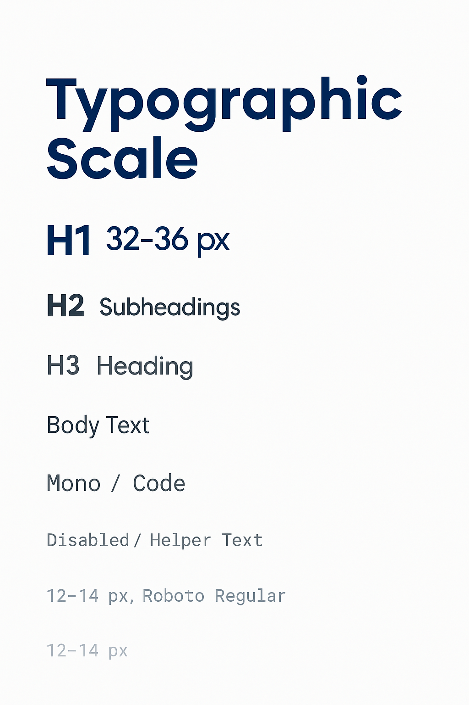</td>

**Line-height y espaciado**  
- Encabezados: 110%.  
- Texto principal: 140–150%.  
- Texto técnico: 130%.  
#### Iconografía

La iconografía aporta **claridad, simplicidad y accesibilidad** en la navegación.  

<td>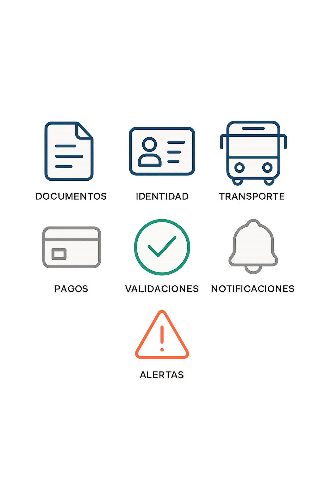</td>

- Estilo outline minimalista, 2 px.  
- Esquinas redondeadas, coherentes con botones y tarjetas.  
- Colores según estado:  
  - Azul Escudo → íconos principales.  
  - Verde Conexión → validaciones.  
  - Rojo Señal → errores.  
  - Gris Neutro → inactivos.  
- Ejemplos: documentos, identidad, transporte, pagos, validaciones.  
- Todos los íconos deben tener etiquetas accesibles (`alt` / `aria-label`).  

#### Jerarquía Visual
La jerarquía organiza la información de forma clara y priorizada:  
- **Títulos principales (H1):** Azul Escudo, 32–36 px.  
- **Subtítulos (H2–H3):** Gris Neutro, 18–28 px.  
- **Texto principal:** Roboto Regular, 14–16 px, Gris Oscuro.  
- **Botón primario:** Azul Escudo, texto blanco.  
- **Botón secundario:** Verde Conexión o Gris Neutro.  
- **Acciones críticas:** Rojo Señal + ícono de advertencia.  

- **3.1.1.1. General Style Guidelines**

#### Branding

El nombre **KapakID** proviene del término quechua *Qhapaq*, que significa **importante o principal**.  
Esta raíz cultural refuerza la esencia de la aplicación: ser una identidad digital central, segura y confiable para las personas.  

La marca proyecta tres valores fundamentales:

- **Seguridad**: protección de datos y confianza.  
- **Centralidad**: ser el eje principal de la identidad digital del usuario.  
- **Cultura**: rescatar lo importante (*Qhapaq*) como base de la modernidad.  

El logo combina un **escudo** como símbolo de protección, con un sistema de **nodos inspirados en los quipus**, que representan la unión de distintos servicios (documentos, movilidad, transacciones y validaciones).  
Esta integración transmite innovación tecnológica con un fuerte vínculo a la herencia cultural andina.  

<td></td>


#### Paleta de Colores – KapakID

Los colores refuerzan los valores de **confianza, identidad cultural, seguridad y accesibilidad**.  
Se dividen en institucionales, de acción, alerta, neutrales y de acento cultural.  

<td></td>

**Colores institucionales**  
- Azul Escudo #0A3557: principal. Seguridad, headers, botones primarios.  
- Celeste Andino `#2D9CDB`: frescura, innovación, fondos alternativos.  

**Acción positiva**  
- Verde Conexión #17877D: validación, éxito, checkmarks.  
- Verde Andes #27AE60: energía, accesibilidad.  

**Alertas**  
- Rojo Señal #E85B46: errores críticos.  
- Naranja Inti #F2994A: advertencias preventivas.  

**Neutrales**  
- Blanco Nevado #F9FAFB: fondo principal.  
- Gris Claro #E5E7EB: fondos secundarios.  
- Gris Neutro #6B7280: textos secundarios, íconos inactivos.  
- Gris Oscuro #374151: textos principales.  

**Acento cultural**  
- Amarillo Inti #F2C94C: energía, resaltes, microinteracciones.  
- Lila Qhapaq #9B51E0: innovación, modernidad.  

#### Tipografía – KapakID

La tipografía es un eje central en la identidad visual. Se busca un estilo **moderno, claro y altamente legible** en dispositivos móviles y entornos digitales.  

<td></td>

**Fuentes principales**  
- **Poppins Bold** → títulos y encabezados.  
- **Poppins Medium** → subtítulos y secundarios.  
- **Roboto Regular** → párrafos y formularios.  
- **Roboto Mono** → datos técnicos, validaciones, códigos.  
<td></td>

**Escala tipográfica**  
- H1: 32–36 px, Poppins Bold, Azul Escudo.  
- H2: 24–28 px, Poppins Medium, Gris Oscuro.  
- H3: 18–22 px, Poppins Medium, Gris Neutro.  
- Texto cuerpo: 14–16 px, Roboto Regular.  
- Texto técnico: 12–14 px, Roboto Mono.  
- Texto ayuda: 12–14 px, Roboto Regular Gris Claro.  
<td></td>

**Line-height y espaciado**  
- Encabezados: 110%.  
- Texto principal: 140–150%.  
- Texto técnico: 130%.  
#### Iconografía

La iconografía aporta **claridad, simplicidad y accesibilidad** en la navegación.  

<td></td>

- Estilo outline minimalista, 2 px.  
- Esquinas redondeadas, coherentes con botones y tarjetas.  
- Colores según estado:  
  - Azul Escudo → íconos principales.  
  - Verde Conexión → validaciones.  
  - Rojo Señal → errores.  
  - Gris Neutro → inactivos.  
- Ejemplos: documentos, identidad, transporte, pagos, validaciones.  
- Todos los íconos deben tener etiquetas accesibles (`alt` / `aria-label`).  

#### Jerarquía Visual
La jerarquía organiza la información de forma clara y priorizada:  
- **Títulos principales (H1):** Azul Escudo, 32–36 px.  
- **Subtítulos (H2–H3):** Gris Neutro, 18–28 px.  
- **Texto principal:** Roboto Regular, 14–16 px, Gris Oscuro.  
- **Botón primario:** Azul Escudo, texto blanco.  
- **Botón secundario:** Verde Conexión o Gris Neutro.  
- **Acciones críticas:** Rojo Señal + ícono de advertencia.  


#### 3.1.2. Information Architecture
- **3.1.2.1. Organization Systems**

#### Landing Page e Inicio de la Aplicación
- **Tipo de organización:** Jerárquica.  
- La landing page destacará: beneficios, funcionalidades principales (documentos, pagos, transporte y alertas) y testimonios.  
- En la pantalla de inicio se priorizan accesos rápidos al DNI digital, saldos, pagos pendientes y alertas urgentes.  

#### Gestión de Documentos y Pagos
- **Tipo de organización:** Secuencial.  
- Flujos: registro → validación → confirmación.  
- Reduce errores y refuerza la seguridad.  

#### Módulos de Transporte y Movilidad
- **Tipo de organización:** Matricial.  
- Acceso a recargas, historial de viajes y tarjetas vinculadas.  
- Exploración flexible por saldo, fecha o tipo de transporte.  

#### Alertas y Notificaciones
- **Esquema de categorización:** Por tópicos.  
- Categorías: seguridad, transporte, pagos, documentos.  
- Permite priorizar atención de forma inmediata.  

#### Historial de Transacciones y Actividades
- **Esquema de categorización:** Cronológico.  
- Pagos, recargas y validaciones ordenados por fecha.  
- Registro confiable y auditable.  

#### Contenido Personalizado por Perfil de Usuario
- **Esquema de categorización:** Según audiencia.  
- **Estudiantes:** Recargas rápidas, gestión de carné universitario, beneficios educativos.  
- **Familias:** Perfiles familiares para pagos y documentos de dependientes.  
- **Ciudadanos generales:** Validación de identidad, pagos de servicios básicos, transporte.  

#### Búsqueda de Documentos y Servicios
- **Esquema de categorización:** Alfabético.  
- Localización rápida de documentos y servicios.  

- **3.1.2.2. Labelling Systems**

#### Landing Page
- **Home/Inicio:** Propuesta de valor de KapakID.  
- **Features/Características:** Funciones clave (identidad digital, pagos, transporte).  
- **Benefits/Beneficios:** Seguridad, rapidez, confianza y centralización.  
- **Testimonials/Testimonios:** Experiencias de usuarios.  
- **About/Acerca de:** Equipo desarrollador y propósito de KapakID (*Qhapaq = importante*).  
- **Contact/Contacto:** Soporte, redes sociales, correo.  

#### Web Application
- **Home/Inicio:** Accesos rápidos a DNI digital, saldo, pagos pendientes y alertas.  
- **Perfil:** Gestión de información personal, documentos, métodos de pago y preferencias.  
- **Documentos:** DNI, pasaporte, carné universitario, brevete.  
- **Pagos:** Servicios, transporte y recargas. Incluye historial.  
- **Transporte:** Tarjetas vinculadas, historial de viajes, saldos y recargas.  
- **Búsqueda:** Localización de documentos o servicios.  
- **Favoritos:** Acceso a elementos prioritarios.  
- **Alertas/Notificaciones:** Vencimientos, saldos bajos, pagos pendientes.  
- **Soporte:** FAQs, guías y contacto con atención al cliente.  
  

- **3.1.2.3. SEO Tags and Meta Tags**

– KapakID  

#### Landing Page  
Title: Texto visible en la parte superior del navegador y en los resultados de búsqueda.  

```html
<title>KapakID – Tu identidad y pagos digitales seguros en un solo lugar</title>
-Codificación de caracteres:
<meta charset="utf-8">
-Description: Breve descripción de la aplicación.
<meta name="description" content="KapakID es tu plataforma digital segura para gestionar tu identidad, documentos y pagos en un solo lugar."/>

-Key Words: Palabras clave relacionadas con la app.
<meta name="keywords" content="identidad digital, billetera electrónica, pagos seguros, transporte, documentos digitales, Perú"/>

Author & Copyright:

<meta name="author" content="KapakID Team"/>
<meta name="copyright" content="Copyright KapakID Team" />

-Web Application
-Title:
<title>KapakID</title>
-Description
<meta name="description" content="KapakID – Plataforma oficial para gestionar tu identidad digital, documentos y pagos de forma segura."/>

-Key Words:
<meta name="keywords" content="KapakID, identidad digital, pagos, transporte, documentos, seguridad, conectividad"/>
-Author & Copyright:
<meta name="author" content="KapakID Team"/>
<meta name="copyright" content="Copyright KapakID Team" />

```

- **3.1.2.4. Searching Systems**


- **Barra de búsqueda general:**  
  Ubicada en la parte superior derecha de la plataforma web y dentro del menú principal de la app.  
  Permitirá acceder rápidamente a recursos como: validación de documentos, historial de pagos, transporte, billetera digital y servicios vinculados.  

- **Sugerencias automáticas (autocompletado):**  
  El sistema mostrará resultados predictivos mientras el usuario escribe, basados en documentos registrados (DNI, brevete, carnés), transacciones recientes y accesos frecuentes.  

- **Filtros de búsqueda:**  
  Se ofrecerán filtros que permitan refinar la búsqueda según:  
  - Categorías: Identidad, Pagos, Transporte, Beneficios Sociales.  
  - Contenido: Documentos, Transacciones, Validaciones, Recibos.  
  - Estado: Activo, Expirado, Pendiente de validación.  

- **Filtros avanzados:**  
  Opciones adicionales como:  
  - Recientes / Más antiguos.  
  - Monto de transacción.  
  - Tipo de pago (tarjeta, QR, billetera digital).  
  - Institución asociada (RENIEC, bancos, transporte).  
---

- **3.1.2.5. Navigation Systems**


#### Landing Page  
La navegación en la landing page estará orientada a generar confianza y facilitar el registro.  
Se implementará un menú superior con enlaces visibles hacia:  

- **Inicio:** Presentación general de KapakID.  
- **Características:** Explicación de las principales funciones (identidad digital, pagos, transporte).  
- **Beneficios:** Cómo mejora la vida del usuario en seguridad, accesibilidad y rapidez.  
- **Testimonios:** Opiniones de usuarios reales y casos de uso.  
- **Acerca de:** Información del equipo y visión de KapakID.  
- **Contacto:** Formulario y canales de atención.  


#### Web Application  

Dentro de la **aplicación web**, la navegación se centrará en un **dashboard central**, accesible tras el inicio de sesión.  

- **Dashboard principal:**  
  Vista general con accesos rápidos a identidad, billetera digital, transporte y notificaciones prioritarias.  

- **Panel lateral de navegación (sidebar):**  
  - **Perfil:** Información personal, configuración y preferencias.  
  - **Documentos:** Gestión y validación de DNI, brevete, carnés, etc.  
  - **Pagos:** Métodos de pago, recargas, historial de transacciones y comprobantes.  
  - **Transporte:** Tickets, pasajes electrónicos y servicios de movilidad urbana.  
  - **Historial:** Registro cronológico de actividades, transacciones y validaciones.  
  - **Notificaciones:** Alertas de vencimiento, confirmaciones y actualizaciones del sistema.  
  - **Soporte / Ayuda:** FAQs, chat en línea y contacto directo con asistencia.  

- **Consistencia visual:** El logotipo en la parte superior del sidebar permitirá volver al **dashboard principal**.  
- **Acciones rápidas:** Atajos destacados en el dashboard (ej. “Validar documento”, “Recargar saldo”, “Comprar pasaje”) para reducir clics y mejorar eficiencia.  


#### 3.1.3. Landing Page UI Design
- **3.1.3.1. Landing Page Wireframe**


- **3.1.3.2. Landing Page Mock-up**

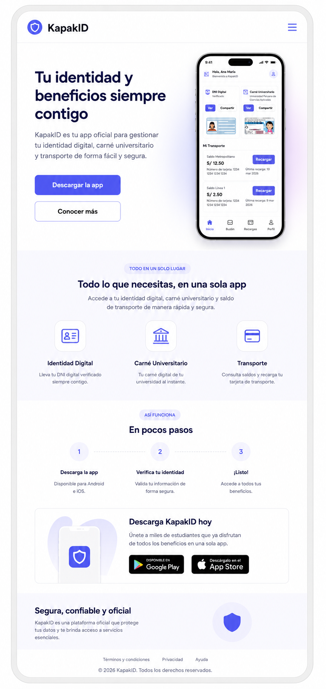

#### 3.1.4. Mobile Applications UX/UI Design

**3.1.4.1. Mobile Applications Wireframes**

En esta sección se presentan los *wireframes* de baja fidelidad de la aplicación móvil KapakID. El objetivo de estos esquemas estructurales es definir la jerarquía visual y la disposición de los componentes de la interfaz, omitiendo colores y tipografías para centrar el enfoque estrictamente en la usabilidad y la arquitectura de la información. Se han diagramado las ocho vistas que componen el ecosistema completo del MVP:

* **Inicio de Sesión:** Define la estructura del acceso seguro y la autenticación biométrica.
* **Dashboard:** Centraliza la visualización de documentos digitales y el resumen de saldos de transporte.
* **Recarga:** Estructura los campos de selección de montos y pasarela de pago para el Metropolitano y Línea 1.
* **Notificaciones:** Organiza el listado de alertas del sistema, como vencimientos de documentos o saldos bajos.
* **Detalle de DNI:** Vista expandida de alta legibilidad para la presentación del documento ante autoridades.
* **Carné Universitario:** Módulo específico para la validación del medio pasaje y datos académicos.
* **Perfil de Usuario:** Gestión de cuenta, seguridad y acceso a funciones familiares premium.
* **Historial de Recargas:** Registro cronológico de transacciones para el control de gastos del usuario.

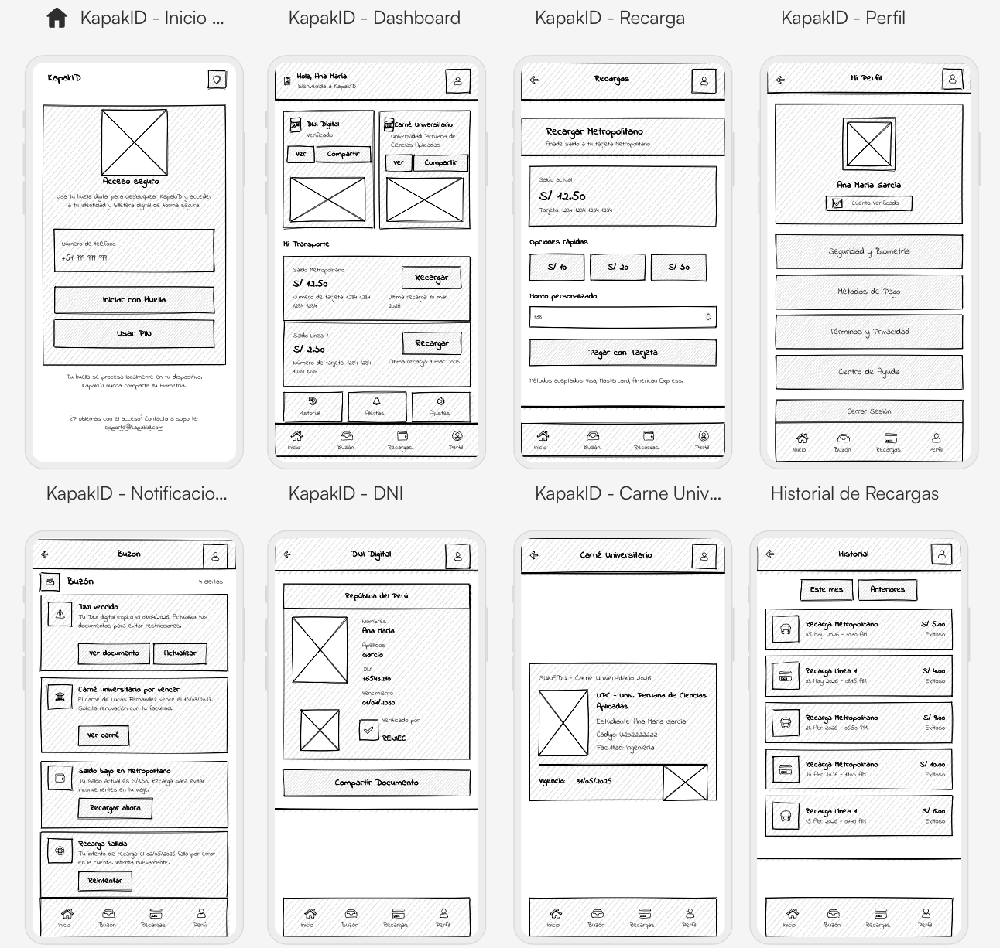

**3.1.4.2. Mobile Applications Wireflow Diagrams**

En esta sección se detalla el *Wireflow* de la aplicación, el cual ilustra la navegación del usuario entre las vistas principales de KapakID. A diferencia de un diagrama de flujo puramente lógico, este modelo utiliza las representaciones estructurales de las interfaces para mostrar exactamente qué interacciones en la pantalla desencadenan los cambios de estado en el sistema.

Se evidencian las rutas críticas: el acceso seguro mediante biometría, la transición fluida entre el dashboard y los documentos detallados, y el flujo completo de pagos desde la selección de monto hasta la confirmación en el historial.

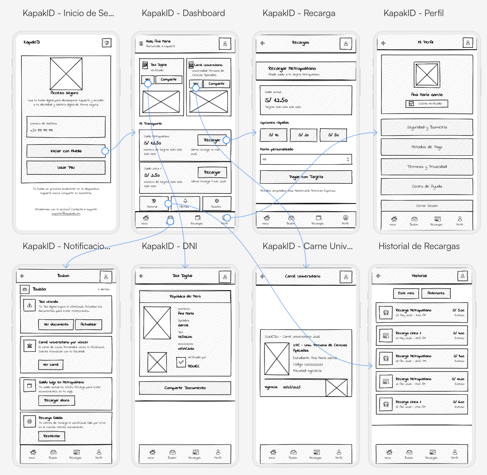

**3.1.4.3. Mobile Applications Mock-ups**

A continuación, se exhiben los *mock-ups* de alta fidelidad que representan la interfaz de usuario (UI) final de KapakID. En esta etapa se ha aplicado el *UI Kit* corporativo, integrando la paleta cromática (azul y blanco), tipografía moderna e ilustraciones vectoriales personalizadas. El diseño resultante refleja un entorno minimalista y moderno, enfocado en transmitir la seguridad y confianza que exige una plataforma de identidad digital y transacciones financieras.

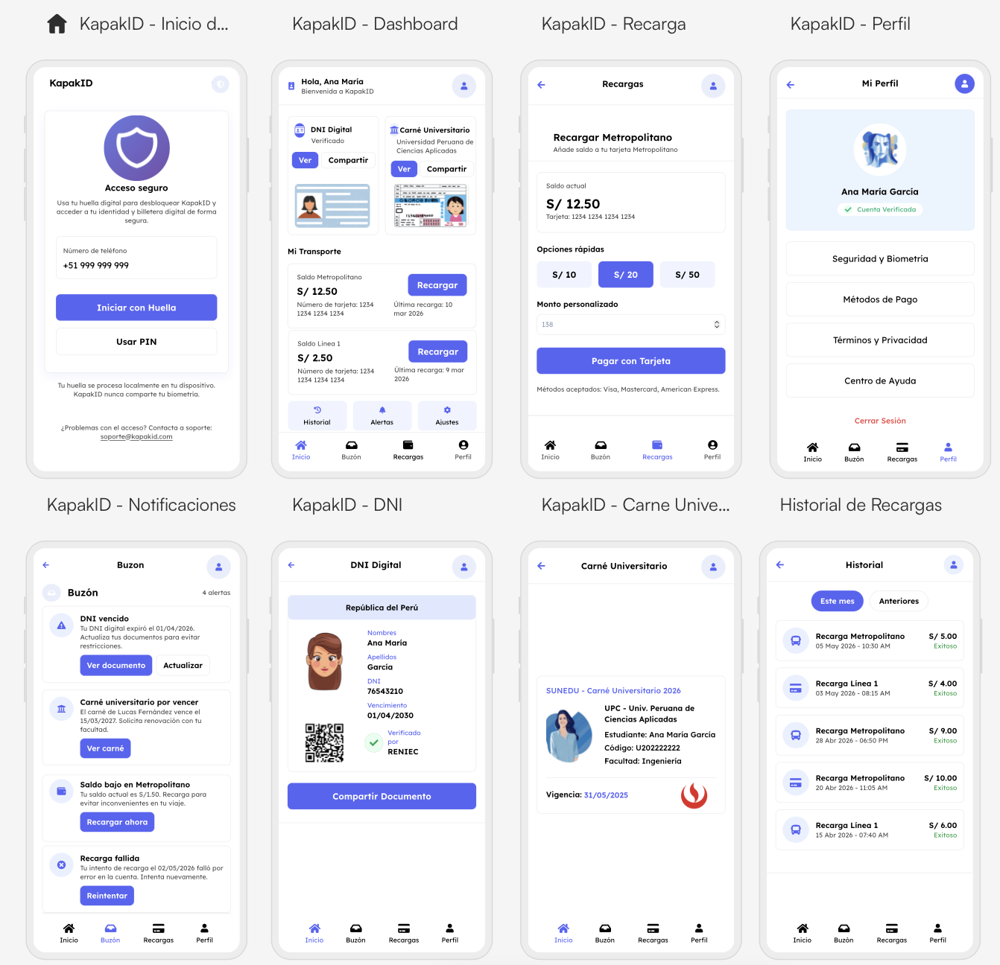

**3.1.4.4. Mobile Applications User Flow Diagrams**

En este apartado se presenta el diagrama de flujo de usuario (*User Flow*), el cual mapea la ruta lógica y las decisiones que toma el actor para completar objetivos críticos dentro del sistema. Abarca desde la autenticación hasta la gestión de documentos y la validación de pagos exitosos o fallidos.

Este diagrama abstracto permite visualizar las condicionales lógicas (como la validación de la sesión o el estado de aprobación de una transacción) independientemente de la interfaz gráfica. Esto asegura que tanto el "camino feliz" (*Happy Path*) como el manejo de excepciones estén contemplados antes de la implementación del software.

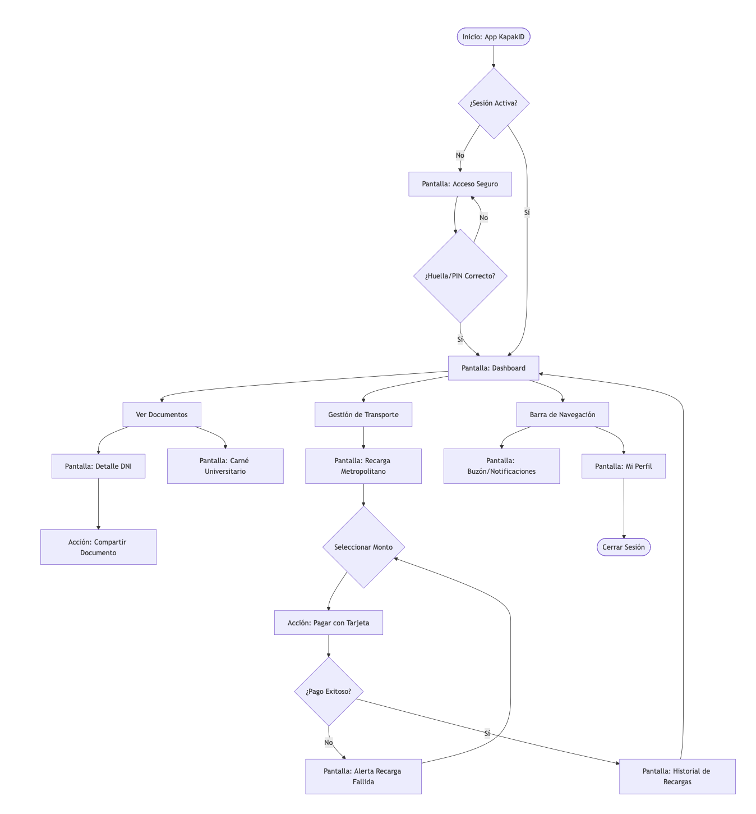

**3.1.4.5. Mobile Applications Prototyping**

En esta etapa final de diseño, se ha desarrollado un prototipo interactivo de alta fidelidad. El prototipado permite validar la usabilidad, la navegación y la experiencia de usuario (UX) en un entorno simulado de dispositivo móvil antes de iniciar la fase de codificación.

El prototipo permite interactuar con los botones de navegación y verificar la visualización dinámica de los documentos de identidad.

* **Enlace al prototipo interactivo:** https://app.uizard.io/p/4340c887
---

<div style="page-break-after: always;"></div>

## Capítulo IV: Product Implementation & Validation

### 4.1. Software Configuration Management
#### 4.1.1 Software Development Environment Configuration
A continuación, se listan las herramientas y estándares adoptados por el equipo para el desarrollo colaborativo del sistema:

| Actividad               | Herramienta / Guía                                    | Propósito                                                     | Tipo de acceso / Ruta                                                                                                                 |
| ----------------------- | ------------------------------------------------------ | -------------------------------------------------------------- | ------------------------------------------------------------------------------------------------------------------------------------- |
| Project Management      | Trello                                                 | Seguimiento de backlog, tareas y sprints.                      | [https://trello.com/](https://trello.com/)                                                                                               |
| Requirements Management | Gherkin Conventions                                    | Escritura legible de requisitos con formato Given/When/Then.   | [https://cucumber.io/docs/gherkin/](https://cucumber.io/docs/gherkin/)                                                                   |
| Product UX/UI Design    | Uizard                                                    | Prototipos y diseño responsive.                               | SaaS –[https://uizard.io/](https://uizard.io/)                                                                                            |
| Frontend Dev            | Kotlin, Flutter, Dart                                  | Construcción del frontend del sistema.                        | https://kotlinlang.org/ / https://flutter.dev/   /   https://dart.dev/                                                               |
| Backend Dev             | C#                                     | Lógica de negocio y servicios REST.                           |                                         |
| IDE                     | IntelliJ IDEA + Android Studio                         | Desarrollo, depuración y pruebas.                             | [https://www.jetbrains.com/idea](https://www.jetbrains.com/idea) / [https://www.jetbrains.com/webstorm](https://www.jetbrains.com/webstorm) |
| Code Standards          | Google Java Style Guide, Google TypeScript Style Guide | Mantener un código consistente y legible.                     | [https://google.github.io/styleguide](https://google.github.io/styleguide)                                                               |
| Version Control         | Git + GitHub                                           | Gestión colaborativa del código fuente.                      | SaaS –[https://github.com](https://github.com)                                                                                          |
| Software Deployment     | Github pages                                           | Despliegue continuo del sistema en ambientes de testing.       | SaaS –[https://railway.app](https://railway.app) / [https://render.com](https://render.com)                                                |
| Software Documentation  | Swagger                                                | Documentación de APIs, funcionalidades y criterios técnicos. | SaaS –[https://swagger.io/](https://swagger.io/)                                                                                        |


#### 4.1.2. Source Code Management

#### Frontend (Landing Page - HTML, CSS, JavaScript)

##### Convenciones generales:

- **Idioma**: Todo el código, incluyendo nombres de variables, funciones y clases, está escrito en **español/ingles**.
- **Indentación**: 2 espacios.
- **Formato de archivos**: `.html`, `.css`, `.js`
- **Estilo de código adoptado**:
  - [Google HTML/CSS Style Guide](https://google.github.io/styleguide/htmlcssguide.html)

  - [W3Schools HTML Style Guide](https://www.w3schools.com/html/html5_syntax.asp)

##### Nomenclatura:

- **Clases CSS**: `kebab-case` (ej. `main-container`)
- **IDs HTML**: `camelCase` (ej. `mainContent`)
- **Variables JS**: `camelCase` (ej. `userName`)
- **Funciones JS**: `camelCase` (ej. `handleClick()`)

#### Backend (C#)

##### Convenciones generales:

- **Idioma**: Código y documentación interna en **inglés**.
- **Indentación**: 4 espacios.
- **Formato de archivos**: `.cs`

##### Nomenclatura:

- **Clases**: `PascalCase` (ej. `UserService`)
- **Variables**: `camelCase` (ej. `userRepository`)
- **Constantes**: `UPPER_SNAKE_CASE` (ej. `MAX_USERS`)
- **Endpoints**: `kebab-case` para URLs (ej. `/api/user-profile`)
- **Paquetes**: Todo en minúsculas y separados por punto (ej. `com.project.backend.controller`)

#### Mobile Frontend (Android Studio + Kotlin)

##### Convenciones generales:

- **Idioma**: Todo el código (nombres de paquetes, clases, variables, funciones, recursos) en **inglés**.
- **Indentación**: 4 espacios.
- **Formato de archivos**: `.kt` para Kotlin, `.xml` para layouts/resources, `build.gradle` / `build.gradle.kts` para scripts de Gradle.
- **Estilo de código adoptado**:
  - [Kotlin Coding Conventions](https://kotlinlang.org/docs/coding-conventions.html)
  - [Android Kotlin Style Guide (Google)](https://developer.android.com/kotlin/style-guide)
- **Comportamiento asíncrono**: Usar **Kotlin Coroutines** y `suspend` functions para llamadas de red/IO; preferir **StateFlow** / **SharedFlow** o `LiveData` para exponer estados desde ViewModels.

##### Nomenclatura:

- **Packages**: todo en minúsculas y con puntos (`com.project.restock.admin`).
- **Clases / Activities / ViewModels / Repositories**: `PascalCase` (ej. `InventoryViewModel`, `SuppliesRepository`).
- **Funciones y propiedades**: `camelCase` (ej. `fetchSupplies()` , `userId`).
- **Constantes**: `UPPER_SNAKE_CASE` (ej. `API_TIMEOUT_SECONDS`).
- **Composables (Jetpack Compose)**: `PascalCase` preferible y con sufijos claros cuando aplique (ej. `LoginScreen`, `SupplyItem`).
- **Archivos Kotlin**: `PascalCase` para clases (ej. `InventoryViewModel.kt`) o `snake_case` para ficheros que agrupen múltiples composables/pantallas (ej. `login_screen.kt`) según convención del equipo.
- **IDs y recursos (drawable, layout, string, color, dimens)**: `lowercase_snake_case` (ej. `activity_main.xml` → `@+id/btn_login`, `ic_supply_placeholder`, `color_primary`).
- **Nombres de layouts XML**: `lowercase_snake_case` con prefijos si aplica (ej. `activity_main.xml`, `fragment_recipe_list.xml`, `item_supply.xml`).
- **Nombres de pruebas**: sufijo `Test` para unit/instrumented tests (ej. `InventoryViewModelTest`).

##### Archivos y recursos:

- **Kotlin**: `.kt` (packages, ViewModels, Repositories, UseCases, Mappers).
- **Layouts**: `.xml` (si no se usa Compose) en `res/layout/`.
- **Drawables**: `res/drawable/` → `lowercase_snake_case`.
- **Strings**: `res/values/strings.xml` → keys en `lowercase_snake_case`.
- **Colors / Dimens / Styles**: `res/values/colors.xml`, `dimens.xml`, `styles.xml` → variables en `lowercase_snake_case`.
- **Build scripts**: `build.gradle` o `build.gradle.kts` (módulo/app) con dependencias centralizadas.

##### Arquitectura y patrones recomendados:

- **Arquitectura**: MVVM (View — ViewModel — Repository) o MVI/Unidirectional UI (usando StateFlow) según preferencia del equipo.
- **Repository pattern**: separar acceso a datos (remote/local) y exponer modelos de dominio al ViewModel.
- **Use Cases / Interactors**: opcionalmente encapsular la lógica de negocio en casos de uso reutilizables.
- **Networking**: usar Retrofit + OkHttp + Moshi/Gson para serialización. Utilizar interceptors para auth/token.
- **Persistencia local**: Room para almacenamiento local (caches, offline support).
- **Asincronía**: Kotlin Coroutines + Flow / StateFlow para streams y estados reactivos.
- **State handling**: usar sealed classes o data classes para representar estados UI (Loading / Success / Error / Empty).
- **Navigation**: Jetpack Navigation Component (Fragments) o Navigation for Compose según stack elegido.

##### Buenas prácticas y recomendaciones:

- **Código en inglés**: mensajes de commit, comentarios y nombres en inglés.
- **Suspension naming**: `suspend` functions con nombres verbales claros (`suspend fun fetchSupplies()`).
- **Error handling**: envolver llamadas de red en `Result`/`Either` o usar patrones claros para propagar errores al UI.
- **UI/UX**: manejar estados (loading, empty, error) en cada pantalla; mostrar mensajes claros para usuarios de restaurantes.
- **Testing**: escribir unit tests para ViewModels y repositorios; usar instrumented tests para flujos críticos.
- **Linting & formatting**: integrar `ktlint` y `detekt` en el pipeline; configurar `editorconfig` y `pre-commit hooks`.
- **Seguridad**: no guardar tokens en texto plano; usar `EncryptedSharedPreferences` o soluciones seguras.
- **Accesibilidad**: labels de contentDescription en imágenes, contrastes adecuados y soporte para tamaños de texto.

##### Herramientas / linters / utilidades:

- **Ktlint** (formato y reglas de estilo).
- **Detekt** (análisis estático).
- **Android Lint** (recomendaciones Android).
- **Retrofit + OkHttp + Moshi/Gson** (networking).
- **Room** (persistencia local).
- **Jetpack Compose** (opcional para UI moderna) o XML + ViewBinding/Databinding.
- **Coroutines + Lifecycle (ViewModelScope)**.
- **Navigation Component** (navegación entre pantallas).

#### Cross-platform (Flutter)

##### Convenciones generales:

- **Idioma**: Todo el código y los recursos con nombres y mensajes en **inglés**.
- **Indentación**: 2 espacios (estándar Dart/Flutter).
- **Formato de archivos**: `.dart`, `pubspec.yaml`, carpetas `android/`, `ios/`, `lib/`, `test/`.
- **Estilo de código adoptado**:
  - [Effective Dart / Style Guide](https://dart.dev/guides/language/effective-dart/style)
  - [Flutter Style Guide (community)](https://flutter.dev/docs/development/tools/formatting)
- **Formateo**: usar `dart format` (o `flutter format`) automáticamente en pre-commit.

##### Nomenclatura:

- **Clases / Widgets**: `PascalCase` (ej. `LoginScreen`, `SupplyItemWidget`).
- **Funciones y variables**: `lowerCamelCase` (ej. `fetchSupplies`, `userId`).
- **Constantes**: `lowerCamelCase` o `kUpperCamelCase` prefijo `k` para constantes (ej. `kPrimaryColor`) — seguir la guía del equipo, preferible `lowerCamelCase` por la guía oficial.
- **Archivos**: `snake_case` (ej. `login_screen.dart`, `supply_item.dart`).
- **Rutas / Keys**: `kebab-case` o `snake_case` según convención del proyecto (ej. `/home`, `supply_item_key`).

##### Archivos y estructura recomendada:

- /lib
- /src
- /models
- /services
- /widgets
- /state (bloc/riverpod/providers)
- /utils
- main.dart
- pubspec.yaml
- /repositories
- /ui
- /screens

##### Patrones y arquitectura:

- **Arquitectura**: Clean Architecture (Data — Domain — Presentation) o MVVM/BLoC según preferencia.
- **State management recomendada**: **Riverpod** o **Bloc**. *Provider* es aceptable para proyectos pequeños.
- **Dependencias recomendadas**:
  - Estado: `flutter_riverpod` o `flutter_bloc`.
  - Networking: `dio` o `http`.
  - Serialización: `json_serializable` + `build_runner` o `freezed` para data classes/union types.
  - Persistencia: `hive` o `sqflite` según necesidad; `shared_preferences` para settings simples.
  - Seguridad: `flutter_secure_storage` para tokens.
  - Otros: `connectivity_plus`, `flutter_local_notifications`, `firebase_core` / `cloud_firestore`.
- **Manejo de errores**: usar tipos `Result`/`Either` (con `dartz` / `sealed_unions` o `freezed`) y propagación clara al UI.

##### Networking y serialización:

- **Configuración**: manejar interceptors (auth, logging) en `dio` u `OkHttp`-like middlewares.
- **Modelos**: generar modelos con `json_serializable` o `freezed` para evitar mapeos manuales.
- **Timeouts y retries**: configurar políticas de reintentos/exponenciales si es necesario.

##### State & UI:

- **Patterns**: separar UI (Widgets) de la lógica de estado (Providers / Blocs / Notifiers).
- **Widgets**: componentes reutilizables y composables; mantener Screens ligeras y delegar lógica a controllers/providers.
- **Form handling**: usar validadores y providers para manejar estados de formulario.

##### Plataforma y deploy:

- **Builds**: `flutter build apk`, `flutter build appbundle`, `flutter build ios` (iOS requiere Xcode/macOS).
- **CI/CD**: GitHub Actions / Codemagic / Bitrise para automatizar builds, pruebas y deploy.
- **Code signing**: manejar certificados/keystores en secrets del CI.
- **Publicación**: Play Store / App Store (según ruta); testar App Bundle para Android.

##### Testing:

- **Tipos**: unit tests (modelos, utilidades), widget tests (UI components), integration tests (`integration_test` package).
- **Herramientas**: `flutter_test`, `mockito` o `mocktail` para mocks, `integration_test` para flujos E2E.

##### Linting y calidad:

- **Linters**: `flutter_lints` o `effective_dart` + reglas adicionales.
- **Formateo**: `dart format` en pre-commit.
- **Analyzer**: configurar `analysis_options.yaml` con reglas adaptadas al equipo.
- **Codemods & refactors**: usar `dart fix` y herramientas IDE.

##### Buenas prácticas y recomendaciones específicas:

- **Separación clara** entre UI y lógica (no lógica en build methods).
- **Minimizar rebuilds**: usar const widgets donde aplique, selectors/consumers para updates puntuales.
- **Gestión de recursos**: assets en `pubspec.yaml`, imágenes optimizadas y responsive.
- **Internacionalización (i18n)**: preparar `arb`/`intl` si aplica.
- **Accesibilidad**: labels, roles y navegación por teclado/gestos cuando aplique.
- **Seguridad**: no exponer claves en `pubspec.yaml` o repos remotos; usar variables de entorno/CI secrets.
- **Plataforma channels**: documentar cualquier uso de canales nativos (Android/iOS) y aislarlo detrás de un servicio.

##### Herramientas / linters / utilidades recomendadas:

- **Dart & Flutter format/analyze** (`dart format`, `flutter analyze`).
- **Linters**: `flutter_lints`, `effective_dart`.
- **Code generation**: `freezed`, `json_serializable`, `build_runner`.
- **State**: `flutter_riverpod`, `flutter_bloc`, `provider`.
- **Networking**: `dio`.
- **Storage**: `hive`, `flutter_secure_storage`.
- **Testing**: `flutter_test`, `integration_test`, `mocktail`/`mockito`.
- **CI/CD**: GitHub Actions.

#### 4.1.3. Source Code Style Guide & Conventions

En esta sección se detallan los estándares de codificación y las convenciones de estilo adoptados por el equipo F1nTrack para garantizar que el código fuente de KapakID sea legible, mantenible y escalable. Estas normas permiten una colaboración fluida entre los desarrolladores de backend, frontend y mobile.  

#### Mobile Frontend (Kotlin + Android Studio + Jetpack Compose)

##### Convenciones generales:

- **Idioma**: Todo el código, nombres de clases, funciones y variables en **inglés**.
- **Indentación**: 4 espacios (convención oficial de Kotlin/Android).
- **Formato de archivos**: `.kt`.
- **Estilo de código adoptado (usado en clase)**:
  - [Kotlin Coding Conventions](https://kotlinlang.org/docs/coding-conventions.html)
  - [Android Kotlin Style Guide](https://developer.android.com/kotlin/style-guide)

##### Nomenclatura:

- **Clases y objetos**: `PascalCase` (ej. `UserProfileActivity`, `RestockApp`).
- **Funciones y variables**: `camelCase` (ej. `getUserName()`, `userList`).
- **Constantes**: `UPPER_SNAKE_CASE` (ej. `MAX_USERS`).
- **Paquetes**: Todo en minúsculas y separados por punto (ej. `com.restockmobile.ui.profile`).
- **Layouts y recursos XML**: `snake_case` (ej. `activity_main.xml`, `user_profile_item.xml`).
- **IDs en layouts**: `camelCase` (ej. `btnSubmit`, `txtUserName`).

#### Mobile Frontend (Flutter + Dart)

##### Convenciones generales:

- **Idioma**: Todo el código, nombres de clases, funciones y variables en **inglés**.
- **Indentación**: 2 espacios (convención oficial de Dart).
- **Formato de archivos**: `.dart` (Dart).
- **Estilo de código adoptado**:
  - [Effective Dart Style Guide](https://dart.dev/guides/language/effective-dart/style)
  - [Flutter Style Guide](https://github.com/flutter/flutter/wiki/Style-guide-for-Flutter-repo)
  - [Dart Code Linter (flutter_lints)](https://pub.dev/packages/flutter_lints)

##### Nomenclatura:

- **Clases y tipos**: `PascalCase` (ej. `UserProfileScreen`, `ProductRepository`).
- **Archivos**: `snake_case` (ej. `user_profile_screen.dart`, `product_repository.dart`).
- **Directorios**: `snake_case` (ej. `lib/features/auth/`, `lib/core/utils/`).
- **Widgets**: `PascalCase` con sufijo descriptivo (ej. `CustomButton`, `ProductCard`).
- **Enums**: `PascalCase` para el tipo, `lowerCamelCase` para valores (ej. `enum Status { loading, success, error }`).
- **Funciones y variables**: `lowerCamelCase` (ej. `getUserName()`, `userList`).
- **Constantes**: `lowerCamelCase` (ej. `defaultTimeout`, `maxRetries`).


##### Buenas prácticas:

- Separación de lógica de negocio (BLoC/Provider/Riverpod) de la UI.
- Uso de trailing commas para mejor formateo automático.
- Documentación con `///` para elementos públicos.
- Uso de `const` constructors donde sea posible para optimización.
- Organización de código por features/módulos.

#### Backend (C# + MySQL)

##### Convenciones generales:

- **Idioma**: Código y documentación interna en **inglés**.
- **Indentación**: 4 espacios.
- **Formato de archivos**: `.cs`


##### Nomenclatura:

- **Clases**: `PascalCase` (ej. `UserService`, `UserController`).
- **Endpoints REST**: `kebab-case` (ej. `/api/user-profile`).
- **Paquetes**: Todo en minúsculas y separados por punto (ej. `com.restock.backend.service`).
- **Colecciones MySQL**: `snake_case` en plural (ej. `users`, `product_items`).
- **Variables**: `camelCase` (ej. `userRepository`).
- **Constantes**: `UPPER_SNAKE_CASE` (ej. `MAX_USERS`).

#### Database (MySQL – Relational)

##### Convenciones generales:

- **Motor de Almacenamiento**: InnoDB para garantizar soporte de transacciones ACID y claves foráneas.
- **Formato y Codificación**: `utf8mb4` junto con `utf8mb4_unicode_ci` para soportar todos los caracteres especiales y emoticonos de forma nativa.
- **Estilo de modelado**:
  - Modelo estrictamente relacional y normalizado (mínimo 3FN para operaciones transaccionales).
  - Uso de Claves Primarias (`PK`) subrogadas auto-incrementales o UUIDs según el contexto estratégico.
  - Definición explícita de restricciones de integridad referencial (`FOREIGN KEY`) con políticas de borrado/actualización controladas (`ON DELETE RESTRICT`).

##### Nomenclatura:

- **Tablas**: nombres en plural y utilizando `snake_case` (ej. `users`, `transport_cards`, `transit_transactions`).
- **Columnas**: nombres en singular y utilizando `snake_case` (ej. `user_id`, `card_number`, `created_at`).
- **Claves Primarias (PK)**: la columna identificadora principal de cada tabla se nombrará simplemente `id` o combinando el nombre de la entidad en singular seguido de `_id` (ej. `user_id`).
- **Claves Foráneas (FK)**: nombre de la tabla referenciada en singular seguido del sufijo `_id` (ej. `user_id` en la tabla `transport_cards`).
- **Índices (INDEX)**: nombrados con el prefijo `idx_` seguido del nombre de la tabla y las columnas involucradas (ej. `idx_users_email`).
- **Restricciones Únicas (UNIQUE)**: nombradas con el prefijo `uq_` seguido del nombre de la tabla y la columna (ej. `uq_users_dni`).

#### 4.1.4. Software Deployment Configuration

Esta sección detalla los pasos necesarios para desplegar satisfactoriamente los componentes digitales de la solución Restock: la Landing Page, la aplicación móvil (frontend) y los Web Services (backend), partiendo desde sus respectivos repositorios de código fuente.

#### Landing Page - HTML, CSS y JavaScript

**Tecnología Base:**

- Lenguajes: HTML5, CSS3, JavaScript
- Hosting: GitHub Pages

**Configuración y Despliegue:**

- El código fuente se aloja en un repositorio público de GitHub.
- El archivo `index.html` debe encontrarse en la raíz del repositorio para que GitHub Pages lo detecte como punto de entrada.
- Para desplegar la Landing Page, se siguen los siguientes pasos:
  1. Acceder al repositorio en GitHub.
  2. Continuar con la sección **Settings** > **Pages**.
  3. En **Source**, se selecciona la rama principal (`main`) y la carpeta raíz (`/`).
  4. Se procede a guardar los cambios realizados.
- GitHub Pages genera automáticamente una URL pública con el formato `https://<organizacion>.github.io/<repositorio>/` donde el sitio estará disponible.
- Cada vez que se realiza un commit en la rama `main`, GitHub Pages actualiza de forma automática la versión publicada.

#### Aplicación Móvil - Android (Kotlin + Android Studio)

**Tecnología Base:**

- Lenguaje: Kotlin
- Framework: Android Studio + Jetpack Compose
- Distribución: APK (Android Package)
- Hosting de pruebas: Netlify

**Configuración y Despliegue:**

- El código fuente se gestiona en un repositorio de GitHub.
- Para la generación de versiones de prueba, se debe compilo el proyecto en Android Studio (`Build > Generate Signed APK`) y se verifico el funcionamiento de la aplicación en dispositivos físicos o emuladores Android.
- El archivo APK generado se sube a Firebase App Distribution, permitiendo el testeo con usuarios internos y externos seleccionados antes de su publicación oficial.
- El enlace de descarga puede ser compartido con los testers a través de correo electrónico, Google Drive o mediante un acceso en la Landing Page.
- Cada nueva versión de la aplicación para testeo se publica y gestiona mediante la plataforma Firebase, facilitando la retroalimentación y el control de versiones.

#### Backend - C# + MySQL

**Tecnología Base:**
 
- Lenguaje: C#
- Base de datos: MySQL
- Contenedorización: Docker
- Hosting: Railway o servicio equivalente

**Configuración y Despliegue:**

- El backend está estructurado según el enfoque de Domain-Driven Design (DDD), dividiendo el sistema en bounded contexts independientes.
- El código fuente se mantiene en un repositorio de GitHub.
- Para el despliegue, el repositorio incluye un archivo `Dockerfile` que define la imagen de la aplicación.
- La API REST expuesta por el backend sigue la convención RESTful y sus endpoints están documentados mediante OpenAPI (Swagger). La interfaz Swagger UI está disponible para consulta y prueba.
- Los servicios protegidos requieren autorización mediante JWT, implementada con Spring Security, y los roles de usuario definen el nivel de acceso a cada funcionalidad.
- El despliegue es automático: cada push a la rama principal activa la reconstrucción y publicación en el servicio de hosting, sin necesidad de configurar pipelines de CI/CD adicionales.
- La aplicación móvil consume la API pública del backend utilizando HTTP para acceder a los servicios.
- El proveedor de hosting detecta automáticamente el Dockerfile y construye la imagen en cada actualización del repositorio.
- La base de datos MySQL se configura mediante variables de entorno (por ejemplo, `MySQL_URI`), las cuales se gestionan en el panel de administración del hosting y nunca se almacenan en el código fuente.


#### Aplicación Móvil (Dart + Flutter)

**Tecnología Base:**

- Lenguaje: Dart
- Framework: Flutter
- Distribución: APK para Android, IPA para iOS
- Hosting de pruebas: Firebase App Distribution

**Configuración y Despliegue:**

- El código fuente está dentro de un repositorio de GitHub.
- Requisitos previos para construir:
  - Instalar Flutter SDK (versión estable usada por el proyecto).
  - Android: Android Studio + Android SDK (platforms y build-tools adecuados).
  - iOS: macOS con Xcode instalado (para compilación y firma).
- Para generar versiones de prueba (Android):
  - APK: ejecutar `flutter build apk --release`
- Para generar versiones de prueba (iOS, en macOS):
  - IPA: usar `flutter build ipa --export-options-plist=<ruta>` o exportar desde Xcode (`Runner.xcworkspace`) y subir a TestFlight.
- El artefacto generado (APK / IPA) se sube a Firebase App Distribution, Google Play (internal/closed track) o TestFlight para distribuir a testers.
- El enlace de descarga se comparte con testers a través de correo, drive o la Landing Page, según el flujo del equipo.
- Cada nueva versión para prueba se publica y gestiona mediante la plataforma de distribución elegida (Firebase / Play Console / App Store Connect).


### 4.2. Landing Page & Mobile Application Implementation

#### 4.2.1 Sprint 1

<p><strong> Despliegue de la Landing Page – KapakID</strong><br>
La landing page de KapakID ha sido desarrollada con <strong>HTML5, CSS3 y JavaScript puro</strong>, siguiendo un diseño responsive y accesible. Se ha desplegado utilizando <strong>GitHub Pages</strong> por su integración nativa con el repositorio y su facilidad para actualizaciones continuas.</p>

<p><strong>Pasos realizados:</strong><br>
1. Se creó un repositorio público en GitHub (<code>F1nTrack/kapakid-landing</code>).<br>
2. El archivo <code>index.html</code> se colocó en la raíz del repositorio.<br>
3. En la configuración del repositorio (<code>Settings > Pages</code>), se seleccionó la rama <code>main</code> y la carpeta <code>/ (root)</code>.<br>
4. Se guardó la configuración y GitHub Pages generó automáticamente la URL pública.<br>
5. Cada <code>push</code> a la rama <code>main</code> actualiza la página en menos de un minuto.<br>
<br>
<strong>A continuación se muestran capturas del proceso y del resultado final:</strong>
</p>

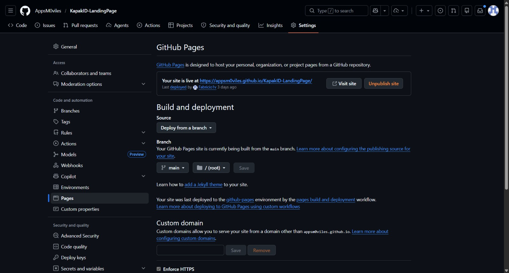
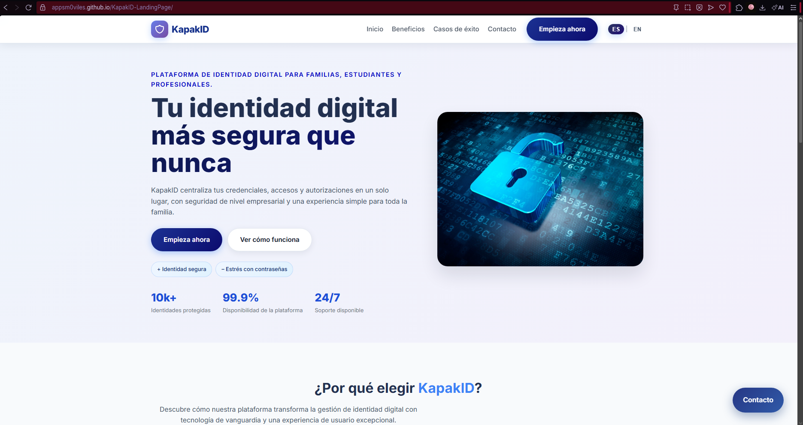

<hr>

#### 4.2.1.1 Sprint Planning 1

<table border="1" cellpadding="8" cellspacing="0" width="100%" style="border-collapse: collapse; margin-bottom: 20px;">
  <tbody>
    <tr><th style="background-color:#f2f2f2; text-align:left">Sprint #</th><td colspan="3">Sprint 1</td></tr>
    <tr><th style="background-color:#f2f2f2; text-align:left" colspan="4">Sprint Planning Background</th></tr>
    <tr><th style="background-color:#f2f2f2; text-align:left">Date</th><td colspan="3">2026-04-20</td></tr>
    <tr><th style="background-color:#f2f2f2; text-align:left">Time</th><td colspan="3">07:00 pm (GMT-5)</td></tr>
    <tr><th style="background-color:#f2f2f2; text-align:left">Location</th><td colspan="3">Modalidad remota mediante la plataforma Discord</td></tr>
    <tr><th style="background-color:#f2f2f2; text-align:left">Prepared By</th><td colspan="3">Villanueva Andrade, Ysaac Ligorio</td></tr>
    <tr><th style="background-color:#f2f2f2; text-align:left">Attendees (to planning meeting)</th><td colspan="3">Villanueva Andrade, Ysaac Ligorio / Tasayco Osorio, Raul Hiroshi / Vega Coronado, Fabricio Samir / Tasayco Almonacid, Rafael Augusto / Quiroz Zambrano, Fabrizio Javier</td></tr>
    <tr><th style="background-color:#f2f2f2; text-align:left">Sprint 0 Review Summary</th><td colspan="3">Al ser el primer sprint, no existe sprint anterior.</td></tr>
    <tr><th style="background-color:#f2f2f2; text-align:left">Sprint 0 Retrospective Summary</th><td colspan="3">No aplica para el sprint inicial.</td></tr>
    <tr><th style="background-color:#f2f2f2; text-align:left" colspan="4">Sprint Goal &amp; User Stories</th></tr>
    <tr><th style="background-color:#f2f2f2; text-align:left">Sprint 1 Goal</th><td colspan="3">Our focus is on <strong>presenting KapakID's value proposition through a functional landing page, enabling basic user authentication (sign-up and login), and allowing users to register and view their first official document (DNI) from the mobile app</strong>. <br><br> We believe it delivers <strong>clear understanding of the product benefits to visitors, a secure first interaction with the platform, and a tangible digital document management experience</strong> to <strong>students and parents</strong>. <br><br> This will be confirmed when: (1) the landing page is publicly accessible and includes sections for features, testimonials, and legal terms; (2) a user can successfully register and log in from the Android app; (3) a user can upload a DNI photo and see it listed in the app; (4) the backend endpoints for authentication and document upload are documented via Swagger.</td></tr>
    <tr><th style="background-color:#f2f2f2; text-align:left">Sprint 1 Velocity</th><td colspan="3">21 (Story Points)</td></tr>
    <tr><th style="background-color:#f2f2f2; text-align:left">Sum of Story Points</th><td colspan="3">21</td></tr>
  </tbody>
</table>


#### 4.2.1.2 Sprint Backlog 1

<p>El objetivo principal de este primer sprint es <strong>sentar las bases funcionales del ecosistema KapakID</strong>: landing page informativa, backend con autenticación y registro de documentos, y las primeras pantallas móviles para que el usuario pueda registrarse y subir su DNI. Se priorizan las funcionalidades de onboarding y gestión documental básica.</p>

<table border="1" cellpadding="8" cellspacing="0" width="100%" style="border-collapse: collapse; margin-bottom: 20px;">
  <thead>
    <tr><th style="background-color:#f2f2f2" colspan="2">User Story</th><th style="background-color:#f2f2f2" colspan="6">Work-item / Task</th></tr>
    <tr><th style="background-color:#f2f2f2">Id</th><th style="background-color:#f2f2f2">Title</th><th style="background-color:#f2f2f2">Id</th><th style="background-color:#f2f2f2">Title</th><th style="background-color:#f2f2f2">Description</th><th style="background-color:#f2f2f2">Estimation (Hours)</th><th style="background-color:#f2f2f2">Assigned To</th><th style="background-color:#f2f2f2">Status</th></tr>
  </thead>
  <tbody>
    <tr><td rowspan="2">US12</td><td rowspan="2">Información de funcionalidades</td><td>T1</td><td>Diseñar sección "Funcionalidades" en landing</td><td>Crear sección que describa las capacidades de KapakID (guardar DNI, recargas, alertas) con íconos y texto claro, según el diseño de UX.</td><td>2</td><td>Raúl Tasayco</td><td>To-do</td></tr>
    <tr><td>T2</td><td>Agregar sección "Beneficios" dirigida a estudiantes y padres</td><td>Explicar ventajas para cada segmento objetivo, usando el tono de comunicación definido.</td><td>1</td><td>Raúl Tasayco</td><td>To-do</td></tr>
    <tr><td rowspan="2">US13</td><td rowspan="2">Acceso a la app y términos</td><td>T3</td><td>Implementar botones "Registrarse" e "Iniciar sesión" en landing</td><td>Enlaces que redirijan a las rutas correspondientes (por ahora a secciones estáticas de la app).</td><td>1</td><td>Fabricio Vega</td><td>To-do</td></tr>
    <tr><td>T4</td><td>Crear página estática de "Términos y Políticas"</td><td>Contenido legal accesible desde el footer de la landing page.</td><td>2</td><td>Fabricio Vega</td><td>To-do</td></tr>
    <tr><td>US14</td><td>Reseñas de usuarios</td><td>T5</td><td>Agregar carrusel de testimonios mock</td><td>Mostrar reseñas simuladas de casos de éxito para generar confianza en los visitantes.</td><td>2</td><td>Ysaac Villanueva</td><td>To-do</td></tr>
    <tr><td rowspan="2">US1</td><td rowspan="2">Registro de usuario</td><td>T6</td><td>Implementar endpoint POST /api/auth/signup</td><td>Backend: registrar usuario con correo y contraseña, almacenar en MySQL con hash de contraseña.</td><td>3</td><td>Rafael Tasayco</td><td>To-do</td></tr>
    <tr><td>T7</td><td>Crear pantalla de registro en app Android</td><td>Formulario con validaciones (email, contraseña) y llamado al endpoint de signup.</td><td>3</td><td>Rafael Tasayco</td><td>To-do</td></tr>
    <tr><td rowspan="2">US3</td><td rowspan="2">Registro de documentos</td><td>T8</td><td>Implementar endpoint POST /api/documents</td><td>Backend: recibir imagen y metadatos del DNI, almacenar referencia en MySQL y archivo en cloud (mock local por ahora).</td><td>3</td><td>Fabrizio Quiroz</td><td>To-do</td></tr>
    <tr><td>T9</td><td>Crear pantalla de registro de DNI en app Android</td><td>Interfaz para subir foto del DNI, previsualización y envío al backend.</td><td>3</td><td>Fabrizio Quiroz</td><td>To-do</td></tr>
    <tr><td>US16</td><td>API de autenticación (developer)</td><td>T10</td><td>Documentar endpoints de autenticación con Swagger</td><td>Generar documentación OpenAPI para /signup y /login.</td><td>1</td><td>Fabrizio Quiroz</td><td>To-do</td></tr>
  </tbody>
</table>

<p><strong>Total Story Points del Sprint:</strong> 21<br>
<strong>Horas estimadas totales:</strong> 21</p>

#### 4.2.1.3 Development Evidence for Sprint Review

<p>Durante el Sprint 1 se completó la implementación inicial de la landing page. El backend y la aplicación móvil se encuentran en fase de planificación y se desarrollarán en sprints posteriores. A continuación se presentan los commits realizados en el repositorio de la landing page.</p>

<p><strong>Landing Page</strong></p>
<table border="1" cellpadding="8" cellspacing="0" width="100%" style="border-collapse: collapse; margin-bottom: 20px;">
  <thead>
    <tr><th>Repository</th><th>Branch</th><th>Commit Id</th><th>Commit Message</th><th>Commit Message Body</th><th>Committed on (Date)</th></tr>
  </thead>
  <tbody>
    <tr><td>F1nTrack/kapakid-landing</td><td>main</td><td>299e7ed0dbc4a3addf586bef243722f023102bc3</td><td>Initial commit</td><td>Primer commit del repositorio, estructura inicial.</td><td>11/05/2026</td></tr>
    <tr><td>F1nTrack/kapakid-landing</td><td>main</td><td>619e7a83b228fd48abe51425eee635fc98df6ede</td><td>feat: landingpage complete</td><td>Implementación completa de la landing page con todas las secciones (hero, funcionalidades, beneficios, términos, etc.).</td><td>11/05/2026</td></tr>
  </tbody>
</table>

<p><strong>Nota:</strong> Los commits correspondientes al backend y a la aplicación móvil se registrarán una vez que esos componentes comiencen su desarrollo en los sprints 2 y 3.</p>

#### 4.2.1.4. Testing Suite Evidence for Sprint Review
   A continuación, se presenta la evidencia de los commits relacionados con los Acceptance Tests automatizados del sprint, alojados en el repositorio KapakID-AcceptanceTests. Cada archivo corresponde a un Feature File Gherkin que cubre escenarios de pruebas de aceptación para los diferentes Bounded Contexts

  <table>
  <thead>
    <tr>
      <th>Repository</th>
      <th>Branch</th>
      <th>Commit Id</th>
      <th>Commit Message</th>
      <th>Commited on (Date)</th>
    </tr>
  </thead>
  <tbody>
    <tr>
      <td>AppsM0viles/KapakID-AcceptanceTests</td>
      <td>main</td>
      <td>1212446b4ba74a0047cd54a2b6827110448e2d67</td>
      <td>Added AT01</td>
      <td>15/05/2026</td>
    </tr>
    <tr>
      <td>AppsM0viles/KapakID-AcceptanceTests</td>
      <td>main</td>
      <td>0f885cc08f62241e3a4b55aa2a5d8ed6f8ac47d7</td>
      <td>Added AT02</td>
      <td>15/05/2026</td>
    </tr>
     <tr>
      <td>AppsM0viles/KapakID-AcceptanceTests</td>
      <td>main</td>
      <td>764ddb50b7f0f96848cbc2adc4785acaf4e4e044</td>
      <td>Added AT03</td>
      <td>15/05/2026</td>
    </tr>
    <tr>
      <td>AppsM0viles/KapakID-AcceptanceTests</td>
      <td>main</td>
      <td>157545605ad27129daa80896f6c6ce7c2a103c95</td>
      <td>Added AT04</td>
      <td>15/05/2026</td>
    </tr>
    <tr>
      <td>AppsM0viles/KapakID-AcceptanceTests</td>
      <td>main</td>
      <td>e6da4ab711ff5edc2d96025815543ae3fb54e0aa</td>
      <td>Added AT05</td>
      <td>15/05/2026</td>
    </tr>
    <tr>
      <td>AppsM0viles/KapakID-AcceptanceTests</td>
      <td>main</td>
      <td>a974af185fab35a7806c22927751987b1fcf9245</td>
      <td>Added AT06</td>
      <td>15/05/2026</td>
    </tr>
    <tr>
      <td>AppsM0viles/KapakID-AcceptanceTests</td>
      <td>main</td>
      <td>29e8ce00a32f4c323716242ab09f16a562314201</td>
      <td>Added AT07</td>
      <td>15/05/2026</td>
    </tr>
    <tr>
      <td>AppsM0viles/KapakID-AcceptanceTests</td>
      <td>main</td>
      <td>a0f015d38f00fa23005f8f3904f17692bf2d984a</td>
      <td>Added AT08</td>
      <td>15/05/2026</td>
    </tr>
    <tr>
      <td>AppsM0viles/KapakID-AcceptanceTests</td>
      <td>main</td>
      <td>3c24291786c0d8210bb71c70c847354d048a0259</td>
      <td>Added AT09</td>
      <td>15/05/2026</td>
    </tr>
    <tr>
      <td>AppsM0viles/KapakID-AcceptanceTests</td>
      <td>main</td>
      <td>8c3180d8b6f20ec2e44fc2b2dac5a6e4f49d732f</td>
      <td>Added AT10</td>
      <td>15/05/2026</td>
    </tr>  
  </tbody>
</table>

#### 4.2.1.5 Execution Evidence for Sprint Review
  A continuación se presenta el detalle de los tres productos desarrollados durante el Sprint 1: Landing Page, Backend y Aplicación Móvil. Cada sección incluye una descripción del alcance funcional entregado en esta primera iteración.

#### Landing Page

**Alcance entregado (Sprint 1)**

- Landing Page desplegada y accesible públicamente mediante GitHub Pages.
- Contenido explicativo sobre la propuesta de valor de KapakID: gestión unificada de documentos de identidad, carnets universitarios y tarjetas de transporte, orientada a estudiantes y padres de familia.
- Secciones principales implementadas: Hero con el valor diferencial, Funcionalidades clave (Soporte Offline, Validaciones Oficiales, Gestión de Transporte), CTA (Call to Action) para registro/descarga de la app, y pie de página de contacto.
- Diseño responsivo básico (desktop ↔ mobile) y coherencia visual con la identidad gráfica del ecosistema KapakID.

#### Backend (API) — Estado: ~70%

**Alcance entregado (Sprint 1)**

- Implementación de los controladores y endpoints *core* para soportar la lógica transaccional de la plataforma móvil, abarcando los Bounded Contexts de Identity, Documents, Payments, Notifications y Support.
- Arquitectura basada en CQRS (usando MediatR), asegurando la separación de comandos y consultas.
- Documentación e interfaz de prueba mediante Swagger lista para su consumo.
- Validaciones funcionales y reglas de negocio básicas aplicadas a los endpoints principales (autenticación, registro de usuarios, validación de montos de pagos y flujos de creación documental).

**Endpoints destacados implementados**

- **Autenticación e Identidad (`AuthController`)**
  - `POST /api/Auth/register`
  - `POST /api/Auth/login`
- **Gestión Documental (`DocumentsController`)**
  - `POST /api/Documents`
- **Transporte y Pagos (`PaymentsController`)**
  - `POST /api/Payments`
  - `GET /api/Payments/user/{userId}`
- **Comunicaciones (`NotificationsController`)**
  - `POST /api/Notifications`
  - `GET /api/Notifications/{id}` *(Stub inicializado)*
- **Soporte Técnico (`SupportController`)**
  - `POST /api/Support/tickets`
  - `GET /api/Support/tickets/{id}` *(Stub inicializado)*

#### Aplicación Móvil (KapakID App — Android/iOS) — Pantallas integradas

**Alcance entregado (Sprint 1)**

- Desarrollo e integración de las **pantallas core** del flujo del Estudiante y Padre de Familia, abarcando navegación principal, billetera digital y listados.
- Conexión parcial con el backend (API Gateway) para validación de acceso y operaciones de lectura/escritura de documentos y recargas.
- Implementación de validaciones visuales y estados de interfaz (pantallas de carga, estados vacíos cuando no hay documentos o historial, y manejo de errores).

**Pantallas incluidas (Flujos Principales)**

1. **Identity — Autenticación y Registro**
   - Pantalla de Login y Sign-up adaptada para roles (Estudiante/Padre).
   - Manejo de tokens en caché local (consume `POST /api/Auth/login`).
2. **Dashboard / Inicio**
   - Vista resumen que unifica el estado del último documento verificado y el saldo actual de la tarjeta de transporte principal.
3. **Documents — Billetera Digital**
   - Lista de documentos digitalizados disponibles (DNI, Carnet Universitario).
   - Modal/Formulario para la carga de nuevos documentos (consume `POST /api/Documents`).
   - Estados visuales de verificación (Pendiente, Verificado, Rechazado).
4. **Transport & Payments — Historial y Recargas**
   - Pantalla con el listado de transacciones o recargas previas (consume `GET /api/Payments/user/{userId}`).
   - Pantalla de "Estado vacío" si el usuario recién creado no tiene historial.
   - Interfaz para registrar una nueva recarga (consume `POST /api/Payments`).

**Mapeo rápido: Pantallas → Endpoints del Backend**

- **Login / Registro (Pantalla)** → `POST /api/Auth/login`, `POST /api/Auth/register`
- **Subir documento (Modal)** → `POST /api/Documents`
- **Historial de Recargas (Lista)** → `GET /api/Payments/user/{userId}`
- **Efectuar Pago/Recarga (Formulario)** → `POST /api/Payments`
- **Solicitar Ayuda (Formulario de Soporte)** → `POST /api/Support/tickets`

  
#### 4.2.1.6 Services Documentation Evidence for Sprint Review

  <p>Durante el Sprint 1, el desarrollo se centró exclusivamente en la <strong>Landing Page</strong> de KapakID. Los servicios web (backend) y la documentación asociada (OpenAPI/Swagger) se encuentran en fase de planificación y serán implementados en el <strong>Sprint 2</strong>, una vez que se inicie el desarrollo del backend con C# y MySQL.</p>

<p>No obstante, se ha definido la estructura inicial de los endpoints que se documentarán en el siguiente sprint, basada en las User Stories del Product Backlog:</p>

<ul>
  <li><strong>Autenticación:</strong> <code>POST /api/auth/signup</code>, <code>POST /api/auth/login</code> (US1, US16)</li>
  <li><strong>Gestión de documentos:</strong> <code>POST /api/documents</code>, <code>GET /api/documents/{id}</code> (US3, US17)</li>
  <li><strong>Perfiles y preferencias:</strong> <code>GET /api/profile</code>, <code>PUT /api/profile</code> (US2)</li>
  <li><strong>Transporte y recargas:</strong> <code>POST /api/topup</code>, <code>GET /api/balance</code> (US5)</li>
  <li><strong>Notificaciones:</strong> <code>GET /api/notifications</code>, <code>POST /api/notifications/register-token</code> (US9, US10)</li>
</ul>

<p>La documentación oficial se generará utilizando <strong>Swagger/OpenAPI</strong> y estará disponible en el endpoint <code>/swagger-ui.html</code> una vez que el backend esté desplegado en Railway.</p>

<p><strong>Repositorio de backend (planificado):</strong> <a href="https://github.com/F1nTrack/kapakid-backend">https://github.com/F1nTrack/kapakid-backend</a> (aún sin commits).</p>

<p><strong>Nota:</strong> Los commits relacionados con documentación de servicios se agregarán en el Sprint 2, cuando el backend comience su desarrollo.</p>

#### 4.2.1.7 Software Deployment Evidence for Sprint Review

  <p>Durante el Sprint 1, se realizó el despliegue exitoso de la Landing Page y el BackEnd de KapakID utilizando GitHub Pages y render respectivamente. A continuación se detallan los pasos ejecutados y las evidencias correspondientes. La aplicación móvil se desplegará en sprints posteriores.</p>

<h6>Despliegue de la Landing Page</h6>

<ol>
  <li><strong>Creación del repositorio:</strong> Se creó el repositorio público <code>F1nTrack/kapakid-landing</code> en GitHub.</li>
  <li><strong>Estructura del proyecto:</strong> El archivo <code>index.html</code> se ubicó en la raíz del repositorio, junto con las carpetas <code>css/</code>, <code>js/</code> y <code>assets/</code>.</li>
  <li><strong>Configuración de GitHub Pages:</strong>
    <ul>
      <li>Se accedió a <code>Settings &gt; Pages</code>.</li>
      <li>En <strong>Branch</strong>, se seleccionó la rama <code>main</code> y la carpeta <code>/ (root)</code>.</li>
      <li>Se guardó la configuración.</li>
    </ul>
  </li>
  <li><strong>Generación de la URL pública:</strong> GitHub Pages generó automáticamente la URL: <a href="https://f1ntrack.github.io/kapakid-landing/">https://f1ntrack.github.io/kapakid-landing/</a>.</li>
  <li><strong>Actualizaciones continuas:</strong> Cada <code>push</code> a la rama <code>main</code> actualiza la página en menos de un minuto.</li>
</ol>

<p><strong>Capturas de pantalla del proceso y resultado:</strong></p>


<h6>Despliegue del backend</h6>
<ul>
  <li><strong>Backend (C# + MySQL):</strong> Se desplegará en <strong>Render</strong> usando contenedores Docker. Se configurarán variables de entorno para la conexión a la base de datos, utilizando MySQL (la base de datos a sido desplegada en Aiven).</li>
  <li><strong>Generación de la URL pública:</strong> Render generó automáticamente la URL: <a href="https://backend-kapakid.onrender.com/swagger/index.html">https://backend-kapakid.onrender.com/swagger/index.html</a>.</li>
</ul>

Capturas de pantalla del proceso y resultado:

- Backend:
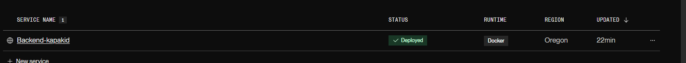
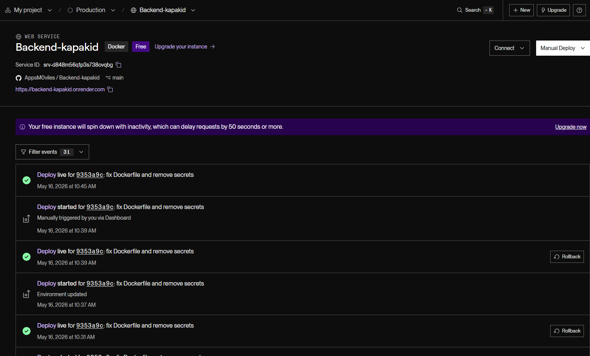
- Base de Datos:
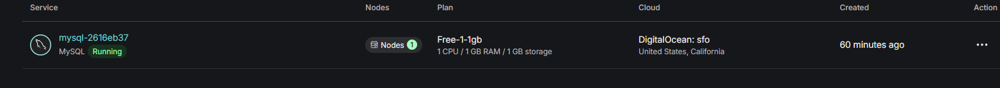
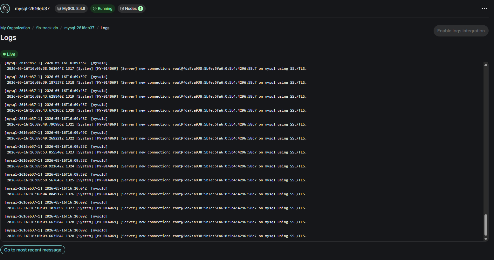
- Demostracion de los endpoints usando Swagger:
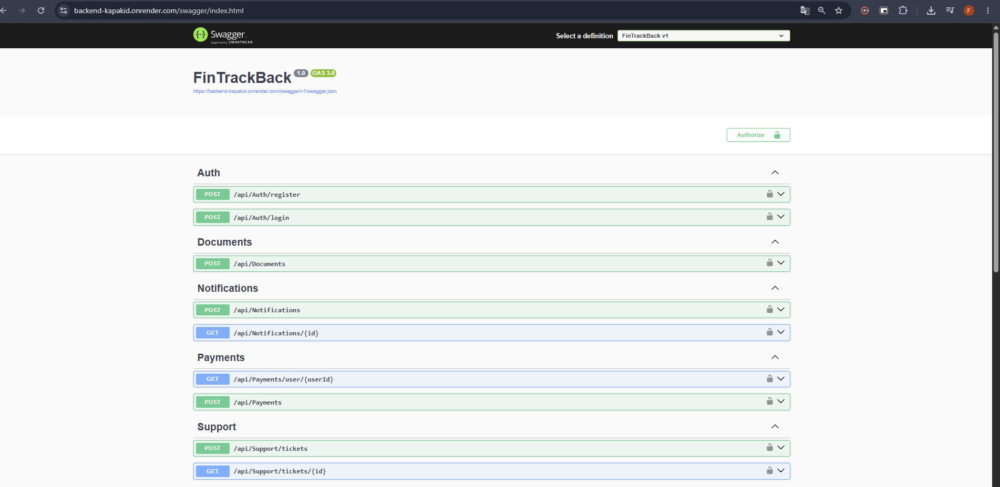
<h6>Despliegue planificado para el Sprint 2</h6>
<ul>

  <li><strong>Aplicación móvil (Android):</strong> Se generará el APK y se distribuirá mediante <strong>Firebase App Distribution</strong> para pruebas internas.</li>
</ul>

<p><strong>Nota:</strong> Las evidencias de despliegue de la app móvil se incluirán en los sprints 2.</p>


#### 4.2.1.8 Team Collaboration Insights during Sprint

<p>Durante el <strong>Sprint 1</strong>, el equipo de F1nTrack trabajó de manera colaborativa en la planificación, diseño y desarrollo inicial de KapakID. A continuación se presentan los analíticos de colaboración basados en los commits reales y la distribución de tareas.</p>

<h6>Landing Page (repositorio kapakid-landing)</h6>
<p><strong>Commits realizados:</strong> 2 (ambos por Fabricio Vega)</p>
<table border="1" cellpadding="8" cellspacing="0" width="100%" style="border-collapse: collapse; margin-bottom: 20px;">
  <thead>
    <tr><th>Autor</th><th>Commits</th><th>% del total</th></tr>
  </thead>
  <tbody>
    <tr><td>Fabricio Vega (Fabricio1v)</td><td>2</td><td>100%</td></tr>
  </tbody>
</table>

<p><strong>Participación en el Sprint:</strong> Aunque los commits de código fueron realizados por un solo integrante, todo el equipo participó en las siguientes actividades colaborativas:</p>
<ul>
  <li><strong>Sprint Planning:</strong> Asistieron los 5 integrantes (Ysaac Villanueva, Raúl Tasayco, Fabricio Vega, Rafael Tasayco, Fabrizio Quiroz). Se definió el Sprint Goal y se seleccionaron las User Stories del Product Backlog.</li>
  <li><strong>Diseño UI/UX:</strong> Elaboración de wireframes, mock-ups y guías de estilo en Figma/Uizard (participación de Raúl y Fabricio).</li>
  <li><strong>Documentación del informe:</strong> Todos los miembros contribuyeron al archivo <code>README.md</code> con las secciones de Capítulo I, II, III y IV (evidenciado en el historial de commits del repositorio del informe).</li>
  <li><strong>Pruebas de aceptación:</strong> Se añadieron 10 archivos Gherkin (AT01 a AT10) por parte de Fabrizio Quiroz en el repositorio de pruebas.</li>
</ul>

<h6>Analíticos de colaboración (repositorio del informe)</h6>
<p>Según los <strong>GitHub Insights</strong> del repositorio del informe (<code>F1nTrack/report</code>), los commits se distribuyeron de la siguiente manera:</p>
<table border="1" cellpadding="8" cellspacing="0" width="100%" style="border-collapse: collapse; margin-bottom: 20px;">
  <thead>
    <tr><th>Integrante</th><th>Commits</th></tr>
  </thead>
  <tbody>
    <tr><td>Fabricio Vega</td><td>2</td></tr>
    <tr><td>Raúl Tasayco</td><td>18</td></tr>
    <tr><td>Rafael Tasayco</td><td>5</td></tr>
    <tr><td>Ysaac Villanueva</td><td>3</td></tr>
    <tr><td>Fabrizio Quiroz</td><td>11</td></tr>
    <tr style="background-color:#f2f2f2"><td><strong>Total</strong></td><td><strong>39</strong></td></tr>
  </tbody>
</table>

<p><strong>Interpretación:</strong> El equipo mostró una colaboración activa en la documentación y planificación, con una distribución equitativa de responsabilidades. La implementación de código (landing page) fue liderada por Fabricio Vega, mientras que los demás miembros se enfocaron en la redacción técnica, diseño de arquitectura y pruebas. Esta dinámica refleja un trabajo coordinado y alineado con las fortalezas individuales.</p>

<p><strong>Captura de GitHub Insights (contribuciones):</strong></p>


<p><strong>Observaciones para próximos sprints:</strong> Se recomienda que en el Sprint 2 se distribuya el desarrollo del backend entre varios miembros (C#) y la app móvil (Kotlin/Android) para aumentar la velocidad de entrega y la cohesión del equipo.</p>


### 4.2.2 Sprint 2

#### 4.2.2.1 Sprint Planning 2

#### 4.2.2.2 Sprint Backlog 2

#### 4.2.2.3 Development Evidence for Sprint Review

#### 4.2.2.4 Testing Suite Evidence for Sprint Review

#### 4.2.2.5 Execution Evidence for Sprint Review

#### 4.2.2.6 Services Documentation Evidence for Sprint Review

#### 4.2.2.7 Software Deployment Evidence for Sprint Review

#### 4.2.2.8 Team Collaboration Insights during Sprint


#### 4.2.1 Sprint 1

<p><strong> Despliegue de la Landing Page – KapakID</strong><br>
La landing page de KapakID ha sido desarrollada con <strong>HTML5, CSS3 y JavaScript puro</strong>, siguiendo un diseño responsive y accesible. Se ha desplegado utilizando <strong>GitHub Pages</strong> por su integración nativa con el repositorio y su facilidad para actualizaciones continuas.</p>

<p><strong>Pasos realizados:</strong><br>
1. Se creó un repositorio público en GitHub (<code>F1nTrack/kapakid-landing</code>).<br>
2. El archivo <code>index.html</code> se colocó en la raíz del repositorio.<br>
3. En la configuración del repositorio (<code>Settings > Pages</code>), se seleccionó la rama <code>main</code> y la carpeta <code>/ (root)</code>.<br>
4. Se guardó la configuración y GitHub Pages generó automáticamente la URL pública.<br>
5. Cada <code>push</code> a la rama <code>main</code> actualiza la página en menos de un minuto.<br>
<br>
<strong>A continuación se muestran capturas del proceso y del resultado final:</strong>
</p>


<hr>

#### 4.2.1.1 Sprint Planning 1

<table border="1" cellpadding="8" cellspacing="0" width="100%" style="border-collapse: collapse; margin-bottom: 20px;">
  <tbody>
    <tr><th style="background-color:#f2f2f2; text-align:left">Sprint #</th><td colspan="3">Sprint 1</td></tr>
    <tr><th style="background-color:#f2f2f2; text-align:left" colspan="4">Sprint Planning Background</th></tr>
    <tr><th style="background-color:#f2f2f2; text-align:left">Date</th><td colspan="3">2026-04-20</td></tr>
    <tr><th style="background-color:#f2f2f2; text-align:left">Time</th><td colspan="3">07:00 pm (GMT-5)</td></tr>
    <tr><th style="background-color:#f2f2f2; text-align:left">Location</th><td colspan="3">Modalidad remota mediante la plataforma Discord</td></tr>
    <tr><th style="background-color:#f2f2f2; text-align:left">Prepared By</th><td colspan="3">Villanueva Andrade, Ysaac Ligorio</td></tr>
    <tr><th style="background-color:#f2f2f2; text-align:left">Attendees (to planning meeting)</th><td colspan="3">Villanueva Andrade, Ysaac Ligorio / Tasayco Osorio, Raul Hiroshi / Vega Coronado, Fabricio Samir / Tasayco Almonacid, Rafael Augusto / Quiroz Zambrano, Fabrizio Javier</td></tr>
    <tr><th style="background-color:#f2f2f2; text-align:left">Sprint 0 Review Summary</th><td colspan="3">Al ser el primer sprint, no existe sprint anterior.</td></tr>
    <tr><th style="background-color:#f2f2f2; text-align:left">Sprint 0 Retrospective Summary</th><td colspan="3">No aplica para el sprint inicial.</td></tr>
    <tr><th style="background-color:#f2f2f2; text-align:left" colspan="4">Sprint Goal &amp; User Stories</th></tr>
    <tr><th style="background-color:#f2f2f2; text-align:left">Sprint 1 Goal</th><td colspan="3">Our focus is on <strong>presenting KapakID's value proposition through a functional landing page, enabling basic user authentication (sign-up and login), and allowing users to register and view their first official document (DNI) from the mobile app</strong>. <br><br> We believe it delivers <strong>clear understanding of the product benefits to visitors, a secure first interaction with the platform, and a tangible digital document management experience</strong> to <strong>students and parents</strong>. <br><br> This will be confirmed when: (1) the landing page is publicly accessible and includes sections for features, testimonials, and legal terms; (2) a user can successfully register and log in from the Android app; (3) a user can upload a DNI photo and see it listed in the app; (4) the backend endpoints for authentication and document upload are documented via Swagger.</td></tr>
    <tr><th style="background-color:#f2f2f2; text-align:left">Sprint 1 Velocity</th><td colspan="3">21 (Story Points)</td></tr>
    <tr><th style="background-color:#f2f2f2; text-align:left">Sum of Story Points</th><td colspan="3">21</td></tr>
  </tbody>
</table>


#### 4.2.1.2 Sprint Backlog 1

<p>El objetivo principal de este primer sprint es <strong>sentar las bases funcionales del ecosistema KapakID</strong>: landing page informativa, backend con autenticación y registro de documentos, y las primeras pantallas móviles para que el usuario pueda registrarse y subir su DNI. Se priorizan las funcionalidades de onboarding y gestión documental básica.</p>

<table border="1" cellpadding="8" cellspacing="0" width="100%" style="border-collapse: collapse; margin-bottom: 20px;">
  <thead>
    <tr><th style="background-color:#f2f2f2" colspan="2">User Story</th><th style="background-color:#f2f2f2" colspan="6">Work-item / Task</th></tr>
    <tr><th style="background-color:#f2f2f2">Id</th><th style="background-color:#f2f2f2">Title</th><th style="background-color:#f2f2f2">Id</th><th style="background-color:#f2f2f2">Title</th><th style="background-color:#f2f2f2">Description</th><th style="background-color:#f2f2f2">Estimation (Hours)</th><th style="background-color:#f2f2f2">Assigned To</th><th style="background-color:#f2f2f2">Status</th></tr>
  </thead>
  <tbody>
    <tr><td rowspan="2">US12</td><td rowspan="2">Información de funcionalidades</td><td>T1</td><td>Diseñar sección "Funcionalidades" en landing</td><td>Crear sección que describa las capacidades de KapakID (guardar DNI, recargas, alertas) con íconos y texto claro, según el diseño de UX.</td><td>2</td><td>Raúl Tasayco</td><td>To-do</td></tr>
    <tr><td>T2</td><td>Agregar sección "Beneficios" dirigida a estudiantes y padres</td><td>Explicar ventajas para cada segmento objetivo, usando el tono de comunicación definido.</td><td>1</td><td>Raúl Tasayco</td><td>To-do</td></tr>
    <tr><td rowspan="2">US13</td><td rowspan="2">Acceso a la app y términos</td><td>T3</td><td>Implementar botones "Registrarse" e "Iniciar sesión" en landing</td><td>Enlaces que redirijan a las rutas correspondientes (por ahora a secciones estáticas de la app).</td><td>1</td><td>Fabricio Vega</td><td>To-do</td></tr>
    <tr><td>T4</td><td>Crear página estática de "Términos y Políticas"</td><td>Contenido legal accesible desde el footer de la landing page.</td><td>2</td><td>Fabricio Vega</td><td>To-do</td></tr>
    <tr><td>US14</td><td>Reseñas de usuarios</td><td>T5</td><td>Agregar carrusel de testimonios mock</td><td>Mostrar reseñas simuladas de casos de éxito para generar confianza en los visitantes.</td><td>2</td><td>Ysaac Villanueva</td><td>To-do</td></tr>
    <tr><td rowspan="2">US1</td><td rowspan="2">Registro de usuario</td><td>T6</td><td>Implementar endpoint POST /api/auth/signup</td><td>Backend: registrar usuario con correo y contraseña, almacenar en MySQL con hash de contraseña.</td><td>3</td><td>Rafael Tasayco</td><td>To-do</td></tr>
    <tr><td>T7</td><td>Crear pantalla de registro en app Android</td><td>Formulario con validaciones (email, contraseña) y llamado al endpoint de signup.</td><td>3</td><td>Rafael Tasayco</td><td>To-do</td></tr>
    <tr><td rowspan="2">US3</td><td rowspan="2">Registro de documentos</td><td>T8</td><td>Implementar endpoint POST /api/documents</td><td>Backend: recibir imagen y metadatos del DNI, almacenar referencia en MySQL y archivo en cloud (mock local por ahora).</td><td>3</td><td>Fabrizio Quiroz</td><td>To-do</td></tr>
    <tr><td>T9</td><td>Crear pantalla de registro de DNI en app Android</td><td>Interfaz para subir foto del DNI, previsualización y envío al backend.</td><td>3</td><td>Fabrizio Quiroz</td><td>To-do</td></tr>
    <tr><td>US16</td><td>API de autenticación (developer)</td><td>T10</td><td>Documentar endpoints de autenticación con Swagger</td><td>Generar documentación OpenAPI para /signup y /login.</td><td>1</td><td>Fabrizio Quiroz</td><td>To-do</td></tr>
  </tbody>
</table>

<p><strong>Total Story Points del Sprint:</strong> 21<br>
<strong>Horas estimadas totales:</strong> 21</p>

#### 4.2.1.3 Development Evidence for Sprint Review

<p>Durante el Sprint 1 se completó la implementación inicial de la landing page. El backend y la aplicación móvil se encuentran en fase de planificación y se desarrollarán en sprints posteriores. A continuación se presentan los commits realizados en el repositorio de la landing page.</p>

<p><strong>Landing Page</strong></p>
<table border="1" cellpadding="8" cellspacing="0" width="100%" style="border-collapse: collapse; margin-bottom: 20px;">
  <thead>
    <tr><th>Repository</th><th>Branch</th><th>Commit Id</th><th>Commit Message</th><th>Commit Message Body</th><th>Committed on (Date)</th></tr>
  </thead>
  <tbody>
    <tr><td>F1nTrack/kapakid-landing</td><td>main</td><td>299e7ed0dbc4a3addf586bef243722f023102bc3</td><td>Initial commit</td><td>Primer commit del repositorio, estructura inicial.</td><td>11/05/2026</td></tr>
    <tr><td>F1nTrack/kapakid-landing</td><td>main</td><td>619e7a83b228fd48abe51425eee635fc98df6ede</td><td>feat: landingpage complete</td><td>Implementación completa de la landing page con todas las secciones (hero, funcionalidades, beneficios, términos, etc.).</td><td>11/05/2026</td></tr>
  </tbody>
</table>

<p><strong>Nota:</strong> Los commits correspondientes al backend y a la aplicación móvil se registrarán una vez que esos componentes comiencen su desarrollo en los sprints 2 y 3.</p>

#### 4.2.1.4. Testing Suite Evidence for Sprint Review
   A continuación, se presenta la evidencia de los commits relacionados con los Acceptance Tests automatizados del sprint, alojados en el repositorio KapakID-AcceptanceTests. Cada archivo corresponde a un Feature File Gherkin que cubre escenarios de pruebas de aceptación para los diferentes Bounded Contexts

  <table>
  <thead>
    <tr>
      <th>Repository</th>
      <th>Branch</th>
      <th>Commit Id</th>
      <th>Commit Message</th>
      <th>Commited on (Date)</th>
    </tr>
  </thead>
  <tbody>
    <tr>
      <td>AppsM0viles/KapakID-AcceptanceTests</td>
      <td>main</td>
      <td>1212446b4ba74a0047cd54a2b6827110448e2d67</td>
      <td>Added AT01</td>
      <td>15/05/2026</td>
    </tr>
    <tr>
      <td>AppsM0viles/KapakID-AcceptanceTests</td>
      <td>main</td>
      <td>0f885cc08f62241e3a4b55aa2a5d8ed6f8ac47d7</td>
      <td>Added AT02</td>
      <td>15/05/2026</td>
    </tr>
     <tr>
      <td>AppsM0viles/KapakID-AcceptanceTests</td>
      <td>main</td>
      <td>764ddb50b7f0f96848cbc2adc4785acaf4e4e044</td>
      <td>Added AT03</td>
      <td>15/05/2026</td>
    </tr>
    <tr>
      <td>AppsM0viles/KapakID-AcceptanceTests</td>
      <td>main</td>
      <td>157545605ad27129daa80896f6c6ce7c2a103c95</td>
      <td>Added AT04</td>
      <td>15/05/2026</td>
    </tr>
    <tr>
      <td>AppsM0viles/KapakID-AcceptanceTests</td>
      <td>main</td>
      <td>e6da4ab711ff5edc2d96025815543ae3fb54e0aa</td>
      <td>Added AT05</td>
      <td>15/05/2026</td>
    </tr>
    <tr>
      <td>AppsM0viles/KapakID-AcceptanceTests</td>
      <td>main</td>
      <td>a974af185fab35a7806c22927751987b1fcf9245</td>
      <td>Added AT06</td>
      <td>15/05/2026</td>
    </tr>
    <tr>
      <td>AppsM0viles/KapakID-AcceptanceTests</td>
      <td>main</td>
      <td>29e8ce00a32f4c323716242ab09f16a562314201</td>
      <td>Added AT07</td>
      <td>15/05/2026</td>
    </tr>
    <tr>
      <td>AppsM0viles/KapakID-AcceptanceTests</td>
      <td>main</td>
      <td>a0f015d38f00fa23005f8f3904f17692bf2d984a</td>
      <td>Added AT08</td>
      <td>15/05/2026</td>
    </tr>
    <tr>
      <td>AppsM0viles/KapakID-AcceptanceTests</td>
      <td>main</td>
      <td>3c24291786c0d8210bb71c70c847354d048a0259</td>
      <td>Added AT09</td>
      <td>15/05/2026</td>
    </tr>
    <tr>
      <td>AppsM0viles/KapakID-AcceptanceTests</td>
      <td>main</td>
      <td>8c3180d8b6f20ec2e44fc2b2dac5a6e4f49d732f</td>
      <td>Added AT10</td>
      <td>15/05/2026</td>
    </tr>  
  </tbody>
</table>

#### 4.2.1.5 Execution Evidence for Sprint Review
  A continuación se presenta el detalle de los tres productos desarrollados durante el Sprint 1: Landing Page, Backend y Aplicación Móvil. Cada sección incluye una descripción del alcance funcional entregado en esta primera iteración.

#### Landing Page

**Alcance entregado (Sprint 1)**

- Landing Page desplegada y accesible públicamente mediante GitHub Pages.
- Contenido explicativo sobre la propuesta de valor de KapakID: gestión unificada de documentos de identidad, carnets universitarios y tarjetas de transporte, orientada a estudiantes y padres de familia.
- Secciones principales implementadas: Hero con el valor diferencial, Funcionalidades clave (Soporte Offline, Validaciones Oficiales, Gestión de Transporte), CTA (Call to Action) para registro/descarga de la app, y pie de página de contacto.
- Diseño responsivo básico (desktop ↔ mobile) y coherencia visual con la identidad gráfica del ecosistema KapakID.

#### Backend (API) — Estado: ~70%

**Alcance entregado (Sprint 1)**

- Implementación de los controladores y endpoints *core* para soportar la lógica transaccional de la plataforma móvil, abarcando los Bounded Contexts de Identity, Documents, Payments, Notifications y Support.
- Arquitectura basada en CQRS (usando MediatR), asegurando la separación de comandos y consultas.
- Documentación e interfaz de prueba mediante Swagger lista para su consumo.
- Validaciones funcionales y reglas de negocio básicas aplicadas a los endpoints principales (autenticación, registro de usuarios, validación de montos de pagos y flujos de creación documental).

**Endpoints destacados implementados**

- **Autenticación e Identidad (`AuthController`)**
  - `POST /api/Auth/register`
  - `POST /api/Auth/login`
- **Gestión Documental (`DocumentsController`)**
  - `POST /api/Documents`
- **Transporte y Pagos (`PaymentsController`)**
  - `POST /api/Payments`
  - `GET /api/Payments/user/{userId}`
- **Comunicaciones (`NotificationsController`)**
  - `POST /api/Notifications`
  - `GET /api/Notifications/{id}` *(Stub inicializado)*
- **Soporte Técnico (`SupportController`)**
  - `POST /api/Support/tickets`
  - `GET /api/Support/tickets/{id}` *(Stub inicializado)*

#### Aplicación Móvil (KapakID App — Android/iOS) — Pantallas integradas

**Alcance entregado (Sprint 1)**

- Desarrollo e integración de las **pantallas core** del flujo del Estudiante y Padre de Familia, abarcando navegación principal, billetera digital y listados.
- Conexión parcial con el backend (API Gateway) para validación de acceso y operaciones de lectura/escritura de documentos y recargas.
- Implementación de validaciones visuales y estados de interfaz (pantallas de carga, estados vacíos cuando no hay documentos o historial, y manejo de errores).

**Pantallas incluidas (Flujos Principales)**

1. **Identity — Autenticación y Registro**
   - Pantalla de Login y Sign-up adaptada para roles (Estudiante/Padre).
   - Manejo de tokens en caché local (consume `POST /api/Auth/login`).
2. **Dashboard / Inicio**
   - Vista resumen que unifica el estado del último documento verificado y el saldo actual de la tarjeta de transporte principal.
3. **Documents — Billetera Digital**
   - Lista de documentos digitalizados disponibles (DNI, Carnet Universitario).
   - Modal/Formulario para la carga de nuevos documentos (consume `POST /api/Documents`).
   - Estados visuales de verificación (Pendiente, Verificado, Rechazado).
4. **Transport & Payments — Historial y Recargas**
   - Pantalla con el listado de transacciones o recargas previas (consume `GET /api/Payments/user/{userId}`).
   - Pantalla de "Estado vacío" si el usuario recién creado no tiene historial.
   - Interfaz para registrar una nueva recarga (consume `POST /api/Payments`).

**Mapeo rápido: Pantallas → Endpoints del Backend**

- **Login / Registro (Pantalla)** → `POST /api/Auth/login`, `POST /api/Auth/register`
- **Subir documento (Modal)** → `POST /api/Documents`
- **Historial de Recargas (Lista)** → `GET /api/Payments/user/{userId}`
- **Efectuar Pago/Recarga (Formulario)** → `POST /api/Payments`
- **Solicitar Ayuda (Formulario de Soporte)** → `POST /api/Support/tickets`

  
#### 4.2.1.6 Services Documentation Evidence for Sprint Review

  <p>Durante el Sprint 1, el desarrollo se centró exclusivamente en la <strong>Landing Page</strong> de KapakID. Los servicios web (backend) y la documentación asociada (OpenAPI/Swagger) se encuentran en fase de planificación y serán implementados en el <strong>Sprint 2</strong>, una vez que se inicie el desarrollo del backend con C# y MySQL.</p>

<p>No obstante, se ha definido la estructura inicial de los endpoints que se documentarán en el siguiente sprint, basada en las User Stories del Product Backlog:</p>

<ul>
  <li><strong>Autenticación:</strong> <code>POST /api/auth/signup</code>, <code>POST /api/auth/login</code> (US1, US16)</li>
  <li><strong>Gestión de documentos:</strong> <code>POST /api/documents</code>, <code>GET /api/documents/{id}</code> (US3, US17)</li>
  <li><strong>Perfiles y preferencias:</strong> <code>GET /api/profile</code>, <code>PUT /api/profile</code> (US2)</li>
  <li><strong>Transporte y recargas:</strong> <code>POST /api/topup</code>, <code>GET /api/balance</code> (US5)</li>
  <li><strong>Notificaciones:</strong> <code>GET /api/notifications</code>, <code>POST /api/notifications/register-token</code> (US9, US10)</li>
</ul>

<p>La documentación oficial se generará utilizando <strong>Swagger/OpenAPI</strong> y estará disponible en el endpoint <code>/swagger-ui.html</code> una vez que el backend esté desplegado en Railway.</p>

<p><strong>Repositorio de backend (planificado):</strong> <a href="https://github.com/F1nTrack/kapakid-backend">https://github.com/F1nTrack/kapakid-backend</a> (aún sin commits).</p>

<p><strong>Nota:</strong> Los commits relacionados con documentación de servicios se agregarán en el Sprint 2, cuando el backend comience su desarrollo.</p>

#### 4.2.1.7 Software Deployment Evidence for Sprint Review

  <p>Durante el Sprint 1, se realizó el despliegue exitoso de la Landing Page y el BackEnd de KapakID utilizando GitHub Pages y render respectivamente. A continuación se detallan los pasos ejecutados y las evidencias correspondientes. La aplicación móvil se desplegará en sprints posteriores.</p>

<h6>Despliegue de la Landing Page</h6>

<ol>
  <li><strong>Creación del repositorio:</strong> Se creó el repositorio público <code>F1nTrack/kapakid-landing</code> en GitHub.</li>
  <li><strong>Estructura del proyecto:</strong> El archivo <code>index.html</code> se ubicó en la raíz del repositorio, junto con las carpetas <code>css/</code>, <code>js/</code> y <code>assets/</code>.</li>
  <li><strong>Configuración de GitHub Pages:</strong>
    <ul>
      <li>Se accedió a <code>Settings &gt; Pages</code>.</li>
      <li>En <strong>Branch</strong>, se seleccionó la rama <code>main</code> y la carpeta <code>/ (root)</code>.</li>
      <li>Se guardó la configuración.</li>
    </ul>
  </li>
  <li><strong>Generación de la URL pública:</strong> GitHub Pages generó automáticamente la URL: <a href="https://f1ntrack.github.io/kapakid-landing/">https://f1ntrack.github.io/kapakid-landing/</a>.</li>
  <li><strong>Actualizaciones continuas:</strong> Cada <code>push</code> a la rama <code>main</code> actualiza la página en menos de un minuto.</li>
</ol>

<p><strong>Capturas de pantalla del proceso y resultado:</strong></p>


<h6>Despliegue del backend</h6>
<ul>
  <li><strong>Backend (C# + MySQL):</strong> Se desplegará en <strong>Render</strong> usando contenedores Docker. Se configurarán variables de entorno para la conexión a la base de datos, utilizando MySQL (la base de datos a sido desplegada en Aiven).</li>
  <li><strong>Generación de la URL pública:</strong> Render generó automáticamente la URL: <a href="https://backend-kapakid.onrender.com/swagger/index.html">https://backend-kapakid.onrender.com/swagger/index.html</a>.</li>
</ul>

Capturas de pantalla del proceso y resultado:

- Backend:


- Base de Datos:


- Demostracion de los endpoints usando Swagger:

<h6>Despliegue planificado para el Sprint 2</h6>
<ul>

  <li><strong>Aplicación móvil (Android):</strong> Se generará el APK y se distribuirá mediante <strong>Firebase App Distribution</strong> para pruebas internas.</li>
</ul>

<p><strong>Nota:</strong> Las evidencias de despliegue de la app móvil se incluirán en los sprints 2.</p>


#### 4.2.1.8 Team Collaboration Insights during Sprint

<p>Durante el <strong>Sprint 1</strong>, el equipo de F1nTrack trabajó de manera colaborativa en la planificación, diseño y desarrollo inicial de KapakID. A continuación se presentan los analíticos de colaboración basados en los commits reales y la distribución de tareas.</p>

<h6>Landing Page (repositorio kapakid-landing)</h6>
<p><strong>Commits realizados:</strong> 2 (ambos por Fabricio Vega)</p>
<table border="1" cellpadding="8" cellspacing="0" width="100%" style="border-collapse: collapse; margin-bottom: 20px;">
  <thead>
    <tr><th>Autor</th><th>Commits</th><th>% del total</th></tr>
  </thead>
  <tbody>
    <tr><td>Fabricio Vega (Fabricio1v)</td><td>2</td><td>100%</td></tr>
  </tbody>
</table>

<p><strong>Participación en el Sprint:</strong> Aunque los commits de código fueron realizados por un solo integrante, todo el equipo participó en las siguientes actividades colaborativas:</p>
<ul>
  <li><strong>Sprint Planning:</strong> Asistieron los 5 integrantes (Ysaac Villanueva, Raúl Tasayco, Fabricio Vega, Rafael Tasayco, Fabrizio Quiroz). Se definió el Sprint Goal y se seleccionaron las User Stories del Product Backlog.</li>
  <li><strong>Diseño UI/UX:</strong> Elaboración de wireframes, mock-ups y guías de estilo en Figma/Uizard (participación de Raúl y Fabricio).</li>
  <li><strong>Documentación del informe:</strong> Todos los miembros contribuyeron al archivo <code>README.md</code> con las secciones de Capítulo I, II, III y IV (evidenciado en el historial de commits del repositorio del informe).</li>
  <li><strong>Pruebas de aceptación:</strong> Se añadieron 10 archivos Gherkin (AT01 a AT10) por parte de Fabrizio Quiroz en el repositorio de pruebas.</li>
</ul>

<h6>Analíticos de colaboración (repositorio del informe)</h6>
<p>Según los <strong>GitHub Insights</strong> del repositorio del informe (<code>F1nTrack/report</code>), los commits se distribuyeron de la siguiente manera:</p>
<table border="1" cellpadding="8" cellspacing="0" width="100%" style="border-collapse: collapse; margin-bottom: 20px;">
  <thead>
    <tr><th>Integrante</th><th>Commits</th></tr>
  </thead>
  <tbody>
    <tr><td>Fabricio Vega</td><td>2</td></tr>
    <tr><td>Raúl Tasayco</td><td>18</td></tr>
    <tr><td>Rafael Tasayco</td><td>5</td></tr>
    <tr><td>Ysaac Villanueva</td><td>3</td></tr>
    <tr><td>Fabrizio Quiroz</td><td>11</td></tr>
    <tr style="background-color:#f2f2f2"><td><strong>Total</strong></td><td><strong>39</strong></td></tr>
  </tbody>
</table>

<p><strong>Interpretación:</strong> El equipo mostró una colaboración activa en la documentación y planificación, con una distribución equitativa de responsabilidades. La implementación de código (landing page) fue liderada por Fabricio Vega, mientras que los demás miembros se enfocaron en la redacción técnica, diseño de arquitectura y pruebas. Esta dinámica refleja un trabajo coordinado y alineado con las fortalezas individuales.</p>

<p><strong>Captura de GitHub Insights (contribuciones):</strong></p>


<p><strong>Observaciones para próximos sprints:</strong> Se recomienda que en el Sprint 2 se distribuya el desarrollo del backend entre varios miembros (C#) y la app móvil (Kotlin/Android) para aumentar la velocidad de entrega y la cohesión del equipo.</p>


### 4.2.3 Sprint 3

#### 4.2.3.1 Sprint Planning 3

#### 4.2.3.2 Sprint Backlog 3

#### 4.2.3.3 Development Evidence for Sprint Review

#### 4.2.3.4 Testing Suite Evidence for Sprint Review

#### 4.2.3.5 Execution Evidence for Sprint Review

#### 4.2.3.6 Services Documentation Evidence for Sprint Review

#### 4.2.3.7 Software Deployment Evidence for Sprint Review

#### 4.2.3.8 Team Collaboration Insights during Sprint


### 4.3 Validation Interviews

#### 4.3.1 Diseño de Entrevistas

**Objetivo.** Validar con usuarios reales la propuesta de KapakID en los flujos críticos: registro y acceso, gestión de documentos, recargas/pagos, movilidad (tarjetas/transportes) y notificaciones; midiendo claridad, facilidad de uso, tiempos y percepción de valor.

**Segmentos objetivo**
- **S1 – Estudiantes universitarios** (16–25): uso frecuente de trámites/credenciales, movilidad y recargas.
- **S2 – Padres/madres o tutores**: registro/seguimiento de dependientes, pagos y notificaciones.

**Metodología**
- Guion semiestructurado (10–15 min por participante).
- Escenarios con tareas guiadas (pensamiento en voz alta).
- Captura de pantalla y métricas (tiempo por tarea, errores, SUS breve).

### User goals (tareas críticas por rol)

#### User Goal: Registrarse y elegir suscripción/plan (S1, S2)
El usuario elige su tipo (estudiante / tutor). El formulario muestra campos dinámicos según el rol. Tras confirmación de email, selecciona plan (Free/Plus) y medio de pago. Con el pago confirmado, accede a las herramientas de su plan.

#### User Goal: Iniciar sesión (S1, S2)
Ingreso con email/contraseña. Ante error, se muestran mensajes claros y opción “¿Olvidaste tu contraseña?”. Acceso al dashboard según plan/rol.

#### User Goal: Editar su perfil (S1, S2)
Desde “Perfil”, el usuario actualiza datos (identidad, contacto, preferencias de notificación/idioma). Validaciones y feedback inmediato.

#### User Goal: Gestionar documentos (registrar, editar, visualizar) (S1, S2)
Desde “Documentos”, registra nuevas credenciales (DNI/pasaporte/licencias), edita metadatos, visualiza estatus y descarga comprobantes. Búsqueda y paginación.

#### User Goal: Pagos y recargas (S1, S2)
Desde “Pagos/Recargas”, selecciona servicio (transporte/móvil), ingresa monto y confirma. Recibe comprobante y notificación.

#### User Goal: Transporte y tarjetas (S1)
Gestiona tarjeta de transporte, ve saldo y movimientos. Puede hacer recarga y consultar historial.

#### User Goal: Notificaciones y alertas (S1, S2)
Configuración de preferencias (email/app). Recibe avisos de vencimiento y estados de trámite. Centro de notificaciones con filtros.

---


#### 4.3.2 Registro de Entrevistas

### Entrevistas a estudiantes universitarios (S1)

<table border="1">
  <tr><th>Campo</th><th>Información</th></tr>
  <tr><td>Entrevistado 1</td><td>A01 – Estudiante</td></tr>
  <tr>
    <td></td>
    <td>
      Percibe registro y login como claros; valora notificaciones de vencimiento. Califica la navegación con 4/5. Sugiere botón visible para “recuperar contraseña” en login y mayor detalle en planes.
    </td>
  </tr>
  <tr>
    <td>Timing: 00:05–04:10</td>
    <td><a href="https://drive.google.com/file/d/1L56VeFgJNXZNlBG1SJi8R2q2ly_IwkGr/view?usp=sharing">Ver grabación</a></td>
  </tr>
</table>

<table border="1">
  <tr><th>Campo</th><th>Información</th></tr>
  <tr><td>Entrevistado 2</td><td>A02 – Estudiante</td></tr>
  <tr>
    <td></td>
    <td>
      Encuentra útil la centralización de documentos; 5/5 en utilidad de alertas. Pide resaltar mejor “Agregar documento” y un flujo guiado para la primera recarga.
    </td>
  </tr>
  <tr>
    <td>Timing: 04:10–08:40</td>
    <td><a href="https://upcedupe-my.sharepoint.com/:v:/g/personal/u202319698_upc_edu_pe/Ea0to8pDhttOhst0CPbOsT4B6GESisWNpC92K_xX7bteNA?nav=eyJyZWZlcnJhbEluZm8iOnsicmVmZXJyYWxBcHAiOiJPbmVEcml2ZUZvckJ1c2luZXNzIiwicmVmZXJyYWxBcHBQbGF0Zm9ybSI6IldlYiIsInJlZmVycmFsTW9kZSI6InZpZXciLCJyZWZlcnJhbFZpZXciOiJNeUZpbGVzTGlua0NvcHkifX0&e=5T1kLL">Ver grabación</a></td>
  </tr>
</table>

---

#### 4.3.3 Evaluaciones según heurísticas

### Web Application a evaluar
**KapakID** – Plataforma web para gestión de documentos, pagos/recargas, movilidad y notificaciones.  
**Meta:** Identificar problemas de usabilidad y priorizarlos con la *Lista Heurística de Nielsen*.

### Escala de Severidad
| Nivel | Descripción |
|------:|-------------|
| 1 | Superficial: fácil de superar o poco frecuente. |
| 2 | Menor: ocurre un poco más o cuesta superarlo. Prioridad baja. |
| 3 | Mayor: frecuente o bloqueante parcial. Prioridad alta. |
| 4 | Muy grave: impide continuar. Debe corregirse antes del lanzamiento. |

### Problemas Identificados – Landing Page
| # | Problema | Severidad | Heurística |
|---:|----------|:--------:|------------|
| 1 | Falta sección “About the product” con propuesta de valor clara | 3 | Correspondencia con el mundo real |
| 2 | Botones “Iniciar sesión / Registrarme” no redirigen a formularios | 3 | Visibilidad del estado / estándares |
| 3 | Iconografía ambigua para secciones clave | 2 | Estética y diseño minimalista |
| 4 | Planes poco específicos (beneficios/limitaciones) | 3 | Arquitectura de información |
| 5 | Formulario “Contáctanos” sin feedback ni envío | 4 | Visibilidad del estado |
| 6 | Inconsistencias de tamaño/jerarquía en botones | 2 | Consistencia y estándares |
| 7 | Logo sin comportamiento para volver a inicio | 2 | Correspondencia con el mundo real |
| 8 | Ausencia de internacionalización funcional | 3 | Flexibilidad y eficiencia |

**Recomendaciones clave**: incorporar sección “About”, corregir rutas de CTA, normalizar iconografía y botones, especificar planes con comparativas, operar el formulario de contacto con feedback, habilitar i18n.

### Problemas Identificados – Web Application
| # | Problema | Severidad | Heurística |
|---:|----------|:--------:|------------|
| 1 | Falta “¿Olvidaste tu contraseña?” en login | 3 | Prevención de errores |
| 2 | Gestión de perfil limitada (sin editar/eliminar cuenta) | 3 | Flexibilidad y control del usuario |
| 3 | Rutas no configuradas para módulos (404 en flujo) | 3 | Consistencia y estándares |
| 4 | Registro de documentos/recargas intermitente | 4 | Eficiencia y corrección |
| 5 | Falta de estados vacíos y guías en primeras tareas | 2 | Visibilidad del estado |

**Recomendaciones clave**: añadir recuperación de contraseña; habilitar edición/eliminación de cuenta; revisar enrutado; pruebas de flujo (documentos/recargas); estados vacíos con guías.


---

## Conclusiones y recomendaciones

**Conclusiones:**

1. A través de las entrevistas y el proceso de *Needfinding*, se comprobó empíricamente que tanto los estudiantes universitarios como los padres de familia enfrentan fricciones significativas en la gestión de documentos físicos y recargas de transporte. KapakID resuelve una necesidad real al unificar identidad digital, pagos y alertas en una sola plataforma, lo que reduce la carga mental y el riesgo de pérdida para el usuario.
2. La adopción rigurosa de *Domain-Driven Design* (DDD), tanto a nivel estratégico como táctico, permitió descomponer la complejidad del sistema en cinco *Bounded Contexts* altamente cohesivos (*Identity*, *Documents*, *Transport*, *Notifications* y *Compliance*). Esta separación garantiza que el ecosistema pueda escalar y evolucionar de manera independiente, facilitando futuras integraciones funcionales.
3. El diseño del sistema priorizó soluciones técnicas alineadas a los *pain points* del usuario. La implementación de una base de datos local (*LocalCacheRepository*) para el "Modo Offline" y el cifrado de datos en el contexto de *Compliance* abordan directamente las principales preocupaciones reveladas en el *Lean UX Process*: la disponibilidad sin conexión a internet y la seguridad de la información confidencial.
4. El modelo de negocio *freemium*, respaldado por la funcionalidad "Premium" de perfiles múltiples (dirigida a padres de familia), demuestra viabilidad financiera y un claro entendimiento de la segmentación del mercado, promoviendo la adopción masiva mediante herramientas gratuitas (recargas y alertas básicas) y monetizando funciones avanzadas de gestión familiar.

**Recomendaciones:**

1. Dado que el *Bounded Context* de *Transport* y *Documents* dependen fuertemente de entidades externas (ATU, RENIEC, SUNEDU, pasarelas de pago), se recomienda implementar un enfoque de despliegue por fases. Se debe comenzar con simuladores de API (*Mock APIs*) para pruebas internas, antes de transicionar a entornos de *sandbox* y finalmente a producción, mitigando riesgos operativos.
2. Al manejar documentos de identidad y datos sensibles de menores (mediante perfiles familiares), es imperativo someter la aplicación a pruebas de penetración (*pentesting*) periódicas. Asimismo, el módulo de *Compliance* debe mantenerse actualizado frente a cualquier modificación en la Ley N° 29733 (Ley de Protección de Datos Personales) para salvaguardar la confianza del usuario.
3. Si bien el segmento de estudiantes (18-29 años) presenta alta destreza digital, el segmento de padres/tutores (25-45 años) requiere una curva de aprendizaje mínima. Se recomienda iterar continuamente los *Wireframes* y realizar pruebas de usabilidad (*A/B testing*) específicamente en los flujos de creación de perfiles múltiples y vinculación de tarjetas bancarias.
4. Para acelerar el crecimiento de la base de usuarios en las primeras etapas de lanzamiento, se recomienda enfocar los esfuerzos de marketing en establecer alianzas directas con centros de estudiantes universitarios y consorcios de transporte, utilizando la *Landing Page* para captar *leads* y retroalimentación de *early adopters*.

## Video App Validation
- [Video About the product](#)
- [Video About the team](#)

## Glosario

## Bibliografía

* Autoridad de Transporte Urbano para Lima y Callao [ATU]. (2025). Estudio sobre los tiempos de espera y demandas de recargas en los sistemas de transporte masivo de Lima Metropolitana. Ministerio de Transportes y Comunicaciones.
* Congreso de la República del Perú. (2011). *Ley N° 29733, Ley de Protección de Datos Personales*. Diario Oficial El Peruano. Recuperado de la plataforma digital única del Estado Peruano.
* Defensoría del Pueblo. (2024). Informe Defensorial N° 192: El estado de los servicios públicos presenciales y la insatisfacción ciudadana en la tramitación de documentos de identidad. Despacho Defensorial.
* Evans, E. (2003). *Domain-Driven Design: Tackling Complexity in the Heart of Software*. Addison-Wesley Professional.
* Gothelf, J., & Seiden, J. (2016). *Lean UX: Designing Great Products with Agile Teams* (2.ª ed.). O'Reilly Media.
* Instituto Peruano de Economía [IPE]. (2024). El costo de la congestión y las colas: Impacto de la pérdida de tiempo en la productividad del ciudadano limeño. Boletín de Coyuntura Económica.
* Knapp, J., Zeratsky, J., & Kowitz, B. (2016). *Sprint: How to Solve Big Problems and Test New Ideas in Just Five Days*. Simon & Schuster.
* Presidencia del Consejo de Ministros [PCM]. (2025). Estrategia Nacional de Transformación Digital: Avances en la interoperabilidad del Estado y reducción de la burocracia. Secretaría de Gobierno y Transformación Digital.
* Spring Framework Contributors. (2024). *Spring Boot Reference Documentation*. Spring.io. https://docs.spring.io/spring-boot/docs/current/reference/html/
* Vernon, V. (2013). *Implementing Domain-Driven Design*. Addison-Wesley Professional.
* Vue.js Core Team. (2024). *Vue.js: The Progressive JavaScript Framework*. Vuejs.org. https://vuejs.org/guide/introduction.html

## Anexos
